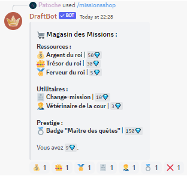

# Découvrir DraftBot !

## DraftBot c'est quoi ?

DraftBot est un bot Discord open-source développé par [@BastLast](https://github.com/BastLast) qui vous permet de vivre une aventure textuelle.

L'histoire se déroule dans un monde médiéval où le joueur contrôle un aventurier qui doit remporter une compétition organisée par le roi afin d’obtenir la main de la princesse. Pour atteindre son but, il doit voyager, collecter des points et affronter de nombreux dangers. Le jeu se déroule en temps réel, le joueur est amené à demander régulièrement des "rapports" au personnage qu'il contrôle. Lors de ces rapports, le personnage pourra être amené à se faire conseiller par le joueur à travers un système de choix utilisant les réactions de Discord. Chaque choix amène le personnage vers des conséquences bénéfiques ou non. Lors de son aventure, le personnage sera amené à être blessé, à collecter différents équipements, etc.

#### Voici un résumé des fonctionnalités principales.

* Dirigez votre petit personnage et aidez-le à **conquérir la princesse** !
* **Aucune permission n'est nécessaire.** Votre serveur est en sécurité !
* **Configuration simple** : DraftBot a seulement besoin d'accèder à un salon pour fonctionner.
* Rejoignez **plusieurs milliers de joueurs**, combattez et créez votre guilde avec vos amis !
* Aidez-nous à améliorer le bot ! Projet complètement [**open-source**](https://github.com/DraftBot-A-Discord-Adventure/) !

## Comment contribuer ?

Tous les contributeurs sont les bienvenus ! Si vous souhaitez vous investir dans le développement de DraftBot, la rédaction ou la traduction de son guide, les informations dont vous aurez besoin se trouvent dans la section [Comment contribuer](broken-reference).
