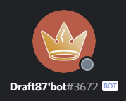
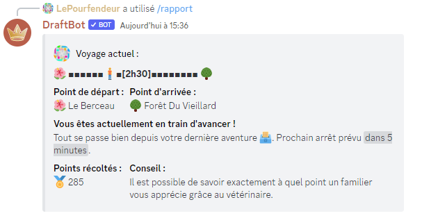

# Changement de nom

Au cours de son histoire, le jeu a changé 2 fois de nom :

A l'origine, le bot s'appellait Draft87'bot, qui était le format par défaut à sa création, et donc un nom temporaire. N'ayant pas d'autres idées que le nom DraftBot, ce dernier a été officiellement adopté le 8 Mai 2018 (soit juste après sa création) suite à un vote.

<figure><figcaption></figcaption></figure> <figure><figcaption>
 
</figcaption></figure>

Puis le 11 juin 2025, DraftBot est devenu Crownicles. Une annonce du créateur du jeu quelques jours plus tard vient nous expliquer que ce changement a été fait pour les raisons suivantes:

* Se détacher peu à peu de Discord afin de devenir un jeu vidéo à part entière.
* Pour éviter la confusion avec un autre bot du même nom mais aussi le problème de référencement qui va avec.
* Le nom DraftBot ne représente pas un jeu d'aventure.
* Après beaucoup de réflexion, une meilleur alternative avait été trouvé, Crownicles, car celle ci reflétait mieux l'essence du jeu (et aussi parce le nom n'existait pas encore).&#x20;

<figure><figcaption>
Une relique du passé...
</figcaption></figure>
