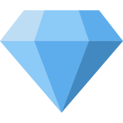

# Badges

`Meilleur joueur au moment du reset de la 1.0`   
`Joueur dans le top 10 au reset de la 1.0`   
`Propriétaire du bot`   
`Personne ayant trouvé tous les secrets du bot`    
`Personne ayant le grade Soutien sur le serveur du bot`   
`Badge pouvant être gagné de temps en temps dans des concours`   
`Donateur`   
`Personne ayant signalé des bugs majeurs`   
`Badge donné de manière totalement random`   
`Personne faisant partie des 20 premières à avoir rejoint le serveur du bot`   
`Personne ayant atteint la première place du classement après le reset`   
 `Badge acheté dans le shop`   
 `Personne ayant aidé à mettre le bot sur un serv de plus de 2000 membres`   
 `Personne ayant participé activement à la traduction du bot`   
 `Rédacteur du bot`   
 `Equipe technique`   
 `Personne ayant dominé un classement de la semaine`   
 `Badge pouvant être gagné chaque noël lors d'un concours`   
 `Badge offert à ceux qui postent un bon meme sur le draftbot`   
 `Personne ayant voté dans les 12 dernières heures`  
 `Membre d'une guilde puissante`  
 `Adopteur de classes de la première heure`  
 `Vainqueur d'un tournoi`  
🚩`Joueur ayant accompli une mission hebdomadaire sur le twitter de bot`  
💞`Joueur ayant dressé un familier légendaire`

Si vous pensez mériter un badge, merci de contacter `Thero1st#9119` ou `Ines#7400` sur Discord.  
Une fois un badge débloqué, celui-ci s'affiche sur votre [profil](../notions-principale/profile.md).

Certains badges ne sont plus disponible depuis la version 1.0 de DraftBot, notamment 🏆🏅⛑️. Les joueurs qui arborent ces badges sont donc considérés comme les plus anciens et les plus loyaux de la communauté !

