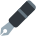

# Badges

`Meilleur joueur au moment du reset de la 1.0` \
`Joueur dans le top 10 au reset de la 1.0` \
`Propriétaire du bot` \
`Personne ayant trouvé tous les secrets du bot`  \
`Personne ayant le grade Soutien sur le serveur du bot` \
`Badge pouvant être gagné de temps en temps dans des concours` \
`Donateur` \
`Personne ayant signalé des bugs majeurs` \
`Badge donné de manière totalement random` \
`Personne faisant partie des 20 premières à avoir rejoint le serveur du bot` \
`Personne ayant atteint la première place du classement après le reset` \
 `Badge acheté dans le shop` \
 `Personne ayant aidé à mettre le bot sur un serv de plus de 2000 membres` \
 `Personne ayant participé activement à la traduction du bot` \
 `Rédacteur du bot` \
 `Equipe technique` \
 `Personne ayant dominé un classement de la semaine` \
 `Badge pouvant être gagné chaque noël lors d'un concours` \
 `Badge offert à ceux qui postent un bon meme sur le draftbot` \
 `Personne ayant voté dans les 12 dernières heures`\
 `Membre d'une guilde puissante`\
 `Adopteur de classes de la première heure`\
 `Vainqueur d'un tournoi`\
:revolving_hearts:`Joueur ayant dressé un familier légendaire`

Si vous pensez mériter un badge, merci de contacter `Thero1st#9119` ou `Ines#7400` sur Discord.\
Une fois un badge débloqué, celui-ci s'affiche sur votre [profil](../notions-principale/profile.md).

Certains badges ne sont plus disponible depuis la version 1.0 de DraftBot, notamment . Les joueurs qui arborent ces badges sont donc considérés comme les plus anciens et les plus loyaux de la communauté !
