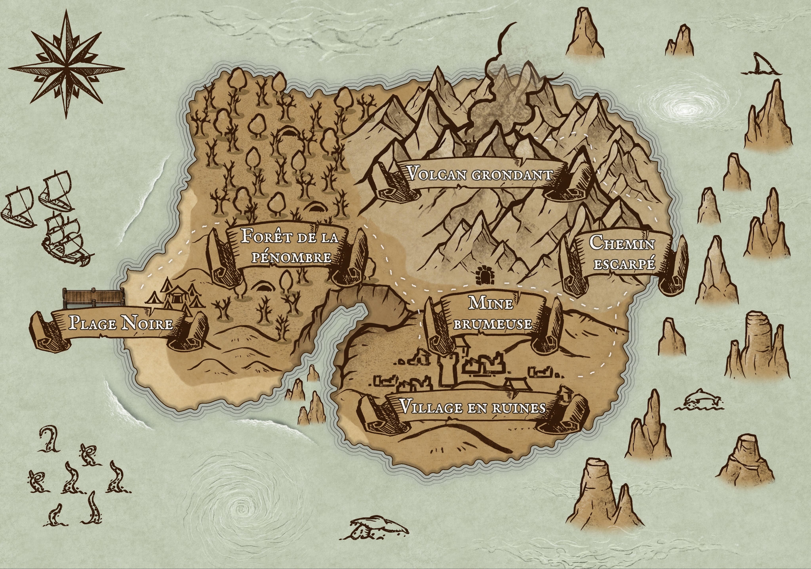
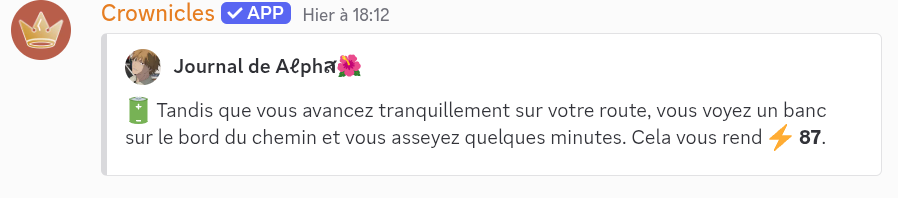
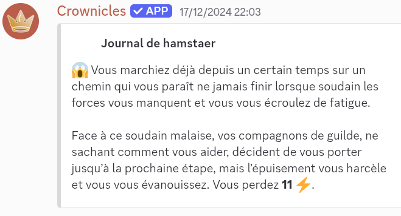
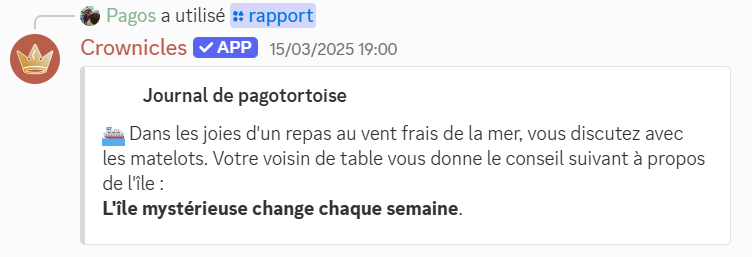
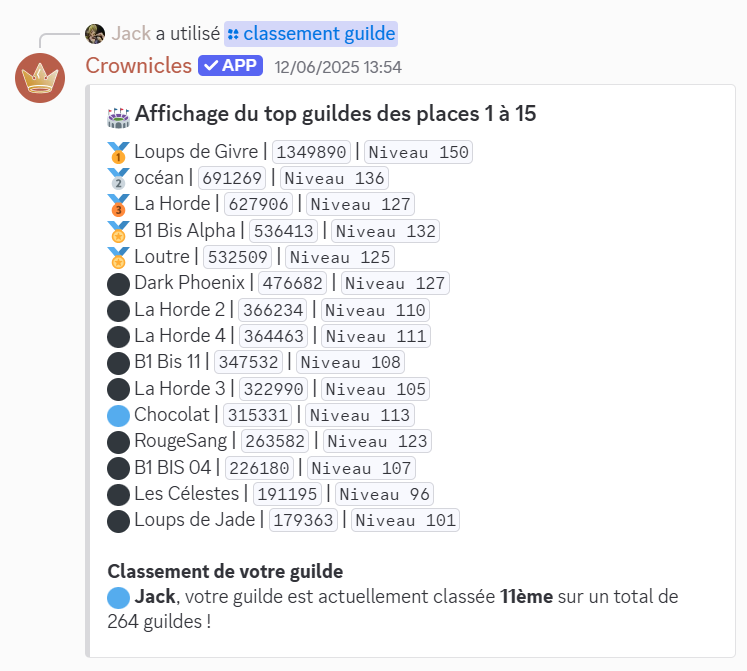

# Îles mystérieuses

Les monstres sont répartis sur 2 îles : l'île volcanique et l'île de glace.


&#x20;Chaque semaine une île est choisie et il ne peut pas avoir 2 semaines de suite la même île.


## Comment y aller ?

Ces îles mystérieuses peuvent être rejointes au travers d'un [mini-évènement](mini-evenements.md) à partir du niveau 20.

<figure><picture><source srcset="../.gitbook/assets/Capture d&#x27;écran 2025-06-19 190520.png" media="(prefers-color-scheme: dark)"></picture><figcaption>
On dirait que quelqu'un est sur le point de partir…
</figcaption></figure>


Si un membre de votre guilde est déjà sur un bateau, il vous suffit de faire `/rejoindrebateau` pour le rejoindre !


Sur ces îles, le jeu se déroule comme des trajets normaux, à la différence que le temps y passe plus vite : un mini-évènement est disponible toutes les 18s environ et les trajets entre les lieux durent 4min.


Les trajets pour aller sur une île et pour la quitter auront des temps différents de ceux sur cette île:

* pour aller sur une île, cela prendra 30 minutes, avec le temps habituel entre 2 mini-évènements ;
* pour quitter l'île, vous ne prendrez que 5 minutes sans mini-évènement, mais avec un évènement spécifique célébrant votre exploit ;
* une fois l'île quittée, votre destination sera une côte du continent principal et son trajet durera 8 minutes.



Vous pouvez quitter l'île à la fin de chaque combat si vous sentez que vous ne tiendrez pas le coup face au prochain monstre avec votre énergie restante.



Si vous choisissez de vous rendre sur l'île avec des membres de votre guilde, le bonus "allié.s" sera activé.&#x20;

Ce bonus réduira les malus rencontrés lors des mini-évènements. Il est actif lors qu'un membre descend du bateau et jusqu'à une heure après son départ de l'île.&#x20;

Pour connaître le nombre d'alliés présents sur l'île, utilisez la commande /guilde et consultez la section des informations sous la liste des membres de la guilde. Le nombre d'alliés sur l'île est indiqué dans la ligne "Nombre d'alliés sur l'île mystérieuse".&#x20;

Vous pouvez également identifier les alliés présents grâce à l'émoji :handshake: affiché à côté de leur pseudo.



Sur l'île, vous ne regagnerez pas d'énergie naturellement, le seul moyen étant de tomber sur des mini-évènements de gain d'énergie.

Certaines commandes seront aussi interdites sur l'île afin d'empêcher toute tentative de triche.


## Combats

Les îles se décomposent en une série de lieux, avec un monstre à combattre différent pour chacun d'entre eux. Après une victoire face à un monstre, vous gagnerez de l'argent et de l'expérience. De plus, si vous appartenez à une guilde, elle recevra aussi de l'expérience (si votre guilde n'est pas au niveau 150) et des points de guilde !


Pendant le combat, si vous êtes plusieurs dans votre guilde à être sur l'île, il y a une petite chance que l'attaque de guilde :stadium: apparaisse : sa puissance varie avec le nombre de membres présents !



Si vous perdez face à un des monstres ci-dessous, vous quitterez instantanément l'île et serez déposé vers un lieu aléatoire avec l'altération :confounded:. De plus, vous perdez de l'argent :moneybag: et des points de guilde (si vous appartenez à une guilde). Si vous n'avez pas de guilde, vous perdez le double d'argent.


## Liste des monstres de l'île volcanique :

<figure><figcaption>
Il y a une odeur de cendres dans l'air !
</figcaption></figure>

### Forêt de la pénombre

Ici, vous affrontez aléatoirement l'un des ces 2 monstres :

**Monstre : Troll de la forêt**

> Un grand troll qui vit dans les forêts. Très fort et très résistant, il est aussi très agressif et attaque tout ce qui bouge. Il est très dangereux pour les aventuriers qui s'aventurent dans les forêts.

**Attaques**:

| Nom de l'attaque                            | Description                                                                                                                                                         | Consommation en souffle |
| ------------------------------------------- | ------------------------------------------------------------------------------------------------------------------------------------------------------------------- | ----------------------- |
| :cricket\_game: Attaque gourdin             | Attaque en deux tours, avec une charge puissante au deuxième.                                                                                                       | 9                       |
| :martial\_arts\_uniform: Attaque projection | Projette l'adversaire s'il utilise une attaque physique. Peut étourdir l'adversaire.                                                                                | 6                       |
| :rage: Colère                               | Augmente son attaque de 100%, en dépit de 75% de sa défense.                                                                                                        | 1                       |
| :sound:Rugissement                          | Baisse l'attaque et la vitesse de l'adversaire.                                                                                                                     | 4                       |
| :triumph: Attaque intense                   | 
Niveau 50+ uniquement. 

Voir la page des <a href="https://guide.draftbot.com/notions-principale/combats#detaille-des-differentes-attaques">combats</a>
 | 4                       |

**Monstre : Mutant Vaseux**

> Le Mutant Vaseux est un monstre pouvant copier les autres monstres ou son adversaire directement. Il est très polyvalent et peut s'adapter à toutes les situations.

| Nom de l'attaque                          | Description                                                                                                                                                                                                      | Consommation en souffle |
| ----------------------------------------- | ---------------------------------------------------------------------------------------------------------------------------------------------------------------------------------------------------------------- | ----------------------- |
| :performing\_arts:Attaque mimique magique | 
Niveau 60+ uniquement. 

Fonctionne comme une <a href="iles-mysterieuses.md#combats">attaque simple</a> en temps normal sauf si l'adversaire lance une attaque magique, celle-ci se verra répliquer.
 | 3                       |
| :test\_tube:Attaque empoisonnée           | Voir la page des [combats](https://guide.draftbot.com/notions-principale/combats#detaille-des-differentes-attaques)                                                                                              | 3                       |
| :farmer:Attaque tir de boue               | Lance de la boue sur l'adversaire qui le rend sale et augmente de 5% son attaque, l'altération a 20% de chances de disparaître à chaque tour.                                                                    | 5                       |
| :amphora: Attaque boue brûlante           | Attaque puissante si l'adversaire est sali ! Sinon dégâts classiques.                                                                                                                                            | 9                       |

### Mine brumeuse

**Monstre : Araignée**

> Une grosse araignée poilue. D'une espèce inconnue, elle attaque tous les voyageurs qui s'approchent de son nid. Venimeuse, elle peut aussi projeter de la soie pour immobiliser ses proies.

**Attaques**:

| Nom de l'attaque                      | Description                                                                                                                                                                     | Consommation en souffle |
| ------------------------------------- | ------------------------------------------------------------------------------------------------------------------------------------------------------------------------------- | ----------------------- |
| :test\_tube: Attaque empoisonnée      | 
Niveau 40+ uniquement. 

Voir la page des <a href="https://guide.draftbot.com/notions-principale/combats#detaille-des-differentes-attaques">combats</a>
             | 3                       |
| :spider\_web: Attaque jet de toile    | Envoie un jet de toile qui blesse et ralentit l'adversaire.                                                                                                                     | 8                       |
| :face\_in\_clouds: Discrétion         | Se cache afin de doubler les dégâts de la prochaine attaque.                                                                                                                    | 6                       |
| :crossed\_swords: Attaque simple      | Voir la page des [combats](https://guide.draftbot.com/notions-principale/combats#detaille-des-differentes-attaques)                                                             | 2                       |
| :fork\_knife\_plate: Repas de famille | Niveau 60+ uniquement. Appelle des alliés pour dévorer l'adversaire et l'empoisonner au passage. Inflige l'altération "Repu" au lanceur, l'empêchant de bouger pendant 2 tours. | 20                      |

### Village en ruines

**Monstre : Squelette**

> Un squelette étrange, il semble être un ancien guerrier. Il paraît faible mais est en réalité très dangereux et nombreux sont ceux qui se sont laissés surprendre.

**Attaques**:

| Nom de l'attaque                             | Description                                                                                                                                                         | Consommation en souffle |
| -------------------------------------------- | ------------------------------------------------------------------------------------------------------------------------------------------------------------------- | ----------------------- |
| :crossed\_swords: Attaque simple             | Voir la page des [combats](https://guide.draftbot.com/notions-principale/combats#detaille-des-differentes-attaques)                                                 | 2                       |
| :shield: Attaque bouclier                    | Voir la page des [combats](https://guide.draftbot.com/notions-principale/combats#detaille-des-differentes-attaques)                                                 | 6                       |
| :bed: Repos                                  | Voir la page des [combats](https://guide.draftbot.com/notions-principale/combats#detaille-des-differentes-attaques)                                                 | 0                       |
| :smiling\_imp: Attaque maudite               | 
Niveau 50+ uniquement. 

Voir la page des <a href="https://guide.draftbot.com/notions-principale/combats#detaille-des-differentes-attaques">combats</a>
 | 6                       |
| :people\_holding\_hands: Invocation d'alliés | Niveau 65+ uniquement. Appelle des alliés qui s'acharneront sur l'adversaire pour le reste du combat. Utilisable une seule fois.                                    | 5                       |

### Chemin escarpé

**Monstre : Golem de roche**

> Un immense golem de roche. Animé par le désir d'écraser tout ce qui s'en approche. Il est très lent, mais ses attaques sont dévastatrices.

**Attaques**:

| Nom de l'attaque             | Description                                                                                                                                     | Consommation en souffle |
| ---------------------------- | ----------------------------------------------------------------------------------------------------------------------------------------------- | ----------------------- |
| :rock: Attaque rocheuse      | Lance des rochers sur l'adversaire. Peut l'étourdir.                                                                                            | 6                       |
| :foot: Attaque impact        | Le lanceur se jette sur l'adversaire, lui réduisant sa vitesse.                                                                                 | 6                       |
| :bricks: Peau de roche       | Recouvre sa peau de roches, augmentant sa défense considérablement si cette attaque est lancée plusieurs fois d'affilée.                        | 3                       |
| :mountain: Bouclier de roche | Crée un bouclier avec des rochers, amortissant la moitié des dégâts de la prochaine attaque de l'adversaire.                                    | 2                       |
| :headstone: Pétrification    | Niveau 50+ uniquement. Transforme l'adversaire en pierre et l'empêche d'attaquer pendant quelques tours, mais en augmentant sa défense de 200%. | 8                       |

### Volcan grondant

**Monstre : Titan de magma**

> Le monstre le plus puissant de l'île. Bouillant de chaleur, il est capable de faire fondre les roches les plus dures. Très peu d'aventuriers ont réussi à s'en défaire et il serait périlleux de l'attaquer seul.

**Attaques**:

| Nom de l'attaque           | Description                                                                                                                                                                                                          | Consommation en souffle |
| -------------------------- | -------------------------------------------------------------------------------------------------------------------------------------------------------------------------------------------------------------------- | ----------------------- |
| :volcano: Éruption         | Fait entrer en éruption le volcan grondant. La précision diminue avec la vitesse adverse.                                                                                                                            | 7                       |
| :foot: Attaque impact      | Le lanceur se jette sur l'adversaire, lui réduisant sa vitesse.                                                                                                                                                      | 6                       |
| :fire:Attaque feu          | Voir la page des [combats](https://guide.draftbot.com/notions-principale/combats#detaille-des-differentes-attaques)                                                                                                  | 8                       |
| :bathtub: Bain de magma    | Fonctionne comme Repos (voir page des [combats](https://guide.draftbot.com/notions-principale/combats#detaille-des-differentes-attaques)). Le lanceur se baigne dans du magma, régénérant une partie de son énergie. | 2                       |
| :hotsprings: Vague de lave | Niveau 50+ uniquement. Le lanceur surfe sur une vague de lave se dirigeant droit sur l'adversaire, infligeant des dégâts importants et le brûlant au passage.                                                        | 15                      |

## Liste des monstres de l'île de glace :

<figure><figcaption>
Il vaut mieux bien se couvrir !
</figcaption></figure>

### Toundra&#x20;

#### Monstre : loup blanc

> Un prédateur féroce et agile. Ses griffes acérées pourraient sceller votre destin. Le froid et les sentiers sinueux lui offrent un grand avantage face aux aventuriers imprudents.

| Nom de l'attaque                 | Description                                                                                                                                              | Consommation en souffle |
| -------------------------------- | -------------------------------------------------------------------------------------------------------------------------------------------------------- | ----------------------- |
| :tooth:Attaque morsure puissante | Une morsure qui applique l'altération saignement.                                                                                                        | 6                       |
| :face\_in\_clouds:Discrétion     | Niveau 40+ uniquement. Se cache afin de doubler les dégâts de la prochaine attaque.                                                                      | 6                       |
| 🌕Hurlement                      | Améliore aléatoirement l'attaque, la défense ou la vitesse.                                                                                              | 1                       |
| :feet:Attaque griffe             | Un violent coup de griffe. Échoue plus souvent face à un adversaire plus rapide.                                                                         | 2                       |
| :wolf:Appel à la meute           | Niveau 80+ uniquement. Il appelle sa meute à l'aide. La première attaque fait de faible dégâts et les suivantes sont renforcés par la force de la meute. | 9                       |

### Caverne de cristal

#### Monstre : Élémentaire brillant

> Un être né des cristaux de la caverne. Il n'hésitera pas à utiliser ses pouvoirs élémentaires pour vous faire valser à l'autre bout du chemin.

| Nom de l'attaque                | Description                                                                                                                                     | Consommation en souffle |
| ------------------------------- | ----------------------------------------------------------------------------------------------------------------------------------------------- | ----------------------- |
| 🪦 Pétrification                | Niveau 50+ uniquement. Transforme l'adversaire en pierre et l'empêche d'attaquer pendant quelques tours, mais en augmentant sa défense de 200%. | 8                       |
| 🪡Attaque perçante              | Voir la page des [combats](../notions-principale/combats.md#detail-des-differentes-attaques)                                                    | 5                       |
| ⛰️ Bouclier de roche            | Crée un bouclier avec des rochers, amortissant la moitié des dégâts de la prochaine attaque de l'adversaire.                                    | 2                       |
| :sunny:Attaque rayon de lumière | Un rayon de lumière si puissant qu'il peut vous brûler ou vous aveugler.                                                                        | 7                       |
| 🔮Attaque éclat de cristal      | Niveau 90+. Une attaque qui inflige plus de dégâts aux adversaires lents.                                                                       | 3                       |

### Lac souterrain

#### Monstre : Crocodile

> Un grand crocodile terrifiant, à la recherche d'un aventurier pour en faire son festin.

| Nom de l'attaque                 | Description                                                                                                            | Consommation en souffle |
| -------------------------------- | ---------------------------------------------------------------------------------------------------------------------- | ----------------------- |
| :tooth:Attaque morsure puissante | Une morsure qui applique l'altération saignement.                                                                      | 6                       |
| :foot:Attaque impact             | Le lanceur se jette sur l'adversaire, lui réduisant sa vitesse.                                                        | 6                       |
| 🐊Attaque coup de queue          | Une puissante coup de queue qui peut étourdir.                                                                         | 2                       |
| 🥋 Attaque projection            | Niveau 40+. Projette l'adversaire s'il utilise une attaque physique. Peut étourdir l'adversaire.                       | 6                       |
| :face\_in\_clouds:Embuscade      | Niveau 80+. Annule les dégâts de la prochaine attaque du joueur tout en augmentant les dégâts de sa prochaine attaque. | 0                       |

### Village dévasté&#x20;

#### Monstre : Yuki Onna

> Une femme esprit des neiges. Elle est très belle mais aussi très dangereuse. Elle peut geler ses proies d'un simple regard et les faire disparaître dans la neige.

| Nom de l'attaque                  | Description                                                                                                                                      | Consommation en souffle |
| --------------------------------- | ------------------------------------------------------------------------------------------------------------------------------------------------ | ----------------------- |
| 🌡️ Attaque drain de chaleur      | Augmente l'attaque du lanceur et gèle l'adversaire.                                                                                              | 7                       |
| :dash:Attaque vol de souffle      | Niveau 50+. Voir la page des [combats](../notions-principale/combats.md#detail-des-differentes-attaques)                                         | 1                       |
| ❄️ Attaque séduction glaciale     | Niveau 110+. Peut geler ou rendre confus l'adversaire en plus de lui infliger des dégâts.                                                        | 5                       |
| 💋Attaque baiser gelé             | Si l'adversaire est gelé, les dégâts sont fortement réduits.                                                                                     | 4                       |
| :ghost:Attaque revanche spectrale | Semblable à [l'attaque riposte](../notions-principale/combats.md#detail-des-differentes-attaques).Échoue si l'attaque précédente était magique.  | 8                       |

### Portes sacrées

#### Monstre : gardien céleste

> Le gardien des portes sacrées. Empêcher les aventuriers de passer est son devoir, et il utilisera son marteau divin pour vous faire comprendre que vous n'êtes pas le bienvenu.

| Nom de l'attaque                      | Description                                                                                                                                                       | Consommation de souffle |
| ------------------------------------- | ----------------------------------------------------------------------------------------------------------------------------------------------------------------- | ----------------------- |
| :pray:Attaque divine                  | Voir la page des [combats](../notions-principale/combats.md#detail-des-differentes-attaques)                                                                      | 9                       |
| :axe:Attaque puissante                | Voir la page des [combats](../notions-principale/combats.md#detail-des-differentes-attaques)                                                                      | 6                       |
| :bed:Repos                            | Voir la page des [combats](../notions-principale/combats.md#detail-des-differentes-attaques)                                                                      | 0                       |
| :sunny:Attaque rayon radieux explosif | Charge son attaque pendant 2 tours et inflige de gros dégâts au troisième tour pouvant brûler ou aveugler.                                                        | 8                       |
| :hammer:Attaque marteau sismique      | Niveau 50+. Le lanceur frappe le sol avec une force titanesque, infligeant de lourds dégâts.Il est possible d'esquiver les séismes à l'aide d'un familier volant. | 9                       |

### Pic enneigé&#x20;

#### Monstre : Seigneur des glaces

> Un majestueux dragon aux écailles cristallines qui règne depuis les sommets glacés. Perché sur les pics les plus élevés, il surveille son territoire d'un œil vigilant. Son souffle glacial peut transformer un aventurier en statue de glace en quelques secondes, et ses serres acérées lui permettent de fondre sur ses proies depuis les hauteurs avec une précision mortelle.

| Nom de l'attaque                | Description                                                                                                                               | Consommation en souffle |
| ------------------------------- | ----------------------------------------------------------------------------------------------------------------------------------------- | ----------------------- |
| :feet:Attaque griffe            | Un violent coup de griffe. Échoue plus souvent face à un adversaire plus rapide.                                                          | 2                       |
| :dragon:Attaque souffle glacial | Libère un vent glacé qui inflige des dégâts à l'adversaire et a une chance de le geler.                                                   | 13                      |
| 🌨️ Attaque rage de blizzard    | Peut geler, ralentir et réduire la défense de l'adversaire. Utilisable une fois par combat.                                               | 10                      |
| 🦅Attaque plongée aérienne      | Niveau 80+. Il fond sur son adversaire depuis les airs. Échoue si l'attaque précédente est une attaque à distance.                        | 8                       |
| 🧊Attaque armure cristalline    | Niveau 50+. Utilise le bouclier de l'adversaire pour attaquer. Réussit uniquement si l'attaque précédente de son adversaire est physique. | 3                       |

### Nid glacé

#### Monstre : Reine des glaces

> Une redoutable dragonne qui protège férocement son trésor et sa progéniture dans les profondeurs glacées de son antre. Plus agressive que son compagnon, elle n'hésite pas à déchaîner sa fureur contre quiconque ose s'approcher de son nid. Ses écailles scintillent comme des diamants et sa queue peut briser la glace la plus épaisse d'un seul coup.

| Nom de l'attaque                | Description                                                                                                                                  | Consommation en souffle |
| ------------------------------- | -------------------------------------------------------------------------------------------------------------------------------------------- | ----------------------- |
| 🐊Attaque coup de queue         | Une puissante coup de queue qui peut étourdir.                                                                                               | 2                       |
| 🤍Étreinte de glace             | Niveau 70+. Fait des dégâts et peut vous geler. Cette étreinte se prolongera si vous ne vous ne vous défendez pas avec une attaque physique. | 7                       |
| 🧊Attaque armure cristalline    | Utilise le bouclier de l'adversaire pour attaquer. Réussit uniquement si l'attaque précédente de son adversaire est physique.                | 3                       |
| 🐉Attaque souffle glacial       | Libère un vent glacé qui inflige des dégâts à l'adversaire et a une chance de le geler.                                                      | 13                      |
| 💥Attaque effondrement glacial  | Niveau 50+.  Une chute de stalactites qui peut être esquiver par anticipation en faisant une attaque physique.                               | 9                       |

## Mini-évènements

Pendant vos trajets, vous rencontrerez des obstacles différents du continent. Ceux-ci sont listés ci dessous :


La rareté représente la fréquence à laquelle vous risquez de tomber sur l'un des mini-évènements ci-dessous : plus la rareté est élevée, plus le mini-évènement est fréquent.



De plus, la présence d'un ou plusieurs membres de votre guilde sur l'île en même temps que vous aura une influence sur la qualité des mini-évènements rencontrés.


### Gain d'énergie

**rareté : 5**

Comme son nom l'indique, il vous permet de récupérer un peu d'énergie.

<figure><picture><source srcset="../.gitbook/assets/Capture d&#x27;écran 2025-06-19 175936.png" media="(prefers-color-scheme: dark)"></picture><figcaption>
Exemple de mini-évènement de gain d'énergie
</figcaption></figure>

### Péripéties

**rareté : 8**

Durant votre expédition sur l'île, certaines péripéties peuvent survenir, et vous (ainsi que votre guilde si vous en avez une) tentez de surmonter ces catastrophes. Ces mini-évènements ont des issues dépendantes de votre appartenance à une guilde. Ils peuvent ne rien faire, apporter un gain (points de guilde, expérience...) ou vous faire perdre de l'énergie, de l'argent ou de la vie.


Les gains ne sont récoltés que si vous appartenez à une guilde. Si vous êtes du genre solitaire, vous ne gagnerez rien, même si l'issue est positive !


<figure><picture><source srcset="../.gitbook/assets/Capture d&#x27;écran 2025-06-19 180113.png" media="(prefers-color-scheme: dark)"></picture><figcaption>
Exemple de péripétie
</figcaption></figure>

### Combat face à un animal sauvage

**rareté : 8**

Vous rencontrez un animal sauvage qui se met à vous attaquer ! Pour le calmer, vous disposez de 2 à 4 options choisies aléatoirement, dépendant de votre niveau et de votre classe.


Si vous réussissez à calmer l'animal (ou à faire en sorte qu'il ne vous attaque pas), vous obtenez un point de rage (cumulable), c'est-à-dire des dégâts supplémentaires face au monstre de la zone suivante, appliqués en début de combat avant la 1ère attaque du joueur.


<figure><picture><source srcset="../.gitbook/assets/Capture d’écran 2025-06-23 083859.png" media="(prefers-color-scheme: dark)"></picture><figcaption>
Exemple de mini évènement où le joueur rencontre un animal sauvage.
</figcaption></figure>

**Voici les différentes options qui pourraient s'offrir à vous :**

_La plupart des choix dépendent aussi de la rareté de l’animal adverse. Généralement, plus l’animal est rare, plus il est difficile de réussir._

🤛 **Attaquer à gauche / 🤜 Attaquer à droite :** fonctionne mieux si vous attaquez du bon côté (1/10 des joueurs sont gauchers)&#x20;

🥩 **Distraire la bête avec de la viande :** dépend du régime de l’animal et de votre stock de viande 🥩&#x20;

🥕 **Distraire la bête avec un légume :** dépend du régime de l’animal et de votre stock de salades 🥬&#x20;

😱 **Crier :** fonctionne légèrement mieux si l’animal est une femelle&#x20;

👊 **Coup de poing :** dépend de l’attaque 🗡️&#x20;

🛡️ **Se protéger :** dépend de la défense 🛡️&#x20;

🏃 **Fuir :** dépend de la vitesse 🚀&#x20;

⚡ **Concentrer son énergie et attaquer :** fonctionne mieux si beaucoup d’énergie ⚡️&#x20;

🔥 **Utiliser toutes vos forces pour attaquer :** fonctionne mieux si peu d’énergie ⚡️&#x20;

💪 **Intimider la créature :** dépend du niveau du joueur&#x20;

💀 **Faire le mort :** fonctionne mieux si la vie ❤️ du joueur est faible&#x20;

😤 **Provoquer la bête :** fonctionne mieux si le joueur possède une forte attaque par rapport à un bas niveau ou s’il possède l’arme « 🤬 insultes »&#x20;

🙏 **Prier dieu :** dépend du nombre d’objets sacrés dans l’inventaire du joueur&#x20;

🐕 **Faire appel à votre familier :** dépend de la rareté, du régime et du moral du familier du joueur&#x20;

🏟️ **Faire appel aux membres de votre guilde :** dépend du nombre d’alliés 🤝&#x20;

🚶 **Ne rien faire :** peu de réussite

### Informations sur l'île

**rareté : 1 - uniquement disponible sur le trajet en bateau vers l'île**

L'équipage du bateau vous donnera des informations sur l'île vers laquelle vous vous dirigez. Ces infos peuvent vous être utiles pour votre aventure au-delà des côtes du continent principal.

<figure><picture><source srcset="../.gitbook/assets/SE_islandinfo_sombre.png" media="(prefers-color-scheme: dark)"></picture><figcaption>
Exemple de mini-évènement donnant des informations sur l'île
</figcaption></figure>


Malgré sa rareté de 1, il est le seul mini-événement disponible sur le trajet en bateau vers l'île.


## Classement des guildes

Au fil de votre progression, les joueurs gagnent des points de guilde :mirror\_ball: après chaque victoire face à un monstre (et en perdent après une défaite) ou lors de mini-évènements sur l'île. Ces points permettent de faire progresser sa guilde parmi un classement visible avec la commande `/classement guildes`.

&#x20;&#x20;

<figure><picture><source srcset="../.gitbook/assets/classement_guildes_sombre.png" media="(prefers-color-scheme: dark)"></picture><figcaption>
Première page du classement des guildes avec le nom, niveau et nombre de points de chaque guilde
</figcaption></figure>
