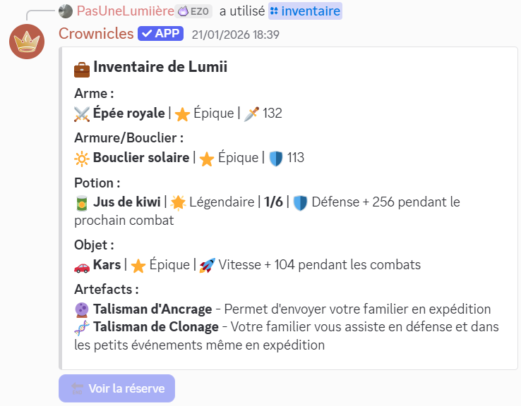

# Gestion de l'inventaire

L'inventaire est l'endroit où sont placés les différents objets amassés par le joueur dans les rapports ou achetés dans le magasin contre de l'argent. Pour afficher le contenu de votre inventaire,  saisissez la commande `/inventaire`.


Vous avez également la possibilité d'afficher l'inventaire d'un autre joueur. Utilisez les options `utilisateur` ou `classement` de la commande `/inventaire` pour cibler un autre joueur. Par exemple, `/inventaire classement:1337` affichera l'inventaire du joueur classé 1337ème.


### Organisation de l'inventaire

<figure><picture><source srcset="../.gitbook/assets/inventaire_artefacts_sombre.png" media="(prefers-color-scheme: dark)"></picture><figcaption>
Un exemple d'inventaire d'un joueur
</figcaption></figure>

L'inventaire se décompose en deux parties distinctes, la première est dédiée aux objets équipés par le joueur, la seconde, quant à elle, est une réserve permettant de stocker un ou plusieurs équipements supplémentaires.

La première partie de l'inventaire est partagée comme suit:

* L'emplacement d'arme
* L'emplacement d'armure ou de bouclier
* L'emplacement de la potion
* L'emplacement de l'objet actif
* L'emplacement des artefacts

La seconde partie de l'inventaire sert à **stocker des équipements supplémentaires** que vous pourrez échanger avec vos équipements actifs en fonction de vos besoins.

<figure><picture><source srcset="../.gitbook/assets/réserve_sombre (1).png" media="(prefers-color-scheme: dark)"></picture><figcaption>
Un exemple de réserve d'inventaire
</figcaption></figure>


La réserve du joueur peut être améliorée dans le magasin. Différents emplacements supplémentaires sont achetables:

* 1 emplacement pour une arme,
* 1 emplacement pour une armure,
* 3 emplacements pour des potions,
* 3 emplacements pour des objets.



Lors de l'achat d'un emplacement supplémentaire, le prix de l'amélioration de la réserve dans le magasin augmente en conséquence.


### Interaction avec les objets de l'inventaire

La commande `/bonusjournalier` permet d'utiliser un objet à effet journalier. Un objet peut être utilisé toutes les 22h minimum.

La commande `/vendre` permet de vendre n'importe quel équipement situé dans la réserve d'un joueur.

La commande `/intervertir` permet d'échanger les équipements actifs avec les équipements de la réserve.

La commande `/deposer` permet de déposer un équipement actif dans la réserve (si vous avez de la place).&#x20;
