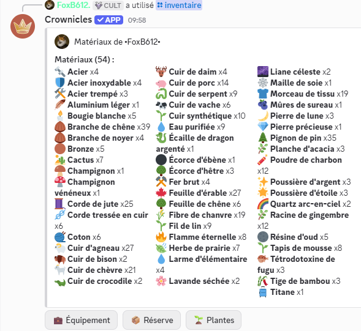
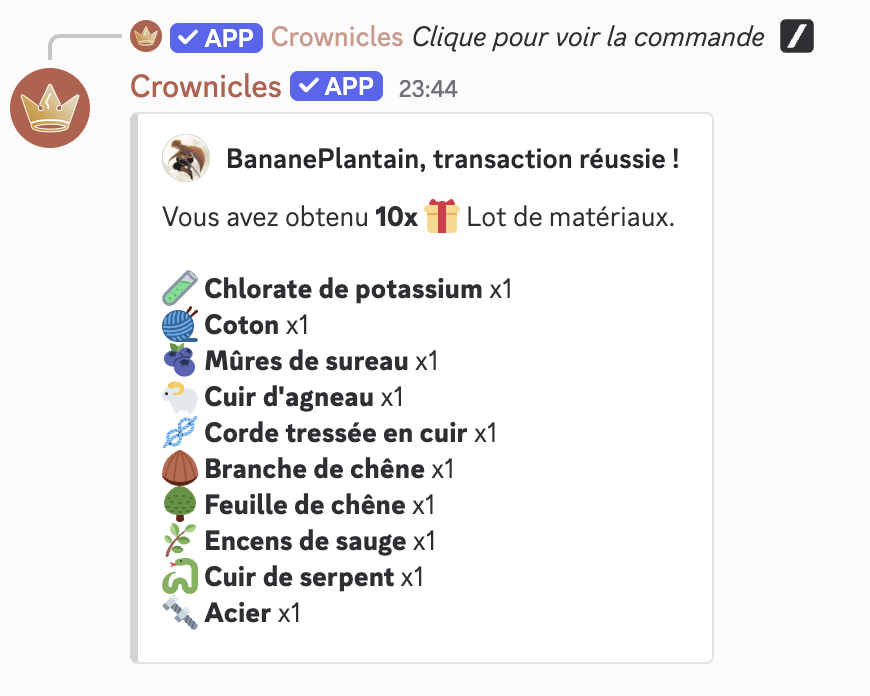
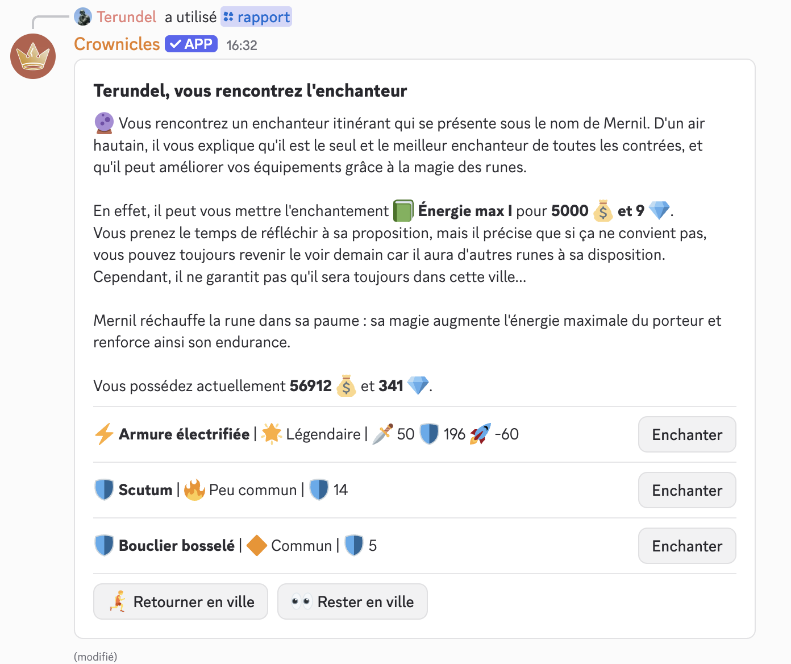

# Matériaux et enchantements

## :bricks: Les matériaux

Il existe 90 matériaux différents, regroupés en différents types, tels que les bois, les explosifs ou les métaux et différentes raretés - commun :small\_orange\_diamond:, peu commun :large\_orange\_diamond:, rare :fire:.

<figure><picture><source srcset="../.gitbook/assets/InventaireMateriaux_sombre.png" media="(prefers-color-scheme: dark)"></picture><figcaption>
Un inventaire de divers matériaux
</figcaption></figure>

Ils peuvent être récupérés avec :&#x20;

* Un mini-évènement qui en donne entre 1 et 16 d'un seul type.
* En butin d'expédition de familier. Chaque type rapporte certains matériaux spécifiques.
* En récompense après avoir battu un monstre des [îles mystérieuses](iles-mysterieuses.md).
* Chez certains marchands, comme le bûcheron du Village Coco ou le marchand de matériaux de la Ville Forte.

<figure><picture><source srcset="../.gitbook/assets/AchatMateriaux_sombre.png" media="(prefers-color-scheme: dark)"></picture><figcaption>
Un achat de matériaux au marchand de la Ville Forte 
</figcaption></figure>

Une fois récoltés, les matériaux sont parfois utilisés en [cuisine](../notions-principale/villes-et-maisons.md#la-cuisine) mais servent essentiellement à améliorer les armes, boucliers et armures à la forge, ce qui peut augmenter leurs performances jusqu'à ⅓ de puissance supplémentaire. Ces améliorations peuvent être faites chez les forgerons des villes ou dans la forge personnelle du joueur.


Seul le forgeron royal du Château peut améliorer au niveau 5, pour les joueurs de niveau 100+.


Chaque équipement est associé à une vingtaine de matériaux qui lui sont liés. Les améliorations piocheront dans cet ensemble pour les coûts de forge, avec des quantités augmentant avec le niveau d'amélioration visé.


Les équipements les plus rares nécessitent des matériaux plus rares et nombreux.


## :crystal\_ball: Les enchantements

L'enchanteur Mernil :crystal\_ball: est un personnage itinérant, qui se déplace quotidiennement de ville en ville et propose chaque jour un enchantement parmi cette liste :&#x20;

* Attaque PvP I-II-III : augmente les dégâts contre les joueurs (jusqu'à +12%)
* Attaque PvE I-II-III : augmente les dégâts contre les monstres (jusqu'à +12%)
* Attaque I-II-III : augmente les dégâts (jusqu'à +10%)
* Défense I-II-III : réduit les dégâts reçus (jusqu'à environ -8,3%)
* Vitesse I-II-III : augmente la vitesse :rocket: (jusqu'à +20%)
* Énergie max I-II-III : augmente l'énergie :zap:maximale (jusqu'à +9%)
* Souffle de base I-II : Ajoute jusqu'à +2 :dash: au souffle de début de combat
* Souffle max : augmente le souffle maximal :wind\_blowing\_face: de 3
* Aspect de feu : augmente les dégâts de brûlure :hot\_face: de 20% et augmente la résistance au gel :cold\_face: de 25%
* Aspect de givre : augmente les dégâts de gel :cold\_face: de 20% et augmente la résistance au feu :hot\_face: de 25%
* Aspect de venin : augmente les dégâts de poison :nauseated\_face: de 20% et résiste à ses dégâts de 25%


Les enchantements Aspect de feu, de givre et de venin permettent d'augmenter les dégâts infligés d'une altération tout en acquérant une résistance à une altération.



Les enchantements Attaque et Défense impactent directement les dégâts subis ou infligés.&#x20;


Les enchantements d'attaque, de souffle de base et d'aspect de feu, givre et venin peuvent être appliqués sur une arme, alors que défense, vitesse, énergie et souffle max sont réservés aux boucliers et armures.&#x20;

Seuls les enchantements de l'arme et de l'armure équipées sont appliqués.&#x20;

<figure><picture><source srcset="../.gitbook/assets/EnchanteurMernil_sombre.png" media="(prefers-color-scheme: dark)"></picture><figcaption>
Une proposition d'enchantement pour boucliers et armures par Mernil
</figcaption></figure>


Un équipement déjà enchanté ne peut pas recevoir de nouvel enchantement. Il faut d'abord le désenchanter chez un forgeron.&#x20;



Les mages mystiques :mage:bénéficient d'une réduction de 20% sur les services de Mernil !

