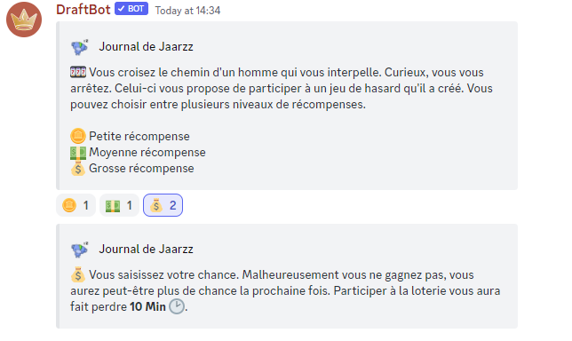

# Mini-évènements

Il existe actuellement 15 types de mini-évènements différents dans le bot. Voici quelques informations au sujet des mini-évènements qui vous permettront d'aborder cette fonctionnalité de manière plus stratégique.

### Mini-shop

**Taux d'apparition :** 4.4%

Vous permet d'acheter un objet pour pas cher (60 % du prix). Il n'est pas possible d'obtenir des objets de rareté supérieure à spécial. Si vous achetez un objet mais que vous n'acceptez pas de remplacer votre objet, l'objet sera racheté par le vendeur pour un prix réduit à son prix d'achat.


Attention une faible proportion de vendeurs sont des arnaqueurs et tenteront de vous vendre des items pour bien trop cher !


.png>)

### Interaction avec un familier

**Taux d'apparition :** 6.25% - Nécessite d'avoir un familier équipé pour apparaître.

Réalise une interaction entre le propriétaire d'un familier et son familier. Ce mini-évènement peut être positif ou négatif en fonction de l'affection du familier. Les familiers plus rares permettent d'obtenir de meilleures récompenses.

| Récompense                 | Nombre d'étoiles du familier | Probabilité |
| -------------------------- | ---------------------------- | ----------- |
| Argent (20 à 70)           | 3                            | Élevée      |
| Nourriture                 | 1                            | Moyenne     |
| Item                       | 5                            | Faible      |
| Points de vie (1 à 5)      | 4                            | Moyenne     |
| Rien ne se passe           | 1                            | Très élevée |
| Un peu d'affection (1 à 3) | 2                            | Moyenne     |
| Temps (5 à 20 minutes)     | 3                            | Faible      |
| Points bonus (20 à 70)     | 1                            | Moyenne     |
| Badge                      | 6                            | Très faible |


Si un familier est dressé, il compte dans le calcul des récompenses accessibles comme ayant une étoile en plus.


| Malus                           | Probabilité |
| ------------------------------- | ----------- |
| Perte de vie (1 à 5)            | Moyenne     |
| Perte d'argent (20 à 70)        | Moyenne     |
| Perte de temps (5 à 20 minutes) | Moyenne     |
| Perte d'affection (1 à 3)       | Moyenne     |
| Fuite du familier               | Très faible |

.png>)

### Trouver un familier

**Taux d'apparition :** 2.2%

Le joueur découvre un familier qui le rejoint dans son aventure. Si le joueur a déjà un familier, le nouveau est placé dans le refuge de la guilde du joueur.


Si il n'y a plus de place dans le refuge de la guilde du joueur et que ce dernier possède déjà un familier alors cet évènement ne rapportera pas de nouveau familier.


Voilà les probabilités d'obtention pour chaque rareté de familiers :

|          |          |         |         |         |
| -------- | -------- | ------- | ------- | ------- |
| 1 :star: | 2 :star: | 3:star: | 4:star: | 5:star: |
| 87.6%    | 9.64%    | 1.664%  | 0.65%   | 0.446%  |

.png>)

### Trouver un équipement

**Taux d'apparition :** 2.2%

Le joueur découvre un équipement aléatoire. Il n'est pas possible d'obtenir des objets légendaires ou mythiques dans ce mini-évènement.

.png>)

### Rien ne se passe

**Taux d'apparition :** 8.8%

Ce mini-évènement affiche simplement une phrase d'encouragement pour le joueur.

.png>)

### Petit malheur

**Taux d'apparition :** 8.8%

Parfois, tout ne se passe pas comme prévu. Certains mini-évènements amènent à de petits malus.

| Malus                    | Effet                      |
| ------------------------ | -------------------------- |
| Perte de vie             | 1 à 5 points de vie perdus |
| Perte d'argent           | 10 à 50 d'argent perdus    |
| Perte de temps aléatoire | 1 à 24 minutes perdues     |

.png>)

### Gros malheur

**Taux d'apparition :** 1.1%

Parfois, tout ne se passe pas comme prévu. Certain mini-évènements amènent à de gros malus. Heureusement, cela reste très rare !

| Malus             | Effet                                                |
| ----------------- | ---------------------------------------------------- |
| Perte de vie      | 5 à 30 points de vie perdus                          |
| Perte d'argent    | 50 à 250 d'argent perdus                             |
| Altération d'état | Le joueur peut être touché par une altération d'état |

.png>)

### Loterie

#### Taux d'apparition : 2.94%

#### :coin: Petite mise :&#x20;

Gains possibles (80%) :&#x20;

* 35 :medal:
* 70 XP de guilde
* 50 :moneybag:
* 40 :star:

Malus  :&#x20;

* Rien (20%)

#### :dollar: Mise intermédiaire :&#x20;

Gains possibles (50%) :&#x20;

* 105 :medal:
* 210 XP de guilde
* 150 :moneybag:
* 120 :star:

Malus :&#x20;

* 10 minutes :clock1: (100%)

#### :moneybag:Grosse mise :&#x20;

Gains possibles (20%) :&#x20;

* 350 :medal:
* 700 XP de guilde
* 500 :moneybag:
* 400 :star:

Malus :&#x20;

* 10 minutes :clock1: (100%)
* 175 :money\_with\_wings: (10%)

<figure><figcaption>
Un exemple de loterie
</figcaption></figure>

### Interaction avec un joueur sur le même trajet

Il est possible de rencontrer d'autres joueurs sur le même trajet en voyageant. Ce mini-évènement permet de discuter avec un joueur que vous croisez, que vous suivez ou que vous précédez !

Il existe une multitude de phrases en fonction de la situation de la personne que vous croisez !

Voilà la liste des caractéristiques qui peuvent être exploitées :

* Top 10
* Top 50
* Top 100
* Top 1
* Guilde puissante
* Débutant
* Niveau 50 ou plus
* Inactif
* Même classe que le joueur
* Même guilde
* Membre du staff
* Point du classement de la semaine
* Peu de vie
* Beaucoup de vie
* Mieux classé
* Moins bien classé
* Riche
* Pauvre
* Duplication de potion
* Familier
* Chef de guilde
* Aîné de guilde
* Classe du joueur
* Altération d'état
* Inventaire du joueur

.png>)
