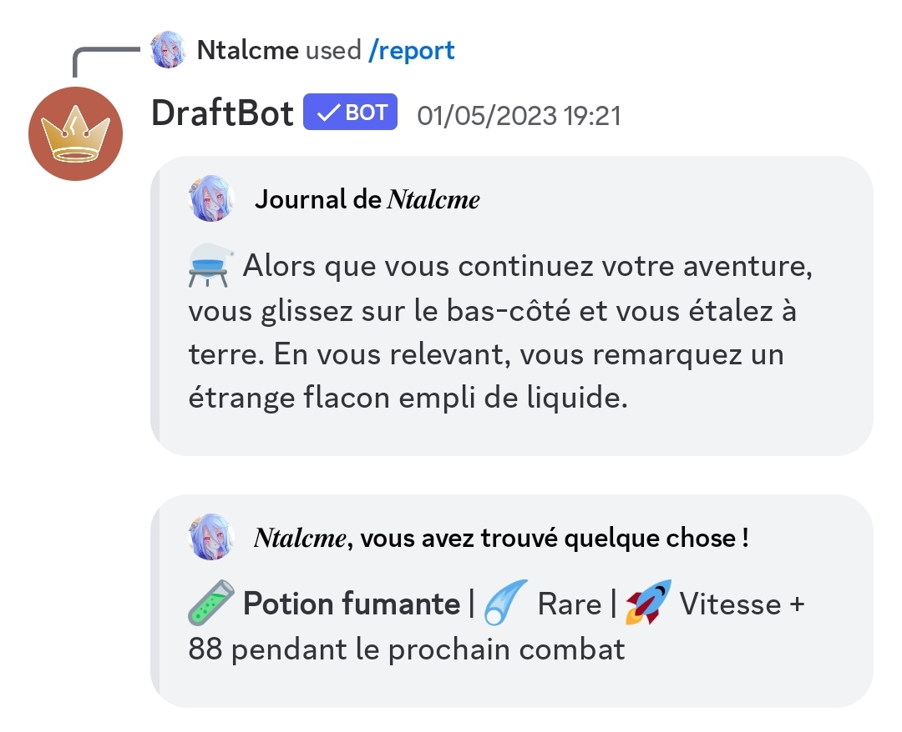
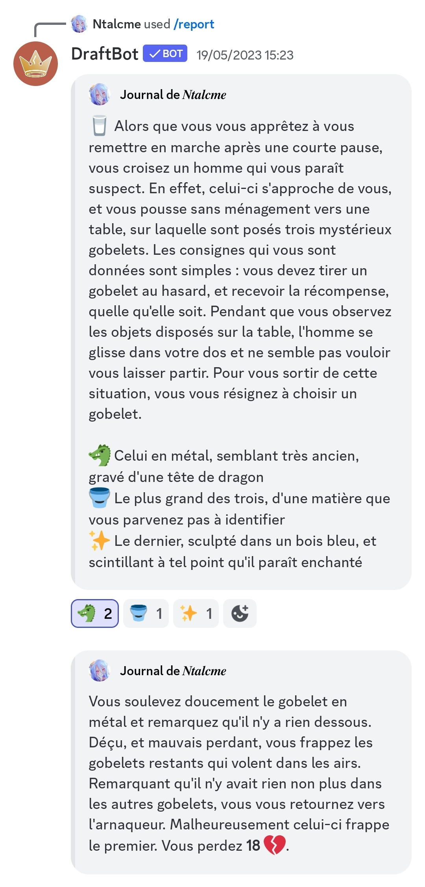
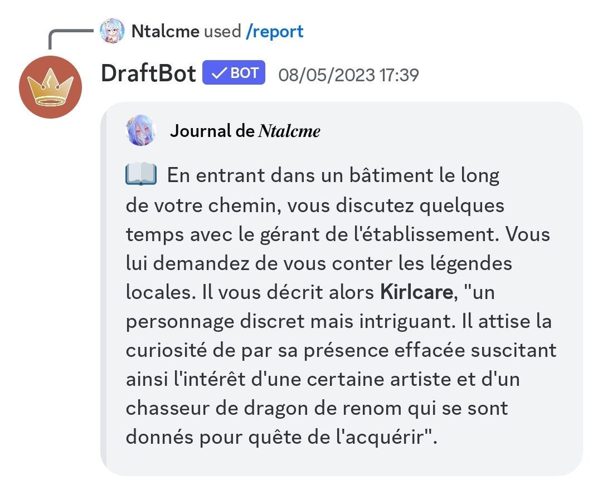
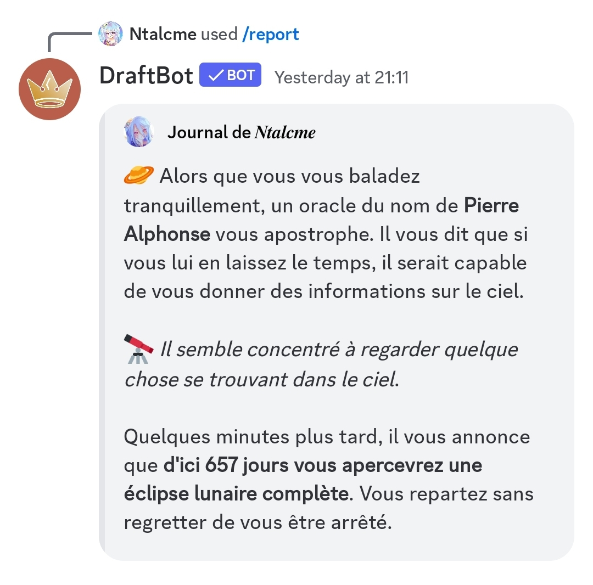
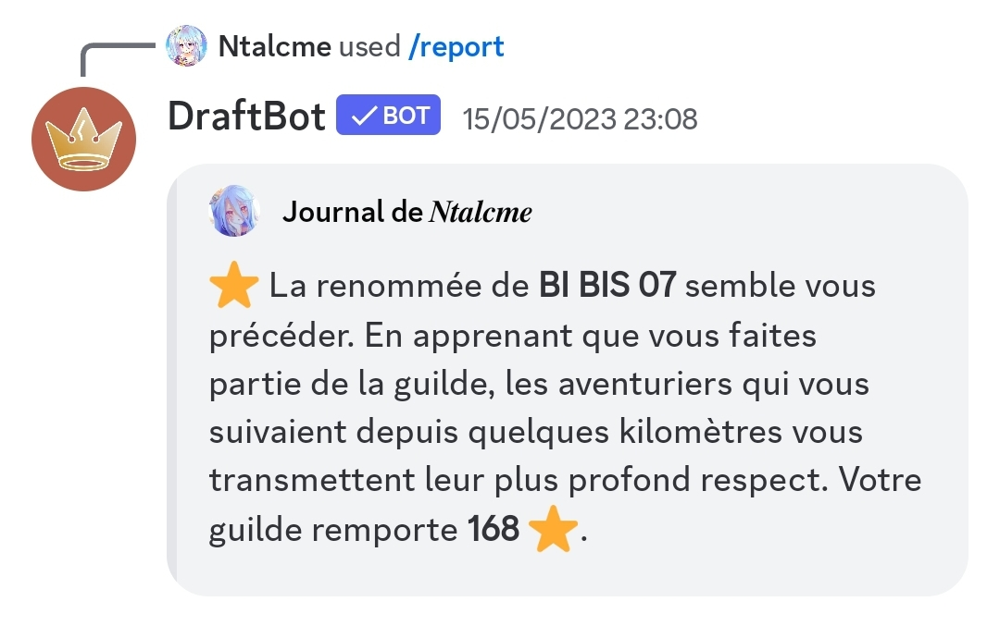
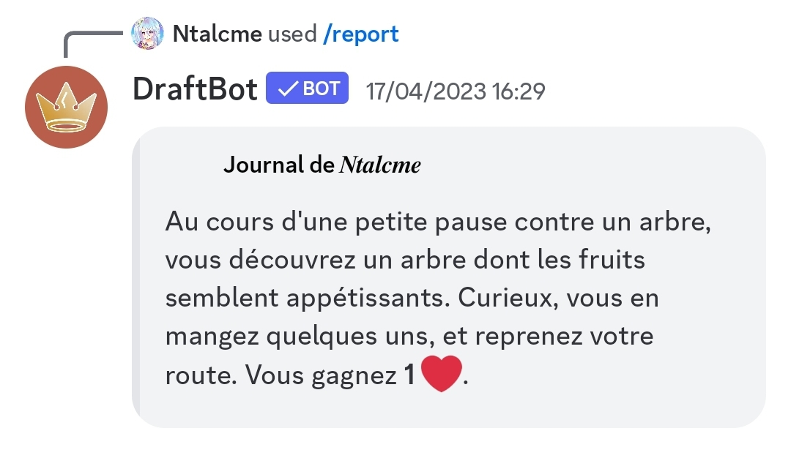
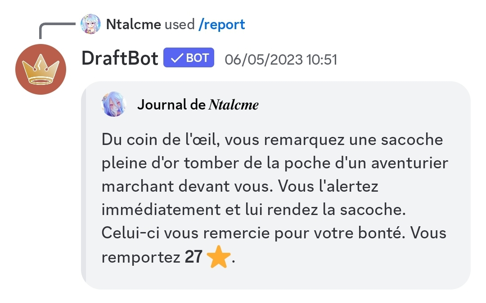
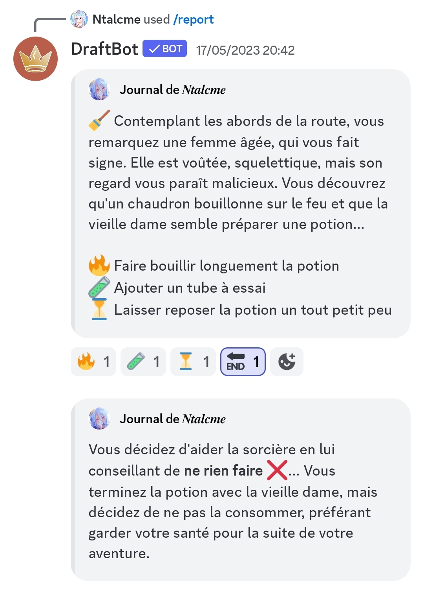
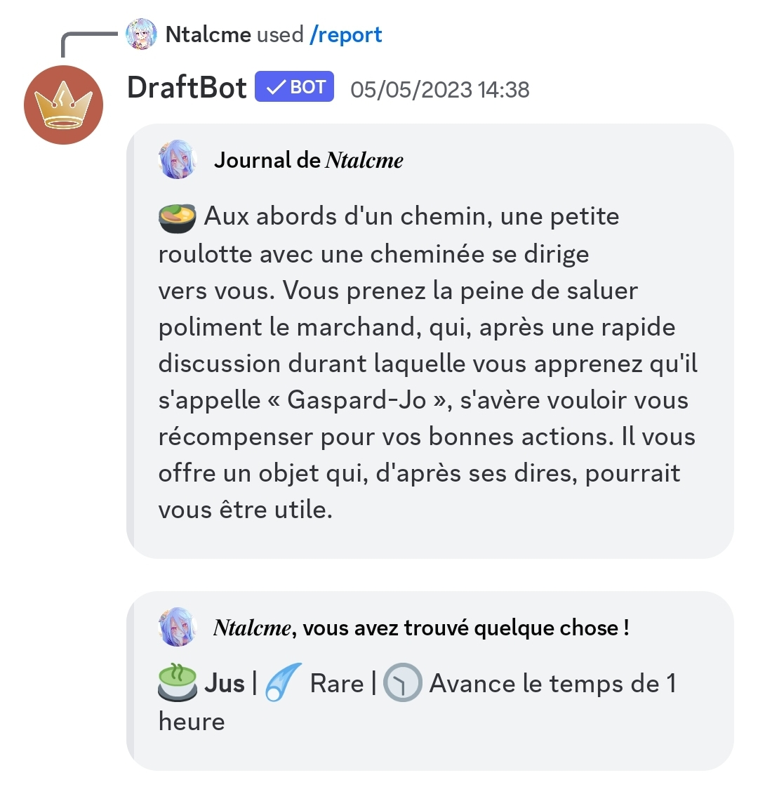
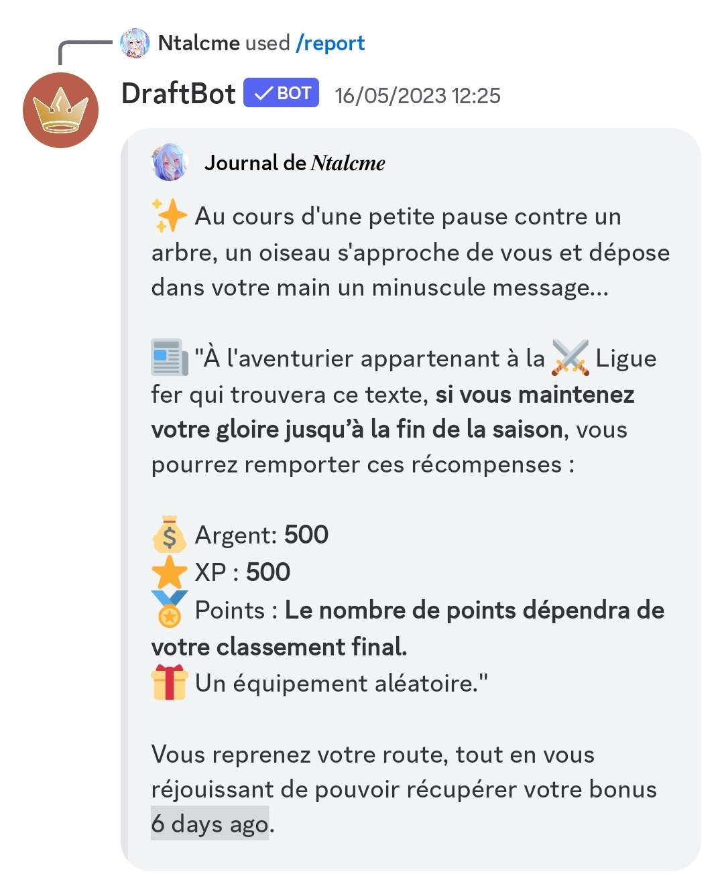

# Mini-évènements

Il existe actuellement 25 types de mini-évènements différents dans le bot. Voici quelques informations au sujet des mini-évènements qui vous permettront d'aborder cette fonctionnalité de manière plus stratégique.

Plus la valeur de la rareté d'un mini-évènement est élevée, plus celui-ci est fréquent.


La rareté maximale actuelle est de 12 (très fréquent) !


## Mini-shop

**Rareté :** **4**

Vous permet d'acheter un objet pour pas cher (60 % du prix). Il n'est pas possible d'obtenir des objets de rareté supérieure à spécial. Si vous achetez un objet mais que vous n'acceptez pas de remplacer votre objet, l'objet sera racheté par le vendeur pour un prix réduit à son prix d'achat.


Attention une faible proportion de vendeurs sont des arnaqueurs et tenteront de vous vendre des items pour 5 fois plus cher !


.png>)

## Interaction avec un familier

**Rareté : 10** - Nécessite d'avoir un familier équipé pour apparaître.

Réalise une interaction entre le propriétaire d'un familier et son familier. Ce mini-évènement peut être positif ou négatif en fonction de l'affection du familier. Les familiers plus rares permettent d'obtenir de meilleures récompenses.

| Récompense                 | Nombre d'étoiles du familier | Probabilité |
| -------------------------- | ---------------------------- | ----------- |
| Argent (20 à 70)           | 3                            | Élevée      |
| Nourriture                 | 1                            | Moyenne     |
| Item                       | 5                            | Faible      |
| Points de vie (1 à 5)      | 4                            | Moyenne     |
| Rien ne se passe           | 1                            | Très élevée |
| Un peu d'affection (1 à 3) | 2                            | Moyenne     |
| Temps (5 à 20 minutes)     | 3                            | Faible      |
| Points bonus (20 à 70)     | 1                            | Moyenne     |
| Badge                      | 6                            | Très faible |
| Énergie (10 à 250)         | 1                            | Élevée      |


Si un familier est dressé, il compte dans le calcul des récompenses accessibles comme ayant une étoile en plus.


| Malus                           | Probabilité |
| ------------------------------- | ----------- |
| Perte de vie (1 à 5)            | Moyenne     |
| Perte d'argent (20 à 70)        | Moyenne     |
| Perte de temps (5 à 20 minutes) | Moyenne     |
| Perte d'affection (1 à 3)       | Moyenne     |
| Fuite du familier               | Très faible |

.png>)

## Trouver un familier

**Rareté : 2**

Le joueur découvre un familier qui le rejoint dans son aventure. Si le joueur a déjà un familier, le nouveau est placé dans le refuge de la guilde du joueur.


Si il n'y a plus de place dans le refuge de la guilde du joueur et que ce dernier possède déjà un familier alors cet évènement ne rapportera pas de nouveau familier.


Voilà les probabilités d'obtention pour chaque rareté de familiers :

|          |          |         |         |         |
| -------- | -------- | ------- | ------- | ------- |
| 1 :star: | 2 :star: | 3:star: | 4:star: | 5:star: |
| 87.6%    | 9.64%    | 1.664%  | 0.65%   | 0.446%  |

.png>)

## Trouver un équipement

**Rareté : 2**

Le joueur découvre un équipement aléatoire. Il n'est pas possible d'obtenir des objets légendaires ou mythiques dans ce mini-évènement.

.png>)

## Rien ne se passe

**Rareté : 8**&#x20;

Ce mini-évènement affiche simplement une phrase d'encouragement pour le joueur.

.png>)

## Petit malheur

**Rareté : 8**

Parfois, tout ne se passe pas comme prévu. Certains mini-évènements amènent à de petits malus.

| Malus                    | Effet                        |
| ------------------------ | ---------------------------- |
| Perte de vie             | 1 à 5 points de vie perdus   |
| Perte d'argent           | 10 à 50 d'argent perdus      |
| Perte de temps aléatoire | 5 minutes à 2 heures perdues |

.png>)

## Gros malheur

**Rareté : 1**

Parfois, tout ne se passe pas comme prévu. Certain mini-évènements amènent à de gros malus. Heureusement, cela reste très rare !

| Malus             | Effet                                                |
| ----------------- | ---------------------------------------------------- |
| Perte de vie      | 5 à 30 points de vie perdus                          |
| Perte d'argent    | 50 à 250 d'argent perdus                             |
| Altération d'état | Le joueur peut être touché par une altération d'état |

.png>)

## Loterie

**Rareté : 3**

Durant votre voyage, un gérant de jeu de hasard peut vous croiser et vous proposer de tenter votre chance pour recevoir un peu d'argent, d'XP ou de points. Pour cela, 3 mises sont à disposition:

* :coin: **Petite mise**
* :dollar: **Mise moyenne**
* :moneybag: **Grosse mise**

Les gains et malus dépendent de la mise choisie:



Gains possibles (80%) :&#x20;

* 35 :medal:
* 70 XP de guilde
* 50 :moneybag:
* 40 :star:

Malus  :&#x20;

* Rien (20%)



Gains possibles (50%) :&#x20;

* 105 :medal:
* 210 XP de guilde
* 150 :moneybag:
* 120 :star:

Malus :&#x20;

* 10 minutes :clock1: (100%)



Gains possibles (20%) :&#x20;

* 350 :medal:
* 700 XP de guilde
* 500 :moneybag:
* 400 :star:

Malus :&#x20;

* 10 minutes :clock1: (100%)
* 175 :money\_with\_wings: (10%)




Vous devez avoir au moins 175 d'argent pour tenter votre chance à la loterie. Si vous en possédez moins, votre mise sera rejetée par le gérant du jeu de hasard.


<figure><figcaption>
Un exemple de loterie
</figcaption></figure>

## Interaction avec un joueur sur le même trajet

**Rareté : 12**

Il est possible de rencontrer d'autres joueurs sur le même trajet en voyageant. Ce mini-évènement permet de discuter avec un joueur que vous croisez, que vous suivez ou que vous précédez !

Il existe une multitude de phrases en fonction de la situation de la personne que vous croisez !

Voilà la liste des caractéristiques qui peuvent être exploitées :

* Top 10
* Top 50
* Top 100
* Top 1
* Guilde puissante
* Débutant
* Niveau 50 ou plus
* Inactif
* Même classe que le joueur
* Même guilde
* Membre du staff
* Point du classement de la semaine
* Peu de vie
* Beaucoup de vie
* Mieux classé
* Moins bien classé
* Riche
* Pauvre
* Duplication de potion
* Familier
* Chef de guilde
* Aîné de guilde
* Classe du joueur
* Altération d'état
* Inventaire du joueur

.png>)

## Avancement du temps

**Rareté : 6**

Avance le temps de 10 à 50 minutes.

<figure><figcaption>
Exemple d'avancement du temps
</figcaption></figure>

## Faits du Bot

**Rareté : 2**

Raconte une information à propos du bot parmi celles-ci :

* Moyenne des points totaux des joueurs
* Moyenne des points durant la semaine
* Nombre de joueurs qui ont commencé leur aventure
* Moyenne du niveaux des joueurs
* Argent total en circulation
* Balance du joueur le plus riche
* Nombre de pets dressés
* Nombre de pets fielleux
* Pourcentage de pets femelles dans le jeu
* Pourcentage de pets mâles dans le jeu
* Moyenne du niveau des guildes
* Nombre de joueurs d'une classe
* Nombre de joueurs voyageant sur notre chemin&#x20;

<figure><figcaption>
Exemple d'une information à propos du bot
</figcaption></figure>

## Vote

**Rareté : 4**

Obtenir une récompense en ayant voté pour le bot sur top.gg parmi celles-ci :

* Argent (entre 150 et 250)
* Item aléatoire

Si vous n'aviez pas voté pour le bot, vous ne verrez qu'un rappel pour voter pour celui-ci.

<figure><figcaption>
Exemple de récompense du vote
</figcaption></figure>

## Classes

**Rareté : 4**

Vous gagnez une récompense qui dépend de votre classe.

| Classes                               | Items                                                                   |
| ------------------------------------- | ----------------------------------------------------------------------- |
| Recrue :herb:                         | Item au hasard ou argent (entre 50:moneybag:et 150:moneybag:)           |
| Combattant :axe:                      | Item au hasard ou argent (entre 50:moneybag:et 150:moneybag:)           |
| Soldat :dagger:                       | Item au hasard ou argent (entre 50:moneybag:et 150:moneybag:)           |
| Fantassin :crossed\_swords:           | Item au hasard ou argent (entre 50:moneybag:et 150:moneybag:)           |
| Ganté :boxing\_glove:                 | Objet de défense, potion de défense ou armure                           |
| Casqué :military\_helmet:             | Objet de défense, potion de défense ou armure                           |
| Maillé :chains:                       | Objet de défense, potion de défense ou armure                           |
| Tank :shield:                         | Objet de défense, potion de défense ou armure                           |
| Lanceur de pierre :rock:              | Objet d'attaque, potion d'attaque ou arme                               |
| Frondeur :mechanical\_arm:            | Objet d'attaque, potion d'attaque ou arme                               |
| Archer :bow\_and\_arrow:              | Objet d'attaque, potion d'attaque ou arme                               |
| Canonnier :gun:                       | Objet d'attaque, potion d'attaque ou arme                               |
| Ecuyer :broom:                        | Item au hasard ou argent (entre 50:moneybag:et 150:moneybag:)           |
| Cavalier :horse\_racing:              | Item au hasard ou argent (entre 50:moneybag:et 150:moneybag:)           |
| Piquier :probing\_cane:               | Item au hasard ou argent (entre 50:moneybag:et 150:moneybag:)           |
| Chevalier :person\_fencing:           | Item au hasard ou argent (entre 50:moneybag:et 150:moneybag:)           |
| Paladin :fleur-de-lis:                | Objet de défense, potion de défense ou armure                           |
| Vétéran :trident:                     | Item au hasard ou gagner des points de vie (entre 1:heart:et 5:heart:)  |
| Fantassin puissant :crossed\_swords:  | Item au hasard ou argent (entre 50:moneybag:et 150:moneybag:)           |
| Tank impénétrable :shield:            | Objet de défense, potion de défense ou armure                           |
| Canonnier redoutable :gun:            | Objet d'attaque, potion d'attaque ou arme                               |
| Chevalier valeureux :person\_fencing: | Item au hasard ou argent (entre 50:moneybag:et 150:moneybag:)           |
| Paladin lumineux :fleur-de-lis:       | Objet de défense, potion de défense ou armure                           |
| Vétéran chevronné :trident:           | Item au hasard ou gagner des points de vie (entre 1 :heart:et 5:heart:) |
| Mage mystique :mage:                  | Item au hasard ou gagner des points de vie (entre 1 :heart:et 5:heart:) |

<figure><figcaption>
Exemple de gain dépendant d'une classe
</figcaption></figure>

## Trouver une mission

**Rareté : 6**

Vous obtenez une mission secondaire.


Vous pouvez avoir jusqu'à 3 missions secondaires au maximum.


<figure><figcaption>
Exemple d'obtention d'une mission secondaire
</figcaption></figure>

## Trouver une potion

**Rareté : 8**

Vous trouvez une potion aléatoire.

<figure><figcaption>
Exemple de gain de potion
</figcaption></figure>

## Gobelets

**Rareté : 2**

Un homme suspect s'approche de vous et vous fait participer à un jeu composé de trois gobelets :&#x20;

* Gobelet en métal :dragon\_face:
* Grand gobelet :bucket:
* Gobelet scintillant sculpté dans un bois bleu :sparkles:

Vous devrez faire un choix entre ces trois gobelets qui vous donnera une des issues suivantes :&#x20;

* Perdre une certaine quantité de vie dépendant de votre niveau
* Une altération qui dépend de votre niveau
* Rien


En réagissant avec :end:, l'action "Ne rien faire" se déclenche et vous perdez une quantité de vie dépendant de votre niveau.


<figure><figcaption>
Exemple du jeu de gobelets
</figcaption></figure>

## Membres du staff

**Rareté : 1**

Ce mini-évènement vous contera une histoire à propos d'un membre du staff.

* Nysvaa
* Thero1st
* Oscar
* QQtin
* LePourfendeur
* Ines
* romain22222
* Izuku
* Draft
* Royal
* Max
* Eagle
* DeadAngelV6
* Kyusaki
* Greninja\_san
* nwcubeok
* SuperBananeNinja
* Hitori
* Pietagorh
* Doctor
* KirIcare
* symsym
* Pagotortoise
* Voltou

<figure><figcaption>
Exemple de légende d'un staff
</figcaption></figure>

## Espace

**Rareté : 3**

Vous rencontrez un homme se disant être un oracle, il vous donnera une vraie information (hormis quelques détails, comme les noms) sur l'espace parmi celles-ci :

* Un objet se rapprochant de la Terre
* Les phases de la Lune
* La prochaine pleine Lune
* La prochaine éclipse lunaire partielle
* La prochaine éclipse lunaire totale

<figure><figcaption>
Exemple de rencontre avec l'oracle
</figcaption></figure>

## Récupération totale d'énergie

**Rareté : 8**

Vous rencontrez une jeune femme qui vous fera regagner toute votre énergie.


Vous n'obtiendrez ce mini-évènement uniquement si votre énergie n'est pas déjà complète.



La guérisseuse ne se balade qu'autour de Claire De Ville.&#x20;


<figure><figcaption>
Exemple de récupération d'énergie
</figcaption></figure>

## Gagner de l'expérience de guilde

**Rareté : 5**

Grâce à vous, votre guilde se fait connaitre et elle remporte de l'expérience de guilde dépendant du niveau de celle-ci.


Vous n'obtiendrez ce mini-évènement uniquement si vous faites parti d'une guilde qui n'est pas niveau 100.


<figure><figcaption>
Exemple de gain d'expérience de guilde
</figcaption></figure>

## Gagner des points de vies

**Rareté : 3**

Durant votre voyage, il vous arrivera de pouvoir récupérer des points de vies entre 1:heart:et 4:heart:.&#x20;


Vous n'obtiendrez ce mini-évènement uniquement si votre vie n'est pas déjà à son maximum.


<figure><figcaption>
Exemple de gain de points de vie
</figcaption></figure>

## Gagner de l'expérience

**Rareté : 3**

Durant votre voyage, il vous arrivera de gagner de l'expérience entre 10:star:et 35:star:.

<figure><figcaption>
Exemple de gain d'expérience
</figcaption></figure>

## Sorcière

**Rareté : 4**

Vous rencontrez une sorcière préparant une potion. Vous pourrez lui conseiller de :&#x20;

* Faire une action
* Ajouter un ingrédient
* Ajouter un ingrédient ou faire une action

Selon votre choix, vous pourrez :&#x20;

* Recevoir une potion
* Avoir une altération d'état
* Perdre la vie
* Ne rien avoir


En réagissant avec :end:, l'action "Ne rien faire" se déclenche et il ne vous arrivera rien.



Si vous êtes de la classe **Mage Mystique** :mage:, un quatrième choix s'offrira à vous et vous pourrez soit ajouter un ingrédient ou faire une action.


<figure><figcaption>
Exemple de rencontre avec la sorcière
</figcaption></figure>

## Marchand ultime de nourriture

**Rareté : 1**

Vous rencontrez un marchand qui vous donnera une récompense parmi celles-ci :

* XP pour votre guilde si celle-ci n'est pas déjà au niveau max.
* Des bonbons si votre guilde est inférieur au niveau 30 et que votre entrepôt vous le permet
* Des soupes ultimes si votre guilde est supérieure ou égale au niveau 30 et que votre entrepôt vous le permet
* Un item aléatoire, dépendant de votre niveau, si votre guilde est supérieure ou égale au niveau 30

Si vous n'avez pas de guilde, vous recevrez de l'argent.

<figure><figcaption>
Exemple du marchand ultime de nourriture
</figcaption></figure>

## Récompenses de ligue

**Rareté : 2**

Ce mini-évènement vous donnera des informations sur les récompenses de votre ligue.

<figure><figcaption>
Exemple d'informations des récompenses de ligue
</figcaption></figure>

## Voyage vers l'île du [PVE](pve.md)

**Rareté : 12 (si les conditions sont remplies)**

Ce mini-event vous permet de voyager vers l'île du PVE, celui-ci ne se déclenche que si vous êtes à 80% minimum de votre énergie maximale et son prix augmente à chaque trajet effectué dans l'ordre suivant : Gratuit - 15 :gem: - 25 :gem:. Une fois 3 trajets effectués il ne vous est plus possible d'aller sur l'île, vous devrez attendre la semaine prochaine !


Ce mini-event ne se déclenche qu'au bord d'un point d'eau !


<figure><figcaption>
et c'est parti !
</figcaption></figure>
