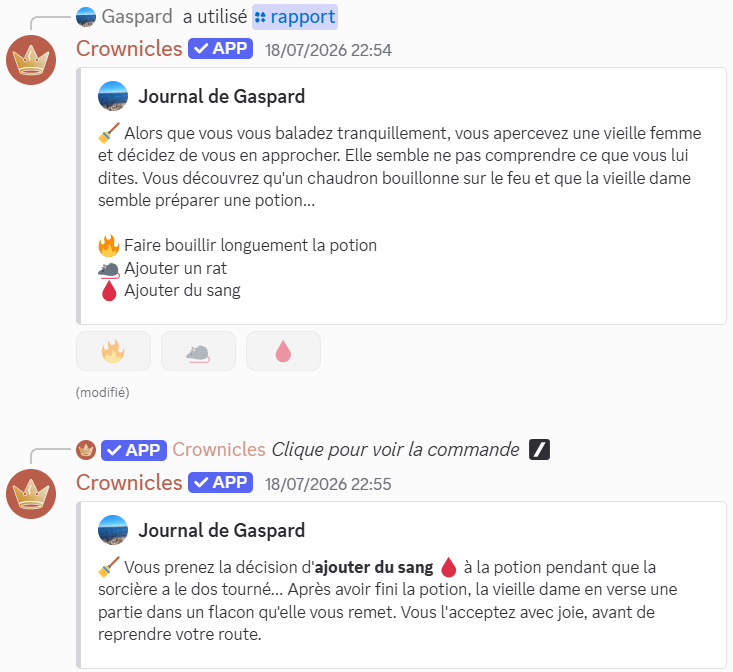
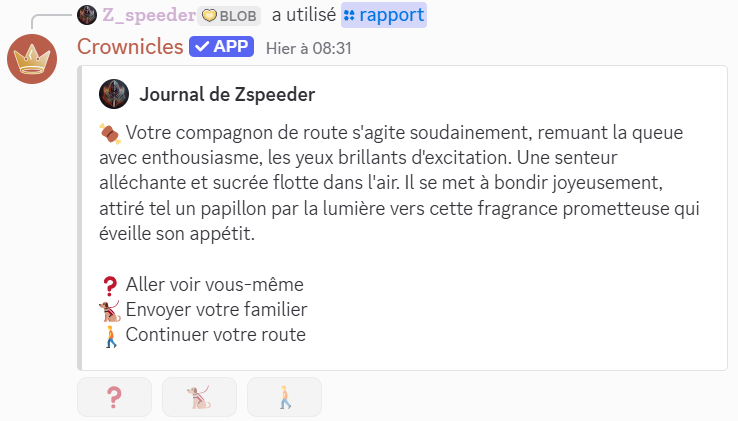
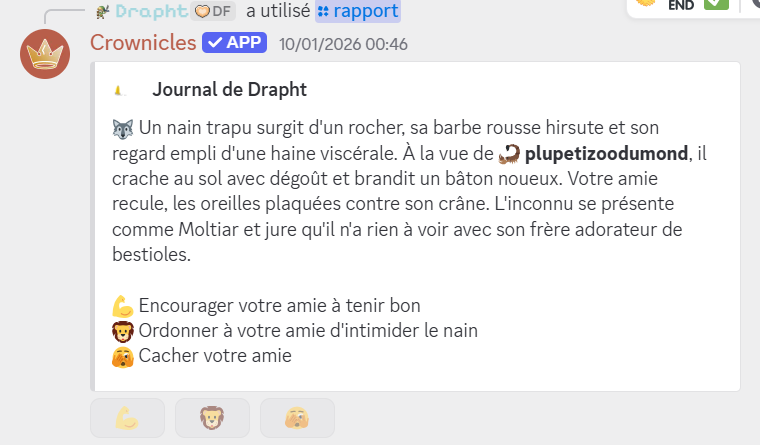
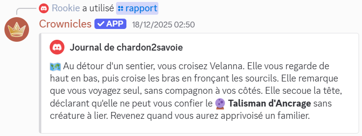
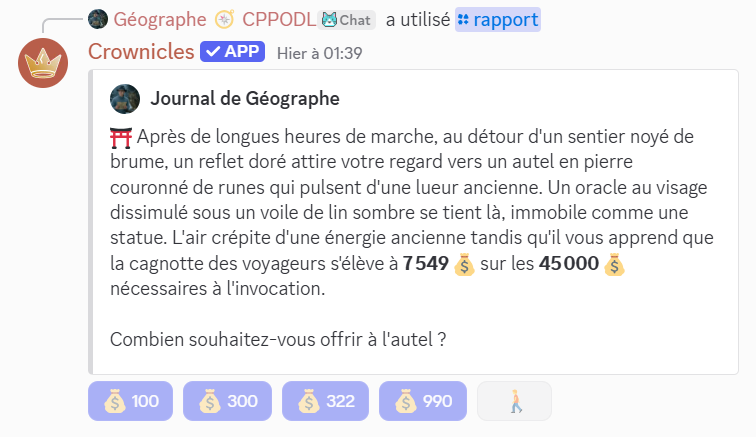
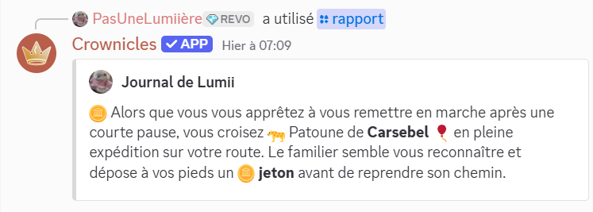
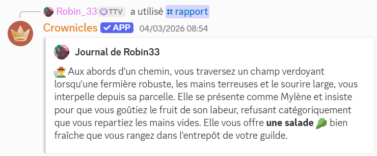

# Mini-évènements sur le continent principal

Il existe actuellement plusieurs types de mini-évènement dans le bot. Voici quelques informations au sujet des mini-évènements qui vous permettront d'aborder cette fonctionnalité de manière plus stratégique.

Plus la valeur de la rareté d'un mini-évènement est élevée, plus celui-ci est fréquent.


Info supplémentaire :  pour le coté technique, la sélection aléatoire des mini-évènements se déroule ainsi : toutes les raretés de tous les mini-évènements sont additionnées, puis un nombre aléatoire entre 0 et le résultat est choisi aléatoirement, puis dans un ordre précis on soustrait à ce nombre la rareté de différents mini-évènements, et celui qui le fait atteindre 0 est choisi.


## Marchand ambulant

**Rareté :** **4**

Vous permet d'acheter un équipement pour pas cher (60 % du prix). Il n'est pas possible d'obtenir des objets de rareté supérieure à spécial. Si vous achetez un objet mais que vous n'acceptez pas de remplacer votre ancien objet, l'objet sera racheté par le vendeur pour un prix inférieur à son prix d'achat.


Attention, une faible proportion de vendeurs sont des arnaqueurs et tenteront de vous vendre des équipements pour 5 fois plus cher !


<picture><source srcset="../.gitbook/assets/Capture d&#x27;écran 2025-06-19 191024.png" media="(prefers-color-scheme: dark)"></picture>

## Interaction avec un familier

**Rareté : 7** - Nécessite d'avoir un familier équipé pour apparaître.

Réalise une interaction entre le propriétaire d'un familier et son familier. Ce mini-évènement peut être positif ou négatif en fonction de l'affection du familier.&#x20;

Les gains sont dus à la vigueur du familier, un nombre entre 1 et 6 qui dépend de la force et de l'amour de l'animal. Les familiers plus forts et aimants permettent d'obtenir de meilleures récompenses !

| Récompense                 | Vigueur du familier | Probabilité |
| -------------------------- | ------------------- | ----------- |
| Rien ne se passe           | 1                   | Très élevée |
| Nourriture                 | 1                   | Moyenne     |
| Points bonus (20 à 70)     | 1                   | Moyenne     |
| Énergie (10 à 250)         | 1                   | Élevée      |
| Un peu d'affection (1 à 3) | 2                   | Moyenne     |
| Argent (20 à 70)           | 3                   | Élevée      |
| Temps (5 à 20 minutes)     | 3                   | Faible      |
| Points de vie (1 à 5)      | 4                   | Moyenne     |
| Équipement                 | 5                   | Faible      |
| Badge                      | 6                   | Très faible |

Si le familier est fielleux, il ne vous apportera que des malus:

| Malus                           | Probabilité |
| ------------------------------- | ----------- |
| Perte de vie (1 à 5)            | Moyenne     |
| Perte d'argent (20 à 70)        | Moyenne     |
| Perte de temps (5 à 20 minutes) | Moyenne     |
| Perte d'affection (1 à 3)       | Moyenne     |
| Fuite du familier               | Très faible |

<picture><source srcset="../.gitbook/assets/Capture d&#x27;écran 2025-06-19 191231.png" media="(prefers-color-scheme: dark)"></picture>

## Trouver un familier

**Rareté : 2**

Le joueur découvre un familier qui le rejoint dans son aventure. Si le joueur a déjà un familier, le nouveau est placé dans le refuge de la guilde du joueur.


S'il n'y a plus de place dans le refuge de la guilde du joueur et que ce dernier possède déjà un familier alors ce mini-évènement ne rapportera pas de nouveau familier.


Voilà les probabilités d'obtention de chaque rareté de familiers :

|                                 |                   |                    |             |                |               |                    |                |
| ------------------------------- | ----------------- | ------------------ | ----------- | -------------- | ------------- | ------------------ | -------------- |
| Commun :large\_orange\_diamond: | Peu commun :fire: | Exotique :trident: | Rare:comet: | Spécial:dizzy: | Épique :star: | Légendaire :star2: | Mythique :gem: |
| 43,75%                          | 25%               | 15%                | 10%         | 5%             | 1%            | 0,23%              | 0,02%          |

<picture><source srcset="../.gitbook/assets/Capture d&#x27;écran 2025-06-19 191320.png" media="(prefers-color-scheme: dark)"></picture>

## Trouver un équipement

**Rareté : 2**

Le joueur découvre un équipement aléatoire. Il n'est pas possible d'obtenir des objets légendaires ou mythiques dans ce mini-évènement.

<picture><source srcset="../.gitbook/assets/Capture d&#x27;écran 2025-06-19 191454.png" media="(prefers-color-scheme: dark)"></picture>

## Rien ne se passe

**Rareté : 6**&#x20;

Ce mini-évènement affiche simplement une phrase d'encouragement pour le joueur.

<picture><source srcset="../.gitbook/assets/Capture d&#x27;écran 2025-06-19 191537.png" media="(prefers-color-scheme: dark)"></picture>

## Petit malheur

**Rareté : 7**

Parfois, tout ne se passe pas comme prévu. Certains mini-évènements amènent à de petits malus.

| Malus                    | Effet                                     |
| ------------------------ | ----------------------------------------- |
| Perte de vie             | 1 à 5 points de vie perdus                |
| Perte d'argent           | 10 à 50 d'argent perdus                   |
| Perte de temps aléatoire | 5 minutes à 2 heures perdues              |
| Altération endormi       | L'altération endormi a une durée variable |

<picture><source srcset="../.gitbook/assets/Capture d&#x27;écran 2025-06-19 191648.png" media="(prefers-color-scheme: dark)"></picture>

## Gros malheur

**Rareté : 1**

Parfois, tout ne se passe pas comme prévu. Certain mini-évènements amènent à de gros malus. Heureusement, cela reste très rare !

| Malus             | Effet                                                |
| ----------------- | ---------------------------------------------------- |
| Perte de vie      | 5 à 30 points de vie perdus                          |
| Perte d'argent    | 50 à 250 d'argent perdus                             |
| Altération d'état | Le joueur peut être touché par une altération d'état |

<picture><source srcset="../.gitbook/assets/Capture d&#x27;écran 2025-06-19 191743.png" media="(prefers-color-scheme: dark)"></picture>

## Loterie

**Rareté : 3**

Durant votre voyage, un gérant de jeu de hasard peut vous croiser et vous proposer de tenter votre chance pour recevoir un peu d'argent, d'XP ou de points. Pour cela, 3 mises sont à disposition:

* :coin: **Petite mise**
* :dollar: **Mise moyenne**
* :moneybag: **Grosse mise**

Les gains et malus dépendent de la mise choisie:



Gains possibles (80%) :&#x20;

* 35 :medal:
* 70 XP de guilde
* 50 :moneybag:
* 40 :star:

Malus  :&#x20;

* Rien (20%)



Gains possibles (50%) :&#x20;

* 105 :medal:
* 210 XP de guilde
* 150 :moneybag:
* 120 :star:

Malus :&#x20;

* 10 minutes :clock1: (100%)



Gains possibles (20%) :&#x20;

* 350 :medal:
* 700 XP de guilde
* 500 :moneybag:
* 400 :star:

Malus :&#x20;

* 10 minutes :clock1: (100%)
* 175 :money\_with\_wings: (10%)




Vous devez avoir au moins 175 d'argent pour tenter votre chance pour la :moneybag: grosse mise. Si vous en possédez moins, votre mise sera rejetée par le gérant du jeu de hasard.


<figure><picture><source srcset="../.gitbook/assets/Capture d&#x27;écran 2025-06-19 191915.png" media="(prefers-color-scheme: dark)"></picture><figcaption>
Un exemple de loterie
</figcaption></figure>

## Interaction avec un joueur sur le même trajet

**Rareté : 10**

Il est possible de rencontrer d'autres joueurs sur le même trajet en voyageant. Ce mini-évènement permet de discuter avec un joueur que vous croisez, que vous suivez ou que vous précédez !

Il existe une multitude de phrases en fonction de la situation de la personne que vous croisez !

Voilà la liste des caractéristiques qui peuvent être exploitées :

* Top 1/10/50/100
* Guilde puissante
* Membre de l'équipe technique
* Débutant
* Niveau 50 ou plus
* Même classe que le joueur
* Même guilde
* Points du classement de la semaine
* Peu ou beaucoup de vie
* Inactif
* Mieux ou moins bien classé
* Riche ou pauvre
* Familier : espèce/expédition/clone
* Chef ou aîné de guilde
* Altération d'état
* Inventaire du joueur
* Classe du joueur
* Badges :shinto\_shrine:/:compass:/ :revolving\_hearts:/ :ring:
* Ligue supérieur ou identique
* Classement glorieux
* Beaucoup de gemmes
* Beaucoup de jetons
* Possède le talisman d'ancrage ou de clonage
* Même familier
* Familier de type volant ou aquatique
* Victoire contre le titan de magma/le seigneur des glaces/la reine des glaces

<picture><source srcset="../.gitbook/assets/Capture d&#x27;écran 2025-06-19 192003.png" media="(prefers-color-scheme: dark)"></picture>

## Avancement du temps

**Rareté : 6**

Avance le temps de 10 à 50 minutes.

<figure><picture><source srcset="../.gitbook/assets/Capture d&#x27;écran 2025-06-19 192306.png" media="(prefers-color-scheme: dark)"></picture><figcaption>
Exemple d'avancement du temps
</figcaption></figure>

## Faits du Bot

**Rareté : 2**

Vous découvrirez une information à propos du bot.

Une liste des différentes informations possibles:

* Moyenne des points totaux des joueurs
* Moyenne des points durant la semaine
* Nombre de joueurs qui ont commencé leur aventure
* Moyenne du niveau des joueurs
* Argent total en circulation
* Balance du joueur le plus riche
* Nombre de familiers dressés
* Nombre de familiers fielleux
* Pourcentage de familiers femelles dans le jeu
* Pourcentage de familiers mâles dans le jeu
* Moyenne du niveau des guilde
* Nombre de joueurs d'une classe
* Nombre de joueurs voyageant sur votre chemin&#x20;

<figure><picture><source srcset="../.gitbook/assets/Capture d&#x27;écran 2025-06-19 192421.png" media="(prefers-color-scheme: dark)"></picture><figcaption>
Exemple d'une information à propos du bot
</figcaption></figure>

## Classes

**Rareté : 4**

Vous gagnez une récompense qui dépend de votre classe.

| Classes                               | Récompense                                                             |
| ------------------------------------- | ---------------------------------------------------------------------- |
| Recrue :herb:                         | Équipement aléatoire ou argent (entre 50:moneybag:et 150:moneybag:)    |
| Combattant :axe:                      | Équipement aléatoire ou argent (entre 50:moneybag:et 150:moneybag:)    |
| Soldat :dagger:                       | Équipement aléatoire ou argent (entre 50:moneybag:et 150:moneybag:)    |
| Fantassin :crossed\_swords:           | Équipement aléatoire ou argent (entre 50:moneybag:et 150:moneybag:)    |
| Ganté :boxing\_glove:                 | Objet de défense, potion de défense ou armure :shield:                 |
| Casqué :military\_helmet:             | Objet de défense, potion de défense ou armure :shield:                 |
| Maillé :chains:                       | Objet de défense, potion de défense ou armure :shield:                 |
| Tank :shield:                         | Objet de défense, potion de défense ou armure:shield:                  |
| Lanceur de pierre :rock:              | Objet d'attaque, potion d'attaque ou arme :dagger:                     |
| Frondeur :mechanical\_arm:            | Objet d'attaque, potion d'attaque ou arme :dagger:                     |
| Archer :bow\_and\_arrow:              | Objet d'attaque, potion d'attaque ou arme :dagger:                     |
| Canonnier :gun:                       | Objet d'attaque, potion d'attaque ou arme :dagger:                     |
| Écuyer :broom:                        | Équipement aléatoire ou argent (entre 50:moneybag:et 150:moneybag:)    |
| Cavalier :horse\_racing:              | Équipement aléatoire ou argent (entre 50:moneybag:et 150:moneybag:)    |
| Piquier :probing\_cane:               | Équipement aléatoire ou argent (entre 50:moneybag:et 150:moneybag:)    |
| Chevalier :person\_fencing:           | Équipement aléatoire ou argent (entre 50:moneybag:et 150:moneybag:)    |
| Paladin :fleur-de-lis:                | Objet de défense, potion de défense ou armure                          |
| Vétéran :trident:                     | Équipement aléatoire ou des points de vie (entre 1:heart:et 5:heart:)  |
| Fantassin puissant :crossed\_swords:  | Équipement aléatoire ou argent (entre 50:moneybag:et 150:moneybag:)    |
| Tank impénétrable :shield:            | Objet de défense, potion de défense ou armure :shield:                 |
| Canonnier redoutable :gun:            | Objet d'attaque, potion d'attaque ou arme :dagger:                     |
| Chevalier valeureux :person\_fencing: | Équipement aléatoire ou argent (entre 50:moneybag:et 150:moneybag:)    |
| Paladin lumineux :fleur-de-lis:       | Objet de défense, potion de défense ou armure :shield:                 |
| Vétéran chevronné :trident:           | Équipement aléatoire ou des points de vie (entre 1 :heart:et 5:heart:) |
| Mage mystique :mage:                  | Équipement aléatoire ou des points de vie (entre 1 :heart:et 5:heart:) |

<figure><picture><source srcset="../.gitbook/assets/Capture d&#x27;écran 2025-06-19 192517.png" media="(prefers-color-scheme: dark)"></picture><figcaption>
Exemple de gain dépendant d'une classe
</figcaption></figure>

## Trouver une mission

**Rareté : 9**

Vous obtenez une mission secondaire. Vous pouvez en accumuler jusqu'à 3 dépendant de votre niveau.&#x20;

<figure><picture><source srcset="../.gitbook/assets/Capture d&#x27;écran 2025-06-19 190037.png" media="(prefers-color-scheme: dark)"></picture><figcaption>
Exemple d'obtention d'une mission secondaire
</figcaption></figure>

## Trouver une potion

**Rareté : 8**

Vous trouvez une potion aléatoire.

<figure><picture><source srcset="../.gitbook/assets/Capture d&#x27;écran 2025-06-19 192729.png" media="(prefers-color-scheme: dark)"></picture><figcaption>
Exemple de gain de potion
</figcaption></figure>

## Gobelets

**Rareté : 2**

Un homme suspect s'approche de vous et vous fait participer à un jeu. Vous devrez faire un choix entre quatre gobelets qui vous donnera une des issues suivantes :&#x20;

* Perdre une quantité de vie dépendant de votre niveau
* Une altération qui dépend de votre niveau
* Rien

Vous aurez donc le choix entre ces 4 gobelets :&#x20;

* Un gobelet en métal :dragon\_face:, équilibré. Chaque issue est équiprobable.
* Un grand gobelet :bucket:, peu risqué. Les malus sont constants mais réduits.
* Un gobelet scintillant :sparkles:
* Un gobelet fissuré :skull:, dont les malus sont rares mais bien plus dévastateurs.

<figure><figcaption>
Exemple du jeu des gobelets
</figcaption></figure>


Ce mini-événement n'apparait pas autour de la Route des Merveilles, de la Route Marécageuse et du mont Célestrum.


## Membres de l'équipe

**Rareté : 1**

Ce mini-évènement vous contera une histoire à propos d'un membre de l'équipe du jeu.

Liste des membres qui possèdent leurs légendes:

* Nysvaa
* Thero1st
* Oscar
* QQtin
* LePourfendeur
* Ines
* romain22222
* Izuku
* Draft
* Royal
* Max
* Eagle
* DeadAngelV6
* Kyusaki
* Greninja\_san
* nwcubeok
* SuperBananeNinja
* Hitori
* Pietagorh
* Doctor
* KirIcare
* symsym
* Pagotortoise
* Voltou
* Ntalcme
* aureochocob0n
* BananePlantain
* Ravenclaw
* GabrieLre

<figure><picture><source srcset="../.gitbook/assets/Capture d&#x27;écran 2025-06-19 192946.png" media="(prefers-color-scheme: dark)"></picture><figcaption>
Exemple de légende d'un staff
</figcaption></figure>

## Espace

**Rareté : 3**

Vous rencontrez un homme se disant être un oracle, il vous donnera une vraie information (hormis quelques détails, comme les noms) sur l'espace.

* Un objet se rapprochant de la Terre
* Les phases de la Lune
* La prochaine pleine Lune
* La prochaine éclipse lunaire partielle
* La prochaine éclipse lunaire totale

<figure><picture><source srcset="../.gitbook/assets/Capture d&#x27;écran 2025-06-19 193031.png" media="(prefers-color-scheme: dark)"></picture><figcaption>
Exemple de rencontre avec l'oracle
</figcaption></figure>

## Récupération totale d'énergie

**Rareté : 8**

Vous rencontrez une jeune femme qui vous fera regagner toute votre énergie.


Vous n'obtiendrez ce mini-évènement que si votre énergie n'est pas déjà complète.



La guérisseuse ne se balade qu'autour de Claire De Ville.&#x20;


<figure><picture><source srcset="../.gitbook/assets/Capture d&#x27;écran 2025-06-19 193145.png" media="(prefers-color-scheme: dark)"></picture><figcaption>
Exemple de récupération d'énergie
</figcaption></figure>

## Gagner de l'expérience de guilde

**Rareté : 5**

Grâce à vous, votre guilde se fait connaitre et elle remporte de l'expérience de guilde. La quantité d'expérience de guilde reçue dépend de son niveau.


Ce mini-évènement n'apparaîtra plus si votre guilde atteint le niveau 150.&#x20;


<figure><picture><source srcset="../.gitbook/assets/Capture d&#x27;écran 2025-06-19 193231.png" media="(prefers-color-scheme: dark)"></picture><figcaption>
Exemple de gain d'expérience de guilde
</figcaption></figure>

## Gagner des points de vie

**Rareté : 3**

Durant votre voyage, il vous arrivera de récupérer des points de vies (entre 1:heart:et 4:heart:).&#x20;


Ce mini-évènement n'apparait pas si votre vie est déjà au maximum.


<figure><picture><source srcset="../.gitbook/assets/Capture d&#x27;écran 2025-06-19 193352.png" media="(prefers-color-scheme: dark)"></picture><figcaption>
Exemple de gain de points de vie
</figcaption></figure>

## Gagner de l'expérience

**Rareté : 3**

Durant votre voyage, il vous arrivera de gagner de l'expérience (entre 10:star:et 35:star:).

<figure><picture><source srcset="../.gitbook/assets/Capture d&#x27;écran 2025-06-19 193445.png" media="(prefers-color-scheme: dark)"></picture><figcaption>
Exemple de gain d'expérience
</figcaption></figure>

## Sorcière

**Rareté : 5**

Vous rencontrez une sorcière préparant une potion. Vous pourrez lui conseiller de :&#x20;

* Faire une action
* Ajouter un ingrédient
* Ajouter un ingrédient ou faire une action

Selon votre choix, vous pourrez :&#x20;

* Recevoir une potion :alembic:
* Avoir une altération d'état :clock2:
* Perdre un peu de vie :broken\_heart:
* Ne rien avoir


Si vous êtes de la classe **Mage Mystique** :mage:, un quatrième choix s'offrira à vous et vous pourrez soit ajouter un ingrédient soit faire une action.



Recevoir une potion permet parfois de débloquer une recette de cuisine, selon le type de potion reçue.


<figure><picture><source srcset="../.gitbook/assets/SE_witch_sombre.png" media="(prefers-color-scheme: dark)"></picture><figcaption>
Exemple de rencontre avec la sorcière
</figcaption></figure>


Si ajouter un ingrédient est immédiat, agir sur la concoction vous prendra généralement quelques minutes :clock2:.


Les potions reçues dépendent des choix, mais vous pourrez toujours obtenir une potion sans effet :x:. Le tableau ci-dessous résume les potions que la sorcière :broom: vous fournira si sa préparation est un succès, ainsi que leur rareté - faible, moyenne ou puissante.&#x20;



:bat: / :frog: Potion de temps :clock1030: ou de vitesse :rocket: moyenne\
:eye: Potion de temps :clock1030: puissante\
:bubbles: Potion de vitesse :rocket: moyenne\
:wind\_blowing\_face: Potion de vitesse :rocket: puissante\
:wilted\_rose: Potion de défense :shield: faible\
:ice\_cube: Potion de défense :shield:puissante\
:rat: / :scorpion: / :snake: / :spider: Potion d'attaque :dagger: faible\
:tooth: Potion d'attaque :dagger:  moyenne\
:dragon: Potion d'attaque :dagger: puissante\
:chicken: / :bone: / :worm: Potion d'énergie :zap:\
:green\_apple: / :apple: / :mushroom: / :drop\_of\_blood: / :rose:Potion de vie :heart: faible\
:honey\_pot: Potion de vie :heart: moyenne\
:anatomical\_heart: Potion de vie :heart:\
:bird: / :package: Potion quelconque\
:test\_tube: Potion quelconque moyenne\
:beer: Permet de boire un alcool\
:spider\_web: Sans effet :x:



:crystal\_ball: Potion de temps :clock1030: moyenne \
:alembic: Potion de temps :clock1030: puissante (55 min :clock2:)\
:fire: Potion d'attaque :dagger: puissante (30 min :clock2:)\
:thermometer: Potion d'attaque :dagger: moyenne (15 min :clock2:)\
:spoon: Potion quelconque faible (5 min :clock2:)\
:musical\_note:Potion quelconque moyenne (10 min :clock2:)\
:book:  Potion quelconque moyenne (25 min :clock2:)\
:magic\_wand: Potion quelconque puissante (50 min :clock2:)\
:hourglass\_flowing\_sand: Sans effet :x: (15 min :clock2:)\
:clock10: Sans effet :x: (45 min :clock2:)



## Marchand ultime de nourriture

**Rareté : 2**

Vous rencontrez un marchand qui vous donne une récompense parmi celles-ci :

* Des friandises si votre niveau est inférieur au niveau 30 et que votre entrepôt vous le permet.
* Des soupes ultimes si votre niveau est supérieur ou égal au niveau 30 et que votre entrepôt vous le permet.
* Un équipement aléatoire, dépendant de votre niveau, si le niveau de votre guilde est supérieur ou égal au niveau 30.

Si vous n'avez pas de guilde, vous recevrez de l'argent.

Gaspard-Jo peut aussi vendre diverses recettes de cuisines, dont les prix progressifs sont : 15 - 50 - 100 - 250 - 500 - 750 - 1000 - 1250 - 1500 :moneybag:.

<figure><picture><source srcset="../.gitbook/assets/Capture d&#x27;écran 2025-06-19 193704.png" media="(prefers-color-scheme: dark)"></picture><figcaption>
Exemple de mini-évènement du marchand ultime de nourriture
</figcaption></figure>

## Récompenses de ligue

**Rareté : 2**

Ce mini-évènement vous donnera des informations sur les récompenses de votre ligue.

<figure><picture><source srcset="../.gitbook/assets/Capture d&#x27;écran 2025-06-19 193840.png" media="(prefers-color-scheme: dark)"></picture><figcaption>
Exemple de mini-évènement d'informations sur les récompenses de ligue
</figcaption></figure>


Ce mini-évènement n'apparait plus le dimanche si vous avez déjà récupéré votre récompense de ligue.


## Voyage vers les [îles mystérieuses](iles-mysterieuses.md)

**Rareté : 40 (si les conditions sont remplies)**

Ce mini-évènement vous permet de voyager vers les îles mystérieuses, il ne se déclenche que si vous êtes à 80% minimum de votre énergie ⚡️ maximale et son prix augmente à chaque trajet effectué dans l'ordre suivant : Gratuit - 15 :gem: - 25 :gem:. Une fois 3 trajets effectués, ou si vous venez de rejoindre une guilde, il ne vous est plus possible d'aller sur l'île, vous devrez attendre la semaine suivante !


Ce mini-évènement ne se déclenche qu'au bord d'un point d'eau, une seule fois par trajet !



Ce mini-évènement ne se déclenche que si êtes au moins niveau 20.


<figure><picture><source srcset="../.gitbook/assets/Capture d&#x27;écran 2025-06-19 193928.png" media="(prefers-color-scheme: dark)"></picture><figcaption>
et c'est parti !
</figcaption></figure>

## Marchand épique

**Rareté : 2**

Ce mini-événement vous fera rencontrer Aldéric, un marchand qui vous proposera un équipement de la rareté épique à la rareté légendaire (voir [items.md](../notions-principale/items.md "mention")) à l'exceptions des potions.


Voyager sur le chemin de la :motorway: **Route des merveilles** réduira considérablement le prix de l'achat sinon vous avez 10% de chance d'avoir une réduction mais moins considérable.


<figure><picture><source srcset="../.gitbook/assets/Capture d&#x27;écran 2025-06-19 194042.png" media="(prefers-color-scheme: dark)"></picture><figcaption>
Exemple du marchand épique
</figcaption></figure>

## Une charrette rapide

**Rareté : 4**

Ce mini-événement vous fera rencontrer un individu mystérieux qui vous proposera une destination connue ou non selon les critères suivants:&#x20;

* 35% de chances d'avoir un voyage dont vous connaissez la destination.
* 30% de chances d'avoir un voyage dont vous ne connaissez pas la destination avec un prix réduit.
* 15% de chances d'avoir une destination fausse mais dont le prix est diminué.
* Sinon le voyage est juste moins cher.

<figure><picture><source srcset="../.gitbook/assets/Capture d&#x27;écran 2025-06-19 194155.png" media="(prefers-color-scheme: dark)"></picture><figcaption>
Exemple d'un voyage rapide
</figcaption></figure>

## Le nain fan des animaux

**Rareté: 5**

Ce mini-événement vous fera rencontrer Talvar, un nain amoureux de la cause animale. Il vous récompensera avec une gemme à chaque nouvelle espèce que vous lui présenterait si votre animal n'est pas fielleux (sinon il vous réprimandera vertement). Une fois toutes les espèces répertoriés (mâle ou femelle n'a pas d'importance), vous gagnerez en signe de profond respect le [badge](badges.md) :feet: (et de l'argent si vous l'avez déjà) .

<figure><picture><source srcset="../.gitbook/assets/Capture d&#x27;écran 2025-06-22 120719.png" media="(prefers-color-scheme: dark)"></picture><figcaption>
On raconte que son amour des animaux est aussi immense que sa richesse.
</figcaption></figure>


Ce mini-événement n'apparaît qu'autour du Mont Célestrum.


## Informations sur les combats

**Rareté : 3**&#x20;

Ce mini-événement  vous fera rencontrer Sir Rowan, ancien capitaine de la garde royale.Il vous présentera les différentes attaques du jeu qu'elles soient humaines ou monstrueuses.

<figure><picture><source srcset="../.gitbook/assets/Capture d&#x27;écran 2025-06-19 194531.png" media="(prefers-color-scheme: dark)"></picture><figcaption></figcaption></figure>


Sir Rowan a également une (infime) chance de vous indiquer si votre personnage est droitier ou gaucher.


## L'homme étrange amoureux de sa ville

**Rareté : 2**

Ce mini-événement vous fera rencontrer un conteur passionné par une cité lointaine. Il vous interrogera sur l’intérêt que vous portez à cette ville. Vos réponses détermineront s’il vous récompense ou non.

<figure><picture><source srcset="../.gitbook/assets/Capture d&#x27;écran 2025-10-08 175955.png" media="(prefers-color-scheme: dark)"></picture><figcaption></figcaption></figure>

<figure><picture><source srcset="../.gitbook/assets/Capture d&#x27;écran 2025-10-08 180038.png" media="(prefers-color-scheme: dark)"></picture><figcaption>
Exemple de récompenses obtenues selon vos réponses.
</figcaption></figure>

## Le familier trouve de la nourriture

**Rareté : 5 -** Nécessite d'avoir un familier équipé pour apparaître.

Lors de ce mini-événement votre familier peut trouver de la nourriture.


Vous n'obtiendrez ce mini-évènement que si votre familier n'a pas été nourri récemment.


<figure><picture><source srcset="../.gitbook/assets/SE_petfood_sombre.png" media="(prefers-color-scheme: dark)"></picture><figcaption></figcaption></figure>

## Malheur pour votre familier

**Rareté : 3 -** Nécessite d'avoir un familier équipé pour apparaître.

Ce mini-événement vous fera rencontrer Moltiar, un nain qui possède une haine profonde des animaux. Prenez garde à lui, il pourrait s'en prendre à votre familier !

<figure><picture><source srcset="../.gitbook/assets/SE_badpet_sombre.png" media="(prefers-color-scheme: dark)"></picture><figcaption></figcaption></figure>



## Conseils sur les expéditions

**Rareté : 4**

Ce mini-événement vous fera rencontrer Velanna, une puissante guerrière, qui vous donnera des conseils sur les expéditions de familier.

<figure><picture><source srcset="../.gitbook/assets/SE_expeditionadvice_sombre.png" media="(prefers-color-scheme: dark)"></picture><figcaption></figcaption></figure>

## Autel

**Rareté : 6**

Lors de ce mini-événement, un oracle vous fera comprendre qu'un don dans sa cagnotte sera le bienvenu pour déclencher une [bénédiction](benedictions.md).


Vous ne rencontrerez pas l'oracle pendant qu'une bénédiction est active sauf pour se présenter.



Ce mini-événement est limité à une fois par trajet.


<figure><picture><source srcset="../.gitbook/assets/SE_altar_sombre.png" media="(prefers-color-scheme: dark)"></picture><figcaption></figcaption></figure>


Les options de dons sont 100, 2% de la richesse du joueur, 10x le niveau du joueur. La dernière option propose différents paliers compris en 50 et 1500.



Après de grandes quantités de dons vous obtiendrez un [badge](badges.md) :shinto\_shrine: et chaque don supérieur à 100 peut vous donner 5 :gem: (avec une probabilité croissante au montant du don) et/ou un équipement (probabilité fixe de 4%).


## Un familier vous offre un jeton

**Rareté : 1**

Ce mini-événement vous fera rencontrer le familier d'un autre joueur qui est en expédition, il vous donnera un jeton.

<figure><picture><source srcset="../.gitbook/assets/SE_petdroptoken_sombre.png" media="(prefers-color-scheme: dark)"></picture><figcaption></figcaption></figure>

## Fermière

**Rareté : 20**

Ce mini-événement vous fera rencontrer une fermière qui vous donnera de la salade, si vous n'avez pas de guilde ou que votre entrepôt est plein, elle vous donnera un objet.

La fermière peut aussi vendre des recettes :scroll: de cuisine, dont les prix progressifs sont : 15 - 50 - 100 - 250 - 500 - 750 - 1000 :moneybag:.&#x20;


Ce mini-événement n'apparait que sur les routes proche d'une plaine et pas plus d'une fois par trajet.


<figure><picture><source srcset="../.gitbook/assets/SE_farmer_sombre.png" media="(prefers-color-scheme: dark)"></picture><figcaption></figcaption></figure>

## :bricks: Butin de matériaux

**Rareté : 8**

Ce mini-évènement permet de trouver entre 2 et 16 matériaux d'un même type, selon votre position sur la carte. Le lieu de départ ou d'arrivée définit ainsi un biome qui indique quel type de matériau sera fourni dans le mini-évènement.&#x20;


Le biome choisit entre le départ et l'arrivée est aléatoire, pondéré par la proportion de trajet parcouru.


Ainsi, les montagnes :mountain: et grottes :hole: donneront des matériaux métalliques, les plaines :ear\_of\_rice:, forêts :evergreen\_tree: et côtes :ocean: donneront des matériaux naturels, les ruines :classical\_building: sont plus axées magies, les déserts :desert: fournissent des explosifs et les marais :herb: donnent des poisons.&#x20;

10% des matériaux trouvés sont rares :fire:, 30% sont peu communs :small\_orange\_diamond:et le reste est commun :large\_orange\_diamond:.&#x20;


Ce mini-évènement peut apparaître sur les îles mystérieuses.&#x20;


## :seedling: Le jardinier

**Rareté : 9**

Le jardinier donne aux joueurs diverses graines, sous certaines conditions, peut donner des plantes et différents conseils. Ces graines peuvent ensuite être plantées dans le :seedling: [jardin](../notions-principale/villes-et-maisons.md#le-jardinage), pour produire la plante correspondante à chaque cycle de croissance.


Vous ne pourrez avoir sur vous qu'une seule graine. Plantez là pour récupérer la suivante.


&#x20;Il apparait sur les trajets :&#x20;

* Le berceau - La forêt du viellard
* Le village Coco - La forêt Célestrum
* Le Bois Hurlant - Lac Mirage

Voici la liste des graines fournies, que le joueur doit récupérer et planter dans l'ordre, avec leurs conditions associées :&#x20;

<table data-search="false"><thead><tr><th width="125">Graine</th><th width="122">Niveau min</th><th width="104.5">Coût</th><th>Conditions</th></tr></thead><tbody><tr><td>Herbe commune</td><td>8</td><td>0</td><td>Aucune</td></tr><tr><td>
Trèfle 

doré
</td><td>15</td><td>250</td><td>Aucune</td></tr><tr><td>Mousse lunaire</td><td>22</td><td>0</td><td>La nuit (21h-6h) et en lune claire (>0.5)</td></tr><tr><td>
Racine de 

fer
</td><td>30</td><td>850</td><td>Aucune</td></tr><tr><td>Champignon nocturne </td><td>38</td><td>0</td><td>La nuit (21h-6h)</td></tr><tr><td>Feuille venimeuse</td><td>48</td><td>0</td><td>Familier herbivore dressé</td></tr><tr><td>
Bulbe de

 feu
</td><td>58</td><td>0</td><td>En mage ou avec un familier de feu ou avec un équipement de feu</td></tr><tr><td>Plante carnée</td><td>68</td><td>0</td><td>Familier carnivore au moins épique ⭐</td></tr><tr><td>Fleur de cristal</td><td>85</td><td>2500</td><td>Aucune</td></tr><tr><td>Arbre ancestral</td><td>100</td><td>0</td><td>Familier herbivore dressé au moins épique ⭐</td></tr></tbody></table>


Les familiers de feu sont le dragon :dragon: et le phénix :fire:. Les équipement de feu sont le Brûleur, l'épée du dragon, la lame du phénix, le pare-feu et le Soleil ou bien une arme avec l'enchantement Aspect de feu.


