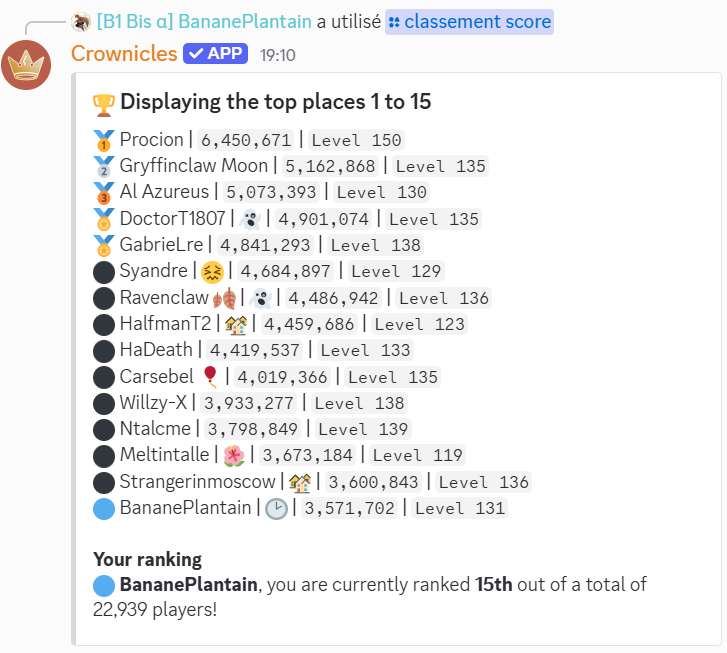

# Rank up

## The `/top score` command

The `/top score` command (not to be confused with `/top glory`) can be used to see the leaderboard of the Crownicles players, by points count. It also displays your ranking, and the page at which you are. The players will be displayed 15 by 15, showing their name, their status, their points count, and their level.

<picture><source srcset="../.gitbook/assets/top_dark.png" media="(prefers-color-scheme: dark)"></picture>

### `/top score` options

#### Display a specific page of the leaderboard

It is possible to see a specific page of the leaderboard, by typing `/top score page:<page number>`.


In the example above you don't need to write <>. For example, typing `/top score page:215` will display the users who are ranked between the 3211th and the 3225th place.


#### Get a specific timing on the leaderboard

Two periods are available for this command: "All time" (the default option when you don't specify the `duration` option), and "This week". The `duration` option will specify the period on which the leaderboard should be displayed.

For example: `/top score duration:🕥 This week.` will show the leaderboard taking account on the points gathered during the week it was launched.


The available values are automatically proposed by Discord, thus there's no possible syntax error as you don't need to write the command entirely by hand!


The weekly leaderboard is reset every sunday. The winner of that leaderboard will receive the following badge:

🎗️ `Player that has won a weekly leaderboard`

More informations about badges can be viewed here:


[badges.md](badges.md)

