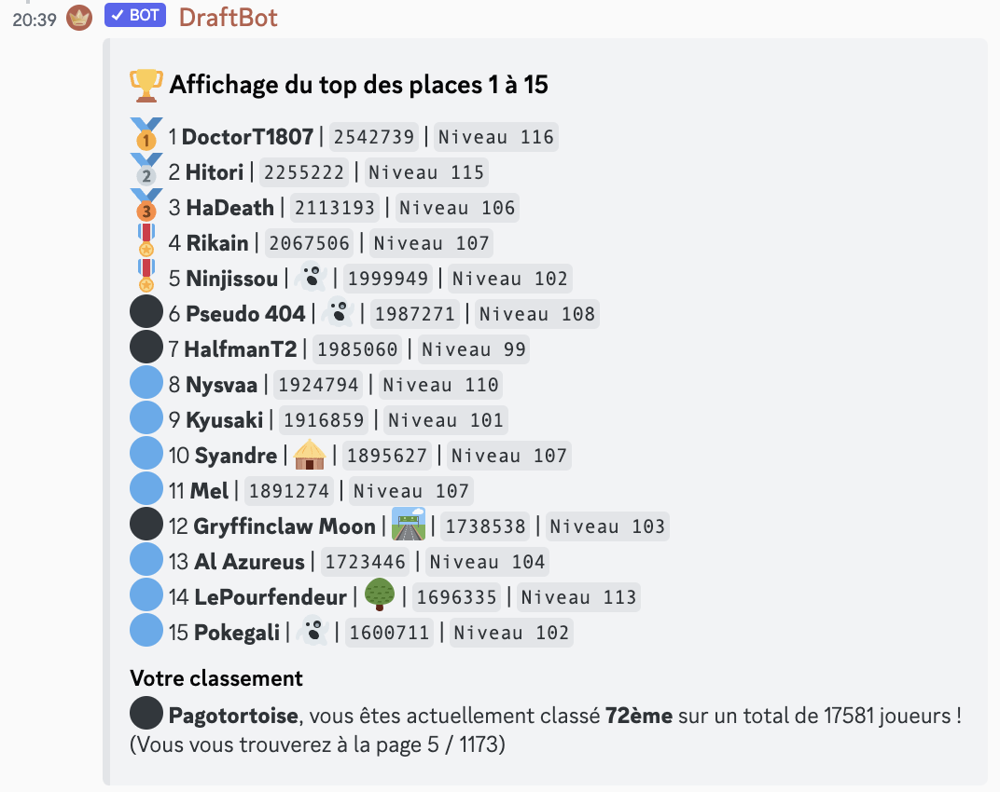

# Monter dans les classements

### La commande `/classement score`

La commande `/classement score` (à ne pas confondre avec `/classement gloire`) est une commande qui sert à savoir qui sont les meilleurs joueurs du DraftBot en les classant avec leur nombre de points. Elle affiche également votre classement, et la page à laquelle vous vous trouvez. Vous verrez les joueurs par tranche de 15, avec leur pseudonyme, leur état, leur nombre de points et leur niveau.

<figure><figcaption>
Exemple de classement général, montrant le top 15
</figcaption></figure>

### Les options de la commande `/classement score`

#### Afficher une page du classement en particulier

Il est possible de parcourir le classement en indiquant un numéro de page en tapant la commande comme ceci : `/classement score page:<numéro de page>`.


Dans la commande ci-dessus il ne faut pas écrire les <>. Par exemple, la commande `/classement score page:215` affichera la 215ème page du classement, présentant ainsi les joueurs classés de la 3211ème à la 3225ème place.


#### Le classement selon une durée

Deux périodes sont disponibles pour le classement: "Depuis toujours" (par défaut) ou "Cette semaine". L'option `duree` permet de choisir la période durant laquelle les points sont comptabilisés.

Exemple: `/classement score duree:🕥 Cette semaine.` affichera le classement selon les points comptabilisés sur la semaine.


Les valeurs possibles pour chaque option sont proposées par Discord dans une liste. Donc aucun risque de se tromper dans la syntaxe car il n'est pas nécessaire de taper cette commande entièrement à la main!


Le classement de la semaine est réinitialisé tous les dimanches. Seul le premier du classement de la semaine reçoit un badge:

🎗️ `Personne ayant dominé un classement de la semaine`.

Plus d'informations sur les badges sont disponibles sur la page dédiée.


[badges.md](badges.md)

