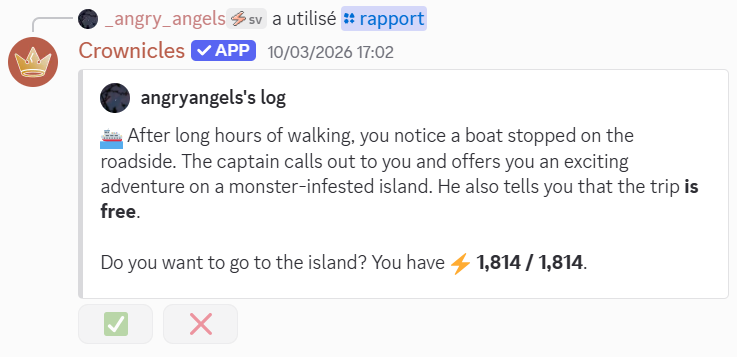
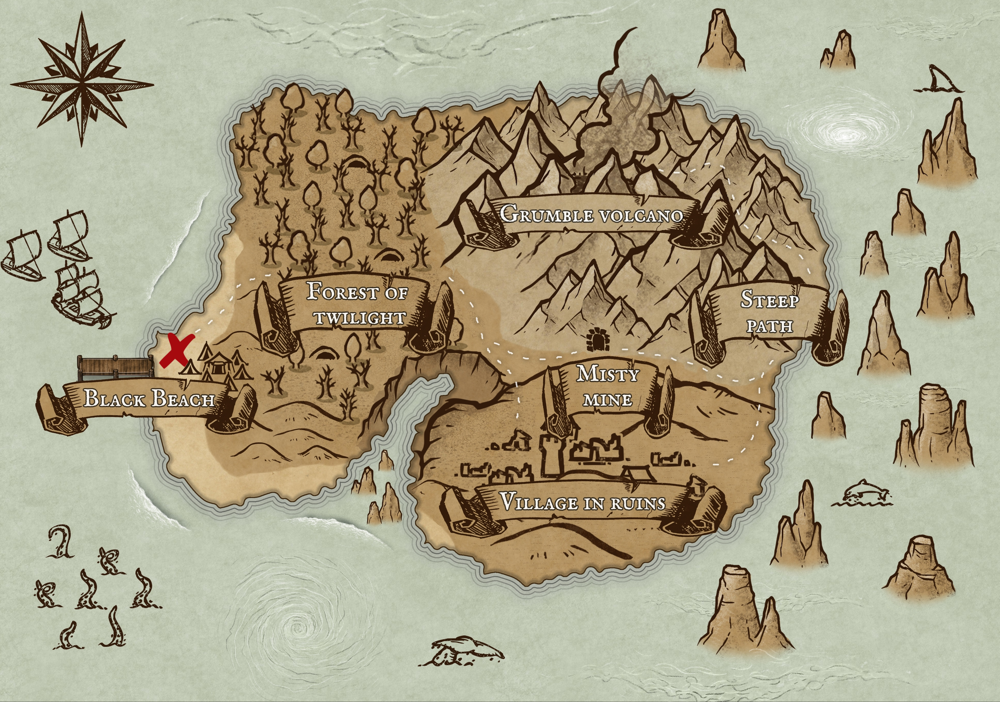
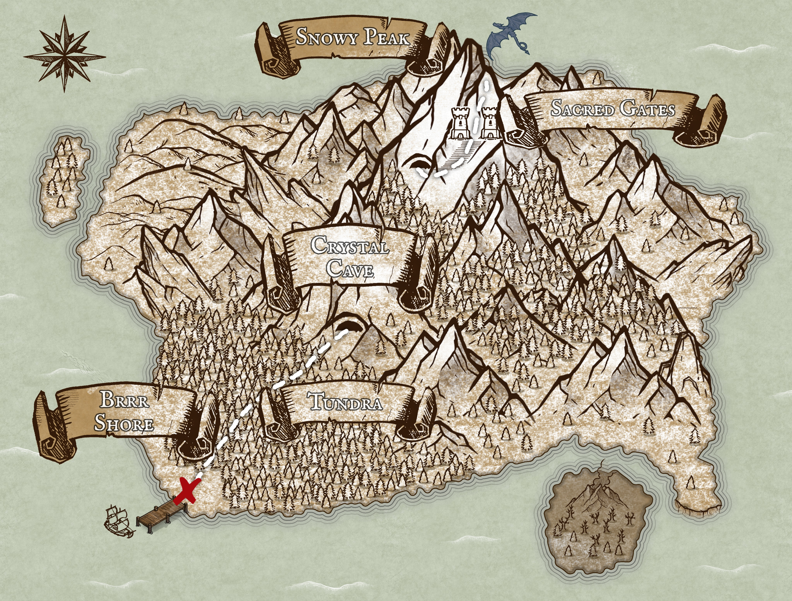
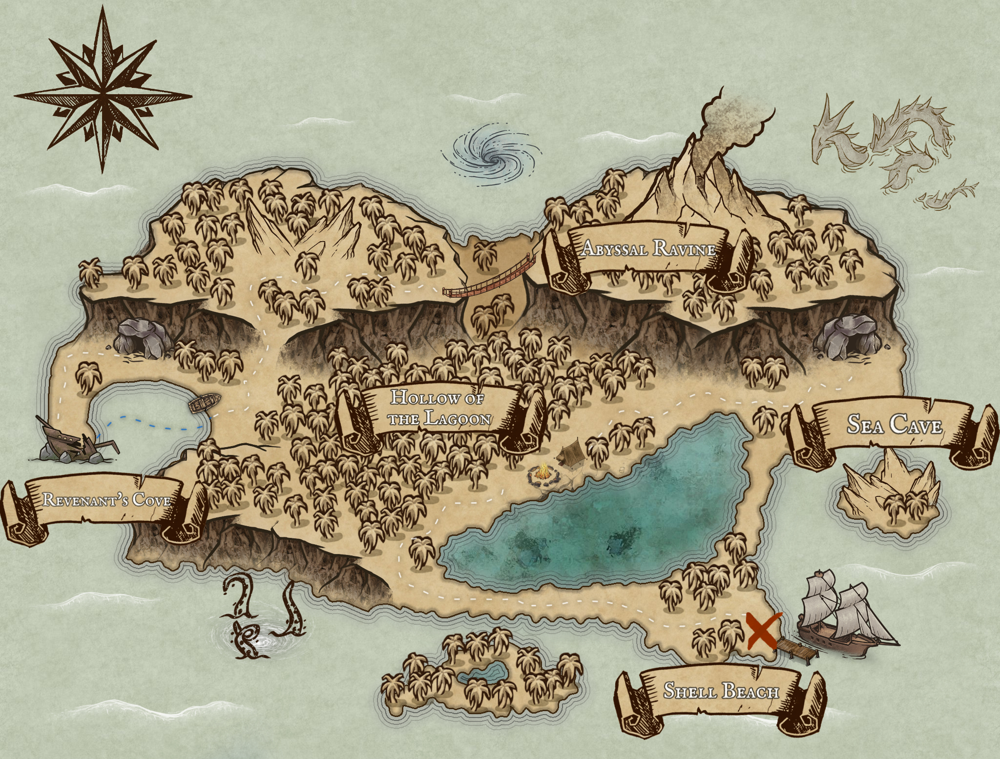

# Mysterious islands

The monsters are spread across three islands: the volcanic island, the ice island, and the ocean island.

## How do I get there?

These mysterious islands can be reached through a [mini-event](small-events-on-the-main-continent.md#travel-to-mysterious-islands) starting at level 20.

<figure><picture><source srcset="../.gitbook/assets/SE_gotopveisland_dark.png" media="(prefers-color-scheme: dark)"></picture><figcaption>
Looks like someone is about to leave…
</figcaption></figure>


If a member of your guild is already on a ship, just type `/joinboat` to join them!


On these islands, the game plays out just like normal trips, except that time passes more quickly there: a small event is available about every 18 seconds, and trips between locations last 4 minutes.


The travel times to and from an island will differ from those on the island itself:

* It will take 30 minutes to travel to an island, including the usual time between two small events;
* to leave the island, it will take only 5 minutes without a small event, but with a special event celebrating your achievement;
* once you’ve left the island, your destination will be a coastline on the main continent, and the journey will take 8 minutes.



You can leave the island at the end of each battle if you feel that you won't be able to defeat the next monster with the energy you have left.



If you choose to travel to the island with members of your guild, the “allies” bonus will be activated.

This bonus will reduce the penalties incurred during small events. It remains active from the moment a member steps off the boat until one hour after they leave the island.

To find out how many allies are on the island, use the `/guild` command and check the information section below the list of guild members. The number of allies on the island is shown in the line labeled “Number of allies on the mysterious island.”

You can also identify allies by the 🤝 emoji displayed next to their username.



On the island, you won't regain energy naturally; the only way to do so is to stumble upon small energy-gaining events.

Certain commands will also be disabled on the island to prevent any attempts to cheat.


## Fights

The islands are divided into a series of locations, each with a different monster to fight. After defeating a monster, you'll earn money and experience. Plus, if you belong to a guild, your guild will also receive experience (if your guild isn't at level 150) and guild points!


During battle, if several members of your guild are on the island, there's a small chance that the guild attack 🏟️ will appear: its power varies depending on the number of members present!



If you lose to one of the monsters listed below, you will instantly leave the island and be teleported to a random location with the 😖 status effect. In addition, you will lose money 💰 and guild points (if you belong to a guild). If you don't belong to a guild, you will lose twice as much money.


## List of monsters on the volcanic island:

<figure><figcaption></figcaption></figure>

## List of monsters on Ice Island:

<figure><figcaption></figcaption></figure>

## List of monsters on Oceanic Island:

<figure><figcaption></figcaption></figure>
