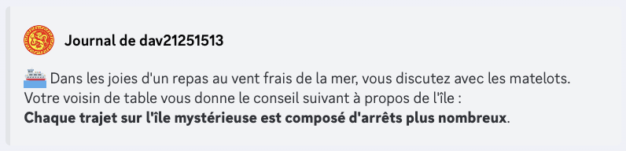

# PVE

## Comment y aller ?

Le PVE est situé sur une île à part qui peut être rejointe au travers d'un [mini-event](mini-evenements.md).

<figure><figcaption>
On dirait que quelqu'un est sur le point de partir...
</figcaption></figure>


Si un membre de votre guilde est déjà sur un bateau, il vous suffit de faire `/rejoindrebateau` pour le rejoindre !


Sur cette île, le jeu se déroule comme des trajets normaux, à la différence que le temps y passe plus vite : 20s environ entre les mini-events et 4min les trajets entre les lieux.

<figure><figcaption>
La carte de l'île
</figcaption></figure>


Les trajets pour aller sur l'île et pour la quitter auront des temps différents de ceux sur cette île:

* pour aller sur l'île, cela prendra 30 minutes, avec le temps entre 2 mini-events habituel;
* pour quitter l'île, vous ne prendrez que 5 minutes sans mini-events, mais avec un event spécifique célébrant votre exploit;
* une fois l'île quittée, votre destination sera une côte du continent principal et son trajet durera 10 minutes, avec un mini-event sur celui-ci.



Vous pouvez quitter l'île à la fin de chaque combat si vous sentez que vous ne tiendrez pas le coup face au prochain monstre avec votre énergie restante.



Sur l'île, vous ne regagnerez pas de points d'énergie naturellement, le seul moyen étant de tomber sur des mini-events de gain de points d'énergie.

Certaines commandes seront aussi interdites sur l'île afin d'empêcher toute tentative de triche.


## Combats

L'île est décomposée en 5 lieux, avec un monstre à combattre différent pour chacun d'entre eux. À l'issue des combats menés, vous gagnerez de l'argent et de l'expérience. De plus, si vous appartenez à une guilde, vous gagnerez aussi de l'xp (si votre guilde n'est pas au niveau 150) et des points de guilde !


Pendant le combat, si vous êtes plusieurs dans votre guilde à être sur l'île, il y a une petite chance que l'attaque groupée :stadium: apparaisse : sa puissance varie avec le nombre de membres présents !



Si vous perdez face à un des monstres ci-dessous, vous quitterez instantanément l'île et serez déposé à un trajet aléatoire avec l'altération :confounded:. De plus, vous perdez de l'argent :moneybag: et des points de guilde (si vous appartenez à une guilde). Si vous n'avez pas de guilde, vous perdez le double d'argent.


### Forêt de la pénombre

**Monstre : Troll de la fôret**

> Un grand troll qui vit dans les forêts. Très fort et très résistant, il est aussi très agressif et attaque tout ce qui bouge. Il est très dangereux pour les aventuriers qui s'aventurent dans les forêts.

**Attaques**:

| Nom de l'attaque   | Description                                                                                                         | Consommation en souffle |
| ------------------ | ------------------------------------------------------------------------------------------------------------------- | ----------------------- |
| Attaque gourdin    | Niveau 50+ uniquement. Attaque en deux tours, avec une charge puissante au deuxième.                                | 9                       |
| Attaque projection | Projète l'adversaire s'il utilise une attaque physique. Peut étourdir l'adversaire.                                 | 6                       |
| Colère             | Augmente son attaque de 100%, en dépit de 75% de sa défense.                                                        | 0                       |
| Rugissement        | Baisse l'attaque et la vitesse de l'adversaire.                                                                     | 4                       |
| Attaque intense    | Voir la page des [combats](https://guide.draftbot.com/notions-principale/combats#detaille-des-differentes-attaques) | 4                       |

### Mine brumeuse

**Monstre : Araignée**

> Une grosse araignée poilue. D'une espèce inconnue, elle attaque tous les voyageurs qui s'approchent de son nid. Venimeuse, elle peut aussi projeter de la soie pour immobiliser ses proies.

**Attaques**:

| Nom de l'attaque     | Description                                                                                                                                                                     | Consommation en souffle |
| -------------------- | ------------------------------------------------------------------------------------------------------------------------------------------------------------------------------- | ----------------------- |
| Attaque empoisonnée  | Voir la page des [combats](https://guide.draftbot.com/notions-principale/combats#detaille-des-differentes-attaques)                                                             | 3                       |
| Attaque jet de toile | Envoie un jet de toile qui blesse et ralentit l'adversaire.                                                                                                                     | 8                       |
| Discrétion           | Se cache afin de doubler les dégâts de la prochaine attaque.                                                                                                                    | 6                       |
| Attaque simple       | Voir la page des [combats](https://guide.draftbot.com/notions-principale/combats#detaille-des-differentes-attaques)                                                             | 2                       |
| Repas de famille     | Niveau 50+ uniquement. Appelle des alliés pour dévorer l'adversaire et l'empoisonner au passage. Inflige l'altération "Repu" au lanceur, l'empêchant de bouger pendant 2 tours. | 20                      |

### Village en ruines

**Monstre : Squelette**

> Un squelette étrange, il semble être un ancien guerrier. Il paraît faible mais est en réalité très dangereux et nombreux sont ceux qui se sont laissé surprendre.

**Attaques**:

| Nom de l'attaque    | Description                                                                                                                                   | Consommation en souffle |
| ------------------- | --------------------------------------------------------------------------------------------------------------------------------------------- | ----------------------- |
| Attaque simple      | Voir la page des [combats](https://guide.draftbot.com/notions-principale/combats#detaille-des-differentes-attaques)                           | 2                       |
| Attaque bouclier    | Voir la page des [combats](https://guide.draftbot.com/notions-principale/combats#detaille-des-differentes-attaques)                           | 5                       |
| Repos               | Voir la page des [combats](https://guide.draftbot.com/notions-principale/combats#detaille-des-differentes-attaques)                           | 0                       |
| Attaque maudite     | Voir la page des [combats](https://guide.draftbot.com/notions-principale/combats#detaille-des-differentes-attaques)                           | 6                       |
| Invocation d'alliés | Niveau 50+ uniquement. Appelle des alliés afin de cumuler les dégâts infligés par chacun des adversaires invoqués en plus de ceux du lanceur. | 10                      |

### Chemin escarpé

**Monstre : Golem de roche**

> Un immense golem de roche. Animé par le désir d'écraser tout ce qui s'en approche. Il est très lent, mais ses attaques sont dévastatrices.

**Attaques**:

| Nom de l'attaque  | Description                                                                                                                                     | Consommation en souffle |
| ----------------- | ----------------------------------------------------------------------------------------------------------------------------------------------- | ----------------------- |
| Lancer de rocher  | Lance des rochers sur l'adversaire. Peut l'étourdir.                                                                                            | 6                       |
| Attaque impact    | Le lanceur se jette sur l'adversaire, lui réduisant sa vitesse.                                                                                 | 6                       |
| Peau de roche     | Recouvre sa peau de roches, augentant sa défense considérablement si cette attaque est lancée plusieurs fois d'affilée.                         | 3                       |
| Bouclier de roche | Crée un bouclier avec des rochers, amortissant la moitié des dégâts de la prochaine attaque de l'adversaire.                                    | 2                       |
| Pétrification     | Niveau 50+ uniquement. Transforme l'adversaire en pierre et l'empêche d'attaquer pendant quelques tours, mais en augmentant sa défense de 200%. | 8                       |

### Volcan grondant

**Monstre : Titan de magma**

> Le monstre le plus puissant de l'île. Bouillant de chaleur, il est capable de faire fondre les roches les plus dures. Très peu d'aventuriers ont réussi à s'en défaire et il serait périlleux de l'attaquer seul.

**Attaques**:

| Nom de l'attaque | Description                                                                                                                                                                                                        | Consommation en souffle |
| ---------------- | ------------------------------------------------------------------------------------------------------------------------------------------------------------------------------------------------------------------ | ----------------------- |
| Éruption         | Fait entrer en éruption le volcan grondant. Émet des rochers en fusion infligeant des dégâts à l'adversaire pensant quelques tours.                                                                                | 8                       |
| Attaque impact   | Cf golem de roche                                                                                                                                                                                                  | 6                       |
| Drain de chaleur | Récupère la chaleur de l'adversaire, le gelant au passage. Augmente l'attaque du lanceur de 20%.                                                                                                                   | 7                       |
| Bain de magma    | Fonctionne comme Repos (cf page des [combats](https://guide.draftbot.com/notions-principale/combats#detaille-des-differentes-attaques)). Le lanceur se baigne dans du magma, régénérant une partie de son énergie. | 2                       |
| Vague de lave    | Niveau 50+ uniquement. Le lanceur surfe sur une vague de lave se dirigeant droit sur l'adversaire, infligeant des dégâts importants et le brûlant au passage.                                                      | 15                      |

## Mini-events

Pendant vos trajets, vous rencontrerez des obstacles différents du continent. Ceux-ci sont listés ci dessous :


La rareté représente la fréquence à laquelle vous risquez de tomber sur l'un des mini-events ci-dessous : plus la rareté est élevée, plus le mini-event est fréquent.


### Gain de points de combat&#x20;

**rareté : 4**

Comme son nom l'indique, il vous permet de récupérer vos points de combat plus vite.

<figure><figcaption>
en voilà un de soigné
</figcaption></figure>

### Péripéties

**rareté : 8**

Durant votre expédition de l'île, certaines péripéties peuvent survenir, qu'elles soient causées par une obscurité totale ou un caillou entre autres, et vous (et votre guilde si vous en appartenez à une) tentez de surmonter cette catastrophe. Ces mini-events ont des issues dépendantes de si vous appartenez à une guilde ou non. Ils peuvent autant ne rien vous faire qu'apporter un gain (points de guilde, expérience...) ou vous faire perdre de l'énergie, de l'argent ou de la vie.


Les gains ne sont récoltés que si vous appartenez à une guilde. Si vous êtes du genre solitaire, vous ne gagnerez rien, même si l'issue est positive!


<figure><figcaption>
Pas de chance !
</figcaption></figure>

### Combat d'animal

**rareté : 8**

Vous rencontrez un animal sauvage qui se met à vous attaquer ! Pour calmer cet adversaire, vous disposez de 2 à 4 options choisies aléatoirement, dépendant de votre niveau et de votre classe.


Si vous réussissez à calmer l'animal (ou faire en sorte à ce qu'il ne vous attaque pas), vous accumulerez un point de rage supplémentaire (cumulable), au cas où vous voudrez vous défouler sur le monstre de la zone de destination.


<figure><figcaption>
L'appel à l'aide est toujours une solution !
</figcaption></figure>

### Informations sur l'île

**rareté : 1 - uniquement disponible sur le trajet en bateau vers l'île**

L'équipage du bateau vous donnera des informations sur l'île vers laquelle vous vous dirigez. Ces infos peuvent vous être utiles pour votre aventure au-delà des côtes du continent principal.

<figure><figcaption>
Ils en ont tout un stock, à croire qu'ils ont établi une encyclopédie de l'île.
</figcaption></figure>


Malgré sa rareté de 1, il est le seul mini-event disponible sur le trajet en bateau vers l'île.

