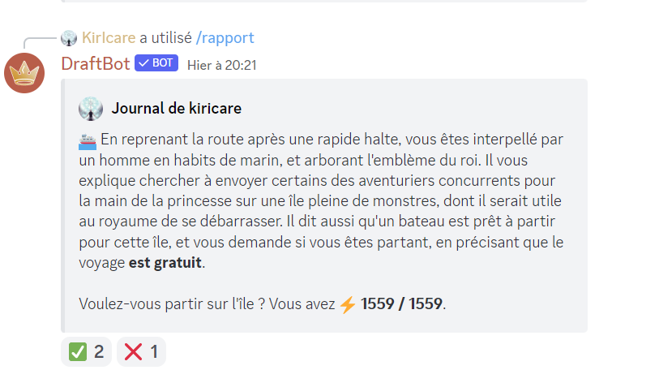
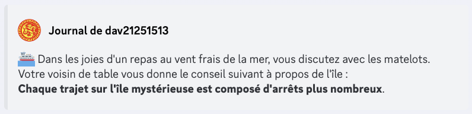

# PVE

## Comment y aller ?

Le PVE est situé sur une île à part qui peut être rejointe au travers d'un [mini-évènement](mini-evenements.md).

<figure><picture><source srcset="../.gitbook/assets/bateau_sombre.png" media="(prefers-color-scheme: dark)"></picture><figcaption>
On dirait que quelqu'un est sur le point de partir…
</figcaption></figure>


Si un membre de votre guilde est déjà sur un bateau, il vous suffit de faire `/rejoindrebateau` pour le rejoindre !


Sur cette île, le jeu se déroule comme des trajets normaux, à la différence que le temps y passe plus vite : un mini-évènement est disponible toutes les 18s environ et les trajets entre les lieux durent 4min.

<figure><figcaption>
La carte de l'île
</figcaption></figure>


Les trajets pour aller sur l'île et pour la quitter auront des temps différents de ceux sur cette île:

* pour aller sur l'île, cela prendra 30 minutes, avec le temps entre 2 mini-évènements habituel;
* pour quitter l'île, vous ne prendrez que 5 minutes sans mini-évènement, mais avec un évènement spécifique célébrant votre exploit;
* une fois l'île quittée, votre destination sera une côte du continent principal et son trajet durera 10 minutes, avec un mini-évènement sur celui-ci.



Vous pouvez quitter l'île à la fin de chaque combat si vous sentez que vous ne tiendrez pas le coup face au prochain monstre avec votre énergie restante.



Si vous choisissez de vous rendre sur l'île avec des membres de votre guilde, le bonus "allié.s" sera activé.&#x20;

Ce bonus réduira les malus rencontrés lors des mini-évènements. Il reste actif pendant une durée de 1 heure après le départ d'un allié de l'île.&#x20;

Pour connaître le nombre d'alliés présents sur l'île, utilisez la commande /guilde et consultez la section des informations sous la liste des membres de la guilde. Le nombre d'alliés sur l'île est indiqué dans la ligne "Nombre d'alliés sur l'île mystérieuse".&#x20;

Vous pouvez également identifier les alliés présents grâce à l'émoji :handshake: affiché à côté de leur pseudo.



Sur l'île, vous ne regagnerez pas de points d'énergie naturellement, le seul moyen étant de tomber sur des mini-évènements de gain de points d'énergie.

Certaines commandes seront aussi interdites sur l'île afin d'empêcher toute tentative de triche.


## Combats

L'île est décomposée en 5 lieux, avec un monstre à combattre différent pour chacun d'entre eux. Après une victoire face à un monstre, vous gagnerez de l'argent et de l'expérience. De plus, si vous appartenez à une guilde, elle recevra aussi de l'expérience (si votre guilde n'est pas au niveau 150) et des points de guilde !


Pendant le combat, si vous êtes plusieurs dans votre guilde à être sur l'île, il y a une petite chance que l'attaque de guilde :stadium: apparaisse : sa puissance varie avec le nombre de membres présents !



Si vous perdez face à un des monstres ci-dessous, vous quitterez instantanément l'île et serez déposé vers un lieu aléatoire avec l'altération :confounded:. De plus, vous perdez de l'argent :moneybag: et des points de guilde (si vous appartenez à une guilde). Si vous n'avez pas de guilde, vous perdez le double d'argent.


### Forêt de la pénombre

Ici, vous affrontez aléatoirement l'un des ces 2 boss:

**Monstre : Troll de la forêt**

> Un grand troll qui vit dans les forêts. Très fort et très résistant, il est aussi très agressif et attaque tout ce qui bouge. Il est très dangereux pour les aventuriers qui s'aventurent dans les forêts.

**Attaques**:

| Nom de l'attaque                            | Description                                                                                                                                                         | Consommation en souffle |
| ------------------------------------------- | ------------------------------------------------------------------------------------------------------------------------------------------------------------------- | ----------------------- |
| :cricket\_game: Attaque gourdin             | Attaque en deux tours, avec une charge puissante au deuxième.                                                                                                       | 9                       |
| :martial\_arts\_uniform: Attaque projection | Projette l'adversaire s'il utilise une attaque physique. Peut étourdir l'adversaire.                                                                                | 6                       |
| :rage: Colère                               | Augmente son attaque de 100%, en dépit de 75% de sa défense.                                                                                                        | 1                       |
| :sound:Rugissement                          | Baisse l'attaque et la vitesse de l'adversaire.                                                                                                                     | 4                       |
| :triumph: Attaque intense                   | 
Niveau 50+ uniquement. 

Voir la page des <a href="https://guide.draftbot.com/notions-principale/combats#detaille-des-differentes-attaques">combats</a>
 | 4                       |

**Monstre : Mutant Vaseux**

> Le Mutant Vaseux est un monstre pouvant copier les autres monstres ou son adversaire directement. Il est très polyvalent et peut s'adapter à toutes les situations.

| Nom de l'attaque                          | Description                                                                                                                                                                                        | Consommation en souffle |
| ----------------------------------------- | -------------------------------------------------------------------------------------------------------------------------------------------------------------------------------------------------- | ----------------------- |
| :performing\_arts:Attaque mimique magique | 
Niveau 60+ uniquement. 

Fonctionne comme une <a href="pve.md#combats">attaque simple</a> en temps normal sauf si l'adversaire lance une attaque magique, celle-ci se verra répliquer.
 | 3                       |
| :test\_tube:Attaque empoisonnée           | Voir la page des [combats](https://guide.draftbot.com/notions-principale/combats#detaille-des-differentes-attaques)                                                                                | 3                       |
| :farmer:Attaque tir de boue               | Lance de la boue sur l'adversaire qui le rend sale et augmente de 5% son attaque, l'altération a 20% de chances de disparaître à chaque tour.                                                      | 5                       |
| :amphora: Attaque boue brûlante           | Attaque puissante si l'adversaire est sali ! Sinon dégâts classiques.                                                                                                                              | 9                       |

### Mine brumeuse

**Monstre : Araignée**

> Une grosse araignée poilue. D'une espèce inconnue, elle attaque tous les voyageurs qui s'approchent de son nid. Venimeuse, elle peut aussi projeter de la soie pour immobiliser ses proies.

**Attaques**:

| Nom de l'attaque                      | Description                                                                                                                                                                     | Consommation en souffle |
| ------------------------------------- | ------------------------------------------------------------------------------------------------------------------------------------------------------------------------------- | ----------------------- |
| :test\_tube: Attaque empoisonnée      | 
Niveau 40+ uniquement. 

Voir la page des <a href="https://guide.draftbot.com/notions-principale/combats#detaille-des-differentes-attaques">combats</a>
             | 3                       |
| :spider\_web: Attaque jet de toile    | Envoie un jet de toile qui blesse et ralentit l'adversaire.                                                                                                                     | 8                       |
| :face\_in\_clouds: Discrétion         | Se cache afin de doubler les dégâts de la prochaine attaque.                                                                                                                    | 6                       |
| :crossed\_swords: Attaque simple      | Voir la page des [combats](https://guide.draftbot.com/notions-principale/combats#detaille-des-differentes-attaques)                                                             | 2                       |
| :fork\_knife\_plate: Repas de famille | Niveau 60+ uniquement. Appelle des alliés pour dévorer l'adversaire et l'empoisonner au passage. Inflige l'altération "Repu" au lanceur, l'empêchant de bouger pendant 2 tours. | 20                      |

### Village en ruines

**Monstre : Squelette**

> Un squelette étrange, il semble être un ancien guerrier. Il paraît faible mais est en réalité très dangereux et nombreux sont ceux qui se sont laissés surprendre.

**Attaques**:

| Nom de l'attaque                             | Description                                                                                                                                                         | Consommation en souffle |
| -------------------------------------------- | ------------------------------------------------------------------------------------------------------------------------------------------------------------------- | ----------------------- |
| :crossed\_swords: Attaque simple             | Voir la page des [combats](https://guide.draftbot.com/notions-principale/combats#detaille-des-differentes-attaques)                                                 | 2                       |
| :shield: Attaque bouclier                    | Voir la page des [combats](https://guide.draftbot.com/notions-principale/combats#detaille-des-differentes-attaques)                                                 | 6                       |
| :bed: Repos                                  | Voir la page des [combats](https://guide.draftbot.com/notions-principale/combats#detaille-des-differentes-attaques)                                                 | 0                       |
| :smiling\_imp: Attaque maudite               | 
Niveau 50+ uniquement. 

Voir la page des <a href="https://guide.draftbot.com/notions-principale/combats#detaille-des-differentes-attaques">combats</a>
 | 6                       |
| :people\_holding\_hands: Invocation d'alliés | Niveau 65+ uniquement. Appelle des alliés afin de cumuler les dégâts infligés par chacun des adversaires invoqués en plus de ceux du lanceur.                       | 5                       |

### Chemin escarpé

**Monstre : Golem de roche**

> Un immense golem de roche. Animé par le désir d'écraser tout ce qui s'en approche. Il est très lent, mais ses attaques sont dévastatrices.

**Attaques**:

| Nom de l'attaque           | Description                                                                                                                                     | Consommation en souffle |
| -------------------------- | ----------------------------------------------------------------------------------------------------------------------------------------------- | ----------------------- |
| :rock: Attaque rocheuse    | Lance des rochers sur l'adversaire. Peut l'étourdir.                                                                                            | 6                       |
| :foot: Attaque impact      | Le lanceur se jette sur l'adversaire, lui réduisant sa vitesse.                                                                                 | 6                       |
| :bricks: Peau de roche     | Recouvre sa peau de roches, augmentant sa défense considérablement si cette attaque est lancée plusieurs fois d'affilée.                        | 3                       |
| :shield: Bouclier de roche | Crée un bouclier avec des rochers, amortissant la moitié des dégâts de la prochaine attaque de l'adversaire.                                    | 2                       |
| :moyai: Pétrification      | Niveau 50+ uniquement. Transforme l'adversaire en pierre et l'empêche d'attaquer pendant quelques tours, mais en augmentant sa défense de 200%. | 8                       |

### Volcan grondant

**Monstre : Titan de magma**

> Le monstre le plus puissant de l'île. Bouillant de chaleur, il est capable de faire fondre les roches les plus dures. Très peu d'aventuriers ont réussi à s'en défaire et il serait périlleux de l'attaquer seul.

**Attaques**:

| Nom de l'attaque               | Description                                                                                                                                                                                                          | Consommation en souffle |
| ------------------------------ | -------------------------------------------------------------------------------------------------------------------------------------------------------------------------------------------------------------------- | ----------------------- |
| :volcano: Éruption             | Fait entrer en éruption le volcan grondant. Émet des rochers en fusion infligeant des dégâts à l'adversaire pendant quelques tours.                                                                                  | 8                       |
| :foot: Attaque impact          | Le lanceur se jette sur l'adversaire, lui réduisant sa vitesse.                                                                                                                                                      | 6                       |
| :thermometer: Drain de chaleur | Récupère la chaleur de l'adversaire, le gelant au passage. Augmente l'attaque du lanceur de 20%.                                                                                                                     | 7                       |
| :bathtub: Bain de magma        | Fonctionne comme Repos (voir page des [combats](https://guide.draftbot.com/notions-principale/combats#detaille-des-differentes-attaques)). Le lanceur se baigne dans du magma, régénérant une partie de son énergie. | 2                       |
| :hotsprings: Vague de lave     | Niveau 50+ uniquement. Le lanceur surfe sur une vague de lave se dirigeant droit sur l'adversaire, infligeant des dégâts importants et le brûlant au passage.                                                        | 15                      |

## Mini-évènements

Pendant vos trajets, vous rencontrerez des obstacles différents du continent. Ceux-ci sont listés ci dessous :


La rareté représente la fréquence à laquelle vous risquez de tomber sur l'un des mini-évènements ci-dessous : plus la rareté est élevée, plus le mini-évènement est fréquent.



De plus, la présence d'un ou plusieurs membres de votre guilde sur l'île en même temps que vous aura une influence sur la qualité des mini-évènements rencontrés.


### Gain d'énergie

**rareté : 4**

Comme son nom l'indique, il vous permet de récupérer un peu d'énergie.

<figure><figcaption>
Exemple de mini-évènement de gain d'énergie
</figcaption></figure>

### Péripéties

**rareté : 8**

Durant votre expédition sur l'île, certaines péripéties peuvent survenir, et vous (ainsi que votre guilde si vous en avez une) tentez de surmonter ces catastrophes. Ces mini-évènements ont des issues dépendantes de votre appartenance à une guilde. Ils peuvent ne rien faire, apporter un gain (points de guilde, expérience...) ou vous faire perdre de l'énergie, de l'argent ou de la vie.


Les gains ne sont récoltés que si vous appartenez à une guilde. Si vous êtes du genre solitaire, vous ne gagnerez rien, même si l'issue est positive !


<figure><figcaption>
Exemple de péripétie
</figcaption></figure>

### Combat face à un animal sauvage

**rareté : 8**

Vous rencontrez un animal sauvage qui se met à vous attaquer ! Pour le calmer, vous disposez de 2 à 4 options choisies aléatoirement, dépendant de votre niveau et de votre classe.


Si vous réussissez à calmer l'animal (ou à faire en sorte qu'il ne vous attaque pas), vous obtenez un point de rage (cumulable), c'est-à-dire des dégâts supplémentaires face au monstre de la zone suivante, appliqués en début de combat avant la 1ère attaque du joueur.


<figure><figcaption>
L'appel à l'aide est parfois une bonne solution !
</figcaption></figure>

### Informations sur l'île

**rareté : 1 - uniquement disponible sur le trajet en bateau vers l'île**

L'équipage du bateau vous donnera des informations sur l'île vers laquelle vous vous dirigez. Ces infos peuvent vous être utiles pour votre aventure au-delà des côtes du continent principal.

<figure><figcaption>
Exemple de mini-évènement donnant des informations sur l'île
</figcaption></figure>


Malgré sa rareté de 1, il est le seul mini-événement disponible sur le trajet en bateau vers l'île.


## Classement des guildes

Au fil de votre progression, les joueurs gagnent des points de guilde :mirror\_ball: après chaque victoire face à un monstre (et en perdent après une défaite) ou lors de mini-évènements sur l'île. Ces points permettent de faire progresser sa guilde parmi un classement visible avec la commande `/classement guildes`.

&#x20;&#x20;

<figure><picture><source srcset="../.gitbook/assets/classement_guildes_sombre.png" media="(prefers-color-scheme: dark)"></picture><figcaption>
Première page du classement des guildes avec le nom, niveau et nombre de points de chaque guilde
</figcaption></figure>
