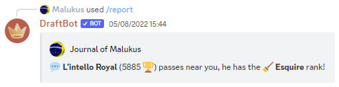
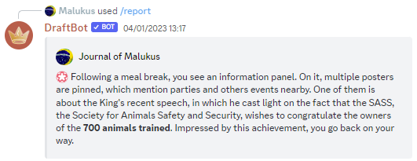
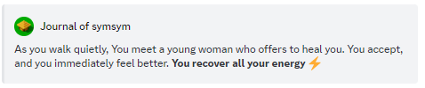

# Small events

There are 25 small event types in the bot at the time this page is being written. Below are some informations about them which will allow you to plan your journey more strategically.

The higher a small event's rarity is, the more frequent it is.


The current maximum rarity (by analogy, the rarity that can be known as the most common) is 12.


### Wandering shop

**Rarity: 4**

This small event lets you buy an equipment for 60% of its original price (most of the time). It can't sell you equipements rarer than the Special rarity. If you buy the seller's equipment but won't replace your currently-stored one, it'll be given back to the seller for a bit less than its buying price.


However, there is a small proportion of sellers who will attempt to scam you by having their items sold at 5 times the original price!


<figure><figcaption></figcaption></figure>

### Interaction with the pet

**Rarity: 10** | Needs to have a pet accompanying you. Otherwise, this small event won't appear.

This small event indicates an interaction between you and your pet. It can be helpful or not depending on the pet's love. Rarer pets may grant you better rewards.

| Reward                 | Minimum rarity | Probability |
| ---------------------- | -------------- | ----------- |
| Money (20 to 70)       | 3              | High        |
| Food                   | 1              | Normal      |
| Item                   | 5              | Low         |
| Health (1 to 5)        | 4              | Normal      |
| Nothing happens        | 1              | Very high   |
| Love (1 to 3)          | 2              | Normal      |
| Time (5 to 20 minutes) | 3              | Low         |
| Points (20 to 70)      | 1              | Normal      |
| Badge                  | 6              | Very low    |
| Energy (10 to 250)     | 1              | High        |


If your pet is trained, it will count as having an additional star, thus getting more bonuses accessible to you. For example, a trained 4:star: pet will count as a 5:star: pet.


| Malus                           | Probability |
| ------------------------------- | ----------- |
| Damage (1 to 5)                 | Normal      |
| Loss of money (20 to 70)        | Normal      |
| Waste of time (5 to 20 minutes) | Normal      |
| Hate (1 to 3)                   | Normal      |
| Running away                    | Very low    |

<figure><figcaption></figcaption></figure>

### Finding a pet

**Rarity: 2**

You will meet a pet which will join you during your adventure. If you already have one, and if you belong to a guild, the newest pet will be stored in the guild's shelter.


If you don't belong to a guild, or your guild's shelter is full and you already have a pet with you, this small event won't give you any new one. However, in some cases, it may give you some meat if you belong in a guild.


The probability to obtain a pet of a specific rarity is as follows:

<table><thead><tr><th width="97"></th><th></th><th></th><th></th><th></th></tr></thead><tbody><tr><td>1 ⭐</td><td>2 ⭐</td><td>3⭐</td><td>4⭐</td><td>5⭐</td></tr><tr><td>87.6%</td><td>9.64%</td><td>1.664%</td><td>0.65%</td><td>0.446%</td></tr></tbody></table>

<figure><figcaption></figcaption></figure>

### Finding an item

**Rarity: 2**

You will find a random, abandoned equipment. You can't find any legendary or mythical item in there.

<figure><figcaption></figcaption></figure>

### Nothing happens.

**Rarity: 8**

This small event is just here to support you on your journey. Nothing much happens, per se.

<figure><figcaption></figcaption></figure>

### Small misadventure

**Rarity: 8**

Sometimes, things don't go as planned. Some small events will get you small maluses:

| Malus         | Effect                    |
| ------------- | ------------------------- |
| Damage        | 1 to 5 health points lost |
| Loss of money | 10 to 50 coins lost       |
| Waste of time | 5 minutes to 2 hours lost |

<figure><figcaption></figcaption></figure>

### Big misadventures

**Rarity: 1**

Unlucky you if you fall through these small events, as they may impact your gameplay much worse than the small ones. Hopefully, these are among the rarest small events you can get.

| Malus         | Effect                                                               |
| ------------- | -------------------------------------------------------------------- |
| Damage        | 5 to 30 health points lost                                           |
| Loss of money | 50 to 250 coins lost                                                 |
| Alteration    | You will get an alteration, stopping you momentarily on your reports |

<figure><figcaption></figcaption></figure>

### Lottery

**Rarity: 3**

During your journey, a hazard game host will encounter you and ask you if you want to play their game. Winning the game may grant you some money, points or XP. You can push your luck with 3 bets:

* :coin: **Small bet**
* :dollar: **Medium bet**
* :moneybag: **Large bet**

Gains and losses depend on the chosen bet:



Gains (80%) :&#x20;

* 35 :medal:
* 70 guild XP
* 50 :moneybag:
* 40 :star:

Losses  :&#x20;

* Nothing (20%)



Gains (50%) :&#x20;

* 105 :medal:
* 210 guild XP
* 150 :moneybag:
* 120 :star:

Losses :&#x20;

* 10 minutes :clock1: (100%)



Gains (20%) :&#x20;

* 350 :medal:
* 700 guild XP
* 500 :moneybag:
* 400 :star:

Losses :&#x20;

* 10 minutes :clock1: (100%)
* 175 :money\_with\_wings: (10%)




You will need to have 175 coins in order to play the lottery. If you have less than this amount, your bet will be rejected by the lottery's host.


<figure><figcaption></figcaption></figure>

### Meeting another player on your tracks

**Rarity: 12**

It's possible to meet other players on the same path you took during your travel. This small event lets you talk with someone you encountered, wheter they were following or being ahead of you!

There are a ton of different sentences depending on the situation of the encountered person. Below are these which can be exploited:

* Top 10
* Top 50
* Top 100
* Top 1
* Powerful guild
* Beginner
* Level 50 or more
* Inactive
* Same class as the player
* Same guild as the player
* Staff member
* Weekly ranking points
* Few health
* Full of health
* Higher ranked
* Lower ranked
* Rich
* Poor
* Pet
* Guild's chief
* Guild's elder
* Class
* Alteration
* Item showcase


The "Poor" interaction will give you two choices: either you'll give the poor player a coin, or not. It all depends on your generosity, dear player... and your economy as well.


<figure><figcaption></figcaption></figure>

### Time skip

**Rarity: 6**

Advances time by 10 to 50 minutes on your travel.

<figure><figcaption></figcaption></figure>

### Bot facts

**Rarity: 2**

This small event tells you a fact about the bot among:

* Average total points
* Average weekly points
* Amount of players who started their adventure
* Average level of a player
* Total amount of money in circulation
* Amount of the richest player
* Number of trained pets
* Number of feisty pets
* Percentage of female pets
* Percentage of male pets
* Average level of a guild
* Number of players with a certain class
* Number of players crossing the same path as you are

<figure><figcaption></figcaption></figure>

### Voting for the bot

**Rarity: 4**

This small event prompts you to vote for the bot on top.gg, or give you a reward for doing so if you already voted in the past 12 hours:

* Money (between 150 and 250)
* Random item

<figure><figcaption></figcaption></figure>

### Classes

**Rarity: 4**

You'll gain some rewards depending on your class:

| Classes                                | Items                                                        |
| -------------------------------------- | ------------------------------------------------------------ |
| Recruit :herb:                         | Random item or money (between 50:moneybag:and 150:moneybag:) |
| Fighter :axe:                          | Random item or money (between 50:moneybag:and 150:moneybag:) |
| Soldier :dagger:                       | Random item or money (between 50:moneybag:and 150:moneybag:) |
| Infantryman :crossed\_swords:          | Random item or money (between 50:moneybag:and 150:moneybag:) |
| Gloved :boxing\_glove:                 | Defensive item / potion or armor                             |
| Helmeted :military\_helmet:            | Defensive item / potion or armor                             |
| Enmeshed :chains:                      | Defensive item / potion or armor                             |
| Tank :shield:                          | Defensive item / potion or armor                             |
| Rock thrower :rock:                    | Offensive item / potion or armor                             |
| Slinger :mechanical\_arm:              | Offensive item / potion or armor                             |
| Archer :bow\_and\_arrow:               | Offensive item / potion or armor                             |
| Gunner :gun:                           | Offensive item / potion or armor                             |
| Esquire :broom:                        | Random item or money (between 50:moneybag:and 150:moneybag:) |
| Horse rider :horse\_racing:            | Random item or money (between 50:moneybag:and 150:moneybag:) |
| Pikeman :probing\_cane:                | Random item or money (between 50:moneybag:and 150:moneybag:) |
| Knight :person\_fencing:               | Random item or money (between 50:moneybag:and 150:moneybag:) |
| Paladin :fleur-de-lis:                 | Defensive item / potion or armor                             |
| Veteran :trident:                      | Random item or health (between 1:heart:and 5:heart:)         |
| Powerful infantryman :crossed\_swords: | Random item or money (between 50:moneybag:and 150:moneybag:) |
| Impenetrable tank :shield:             | Defensive item / potion or armor                             |
| Formidable gunner :gun:                | Offensive item / potion or armor                             |
| Valiant knight :person\_fencing:       | Random item or money (between 50:moneybag:and 150:moneybag:) |
| Luminous paladin :fleur-de-lis:        | Defensive item / potion or armor                             |
| Experienced veteran :trident:          | Random item or health (between 1:heart:and 5:heart:)         |
| Mystic mage :mage:                     | Random item or health (between 1:heart:and 5:heart:)         |

<figure><figcaption></figcaption></figure>

### Find a quest

**Rarity: 6**

You'll obtain a secondary mission this way.


Depending on your level, you can get up to:

* level 0-4: no secondary missions
* level 5-24: 1 secondary mission
* level 25-54: 2 secondary missions
* level 55+: 3 secondary missions


<figure><figcaption></figcaption></figure>

### Find a potion

**Rarity: 8**

You'll get a random potion with this small event.

<figure><figcaption></figcaption></figure>

### Goblets game

**Rarity: 2**

A suspicious man will approach you and force you to play his goblets game. In this game, there are 3 goblets:

* A metal goblet with a dragon's face :dragon\_face:
* A large goblet :bucket:
* A shining goblet sculpted in a blue wood :sparkles:

You'll have to do a choice between these 3 goblets. They'll give you a random issue out of the ones below:

* You'll lose some health (depending on the level) due to your character attempting to fight the man
* You'll find a coin, but the suspicious man won't let you get it and you argue for some time
* You lose the game, but nothing happens while you promise yourself to be luckier at this.


If you react with :end: or do not react at all, you'll lose some health depending on your level.


<figure><figcaption></figcaption></figure>

### Staff members

**Rarity: 1**

This mini-event will tell you the story of a staff member among those below:

* Nysvaa
* Thero1st
* Oscar
* QQtin
* LePourfendeur
* Ines
* romain22222
* Izuku
* Draft
* Royal
* Max
* Eagle
* DeadAngelV6
* Kyusaki
* Greninja\_san
* nwcubeok
* SuperBananeNinja
* Hitori
* Pietagorh
* Doctor
* KirIcare
* symsym
* Pagotortoise
* Voltou

<figure><figcaption></figcaption></figure>

### Space facts

**Rarity: 3**

You will meet an "oracle" (well, someone who claims to be this, at least), who'll give you real information (except some details, such as the asteroid's name) about space among:

* An asteroid approaching Earth
* Moon phases
* The next full moon
* The next partial lunar eclipse
* The next full lunar eclipse

<figure><figcaption></figcaption></figure>

### Full energy restoration

**Rarity: 8**

You'll meet a young woman who'll let you regain all your energy.


You can only trigger this small event when being around Claire de Ville and if your energy isn't full.


<figure><figcaption></figcaption></figure>

### Guild XP gained

**Rarity: 5**

Thanks to you, your guild is becoming more and more talked about and gains an amount of XP depending on the guild's level.


You can only trigger this small event if you belong to a guild between levels 0 and 99.


<figure><figcaption></figcaption></figure>

### Health gained

**Rarity: 3**

During your adventure, you can regain some health (between 1 and 4:heart:).


You can only trigger this small event if your health is not full.


<figure><figcaption></figcaption></figure>

### XP gained

**Rarity: 3**

During your adventure, you can gain some XP (between 10 and 35:star:).

<figure><figcaption></figcaption></figure>

### Witch

**Rarity: 4**

You'll meet a witch who's preparing some kind of mixture. You can advise her to:

* do something
* add an ingredient
* either of the two above

Depending on your choice, you can:

* get a potion
* suffer an alteration
* lose some health
* get nothing


If you react with :end:, nothing will happen to you as you won't get involved in the mixture's preparation.



Mystic mages have an additional fourth choice (which will also be either doing something or adding an ingredient).


<figure><figcaption></figcaption></figure>

### Ultimate soup merchant

**Rarity: 1**

You will meet Gaspard-Jo, the ultimate soup merchant. He'll give you something depending on some factors:

* if your guild's level is below 100, he may give you some guild XP
* if your guild's below level 30 and have some stock left for candies, he'll give you a small amount of it
* if your guild's on level 30 or more, and if you have some place for ultimate soups, he'll give you some of them
* if your guild's on level 30 or more, he may give an item as well (depending on your level, of course)
* if you don't belong to a guild, he'll give you some money.

<figure><figcaption></figcaption></figure>

### League rewards

This small event will give you some informations about your league's rewards and how much time is left until the fighting season's ending.

<figure><figcaption></figcaption></figure>
