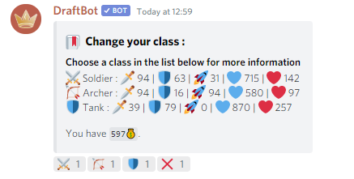

# Classes

Since the [**2.10**](https://history.draftbot.com/draftbot-v2/2.1.0) version of DraftBot, you can choose a class for your player once you have reached the **level 16**. The default class for every players is **Soldier**.

#### How to choose a class ?


There is for the moment 3 classes in the game :

**Soldier**, **Archer** and**Tank**  
_The list of the available classes will be upgraded later._


Once you are at level 16, to change your class you can use the `!class` command

Which give this result :

You then just need to select your favorite class using the reactions.


Every time you will change your class, you will need to pay 5000 money. You can change your class how much time you want.


#### Statistics of the classes

| Class | Attack | Defense | Speed | Fight points | Health |
| :--- | :--- | :--- | :--- | :--- | :--- |
| **Soldat** | +60 | +40 | +20 | +145 | +85 |
| **Archer** | +60 | +10 | +60 | +10 | +40 |
| **Tank** | +25 | +50 | +0 | +300 | +200 |

_Thoses bonuses will change when balancing the classes_

