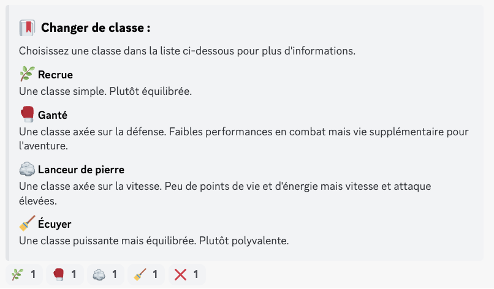
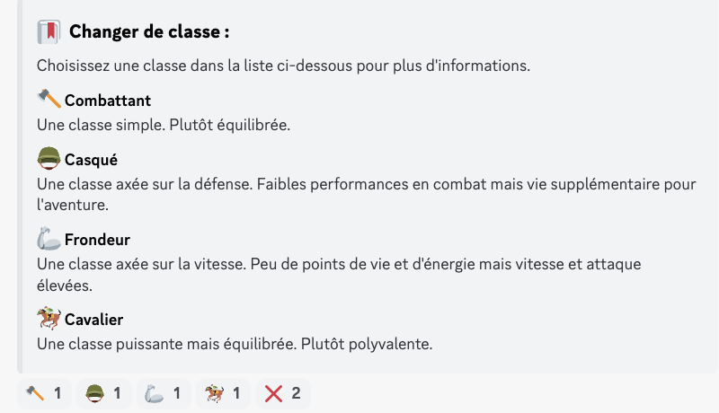
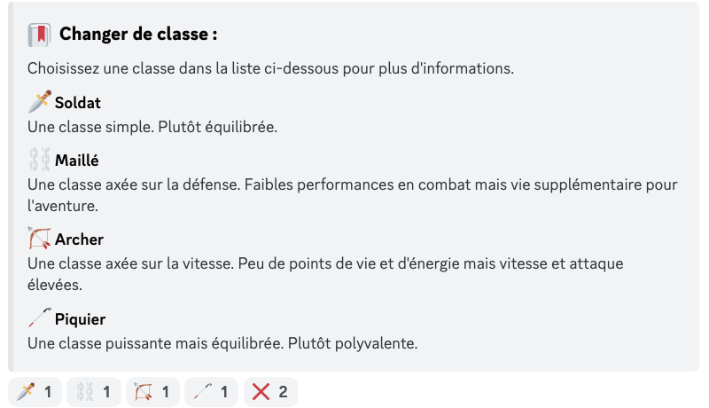
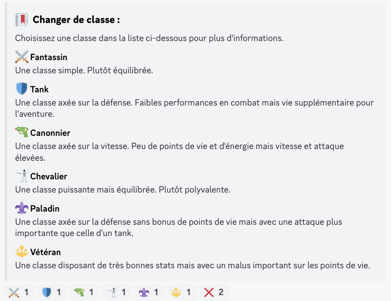
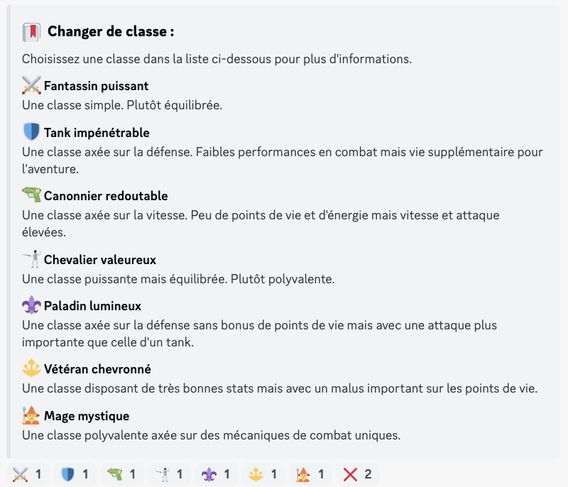

# Classes

Depuis la version [**2.1.0** ](https://history.draftbot.com/draftbot-v2/2.1.0)de DraftBot vous avez la possibilité de choisir une classe pour votre personnage une fois que vous avez atteint le **niveau 4**. La classe par défaut pour l'ensemble des joueurs est **Recrue**.

### Comment choisir une classe ?

Le choix de classe dépend de votre niveau, il existe **5 paliers** de classes différents :

* Palier 1 : Du niveau 4 au niveau 15
* Palier 2 : Du niveau 16 au niveau 31
* Palier 3 : Du nveau 32 au niveau 47
* Palier 4 : Du niveau 48 au niveau 79
* Palier 5 : À partir du niveau 80


Au total, il y a 25 classes disponibles dans le jeu.


Pour changer de classe et à condition que votre personnage soit niveau 4 vous devez utiliser la commande `/classes`.

Puis vous devez cliquer sur la réaction correspondante à la classe que vous souhaitez.

### Liste des classes

<figure><figcaption>
Classes de palier 4
</figcaption></figure>

<figure><figcaption>
Classes de palier 5 (qui sont des améliorations de celles de palier 4, à l'exception du mage)
</figcaption></figure>


Vu que les classes sont gratuites, un cooldown de soit deux semaines (pour les tiers 1 et 2), soit d'un mois (pour les autres tiers) a été mis en place afin d'éviter de spammer les changements de classe.


### Statistiques des classes

Une commande a été ajoutée depuis la version [2.1.1](https://history.draftbot.com/draftbot-v2/2.1.1) de DraftBot pour connaître les différentes statistiques des classes.

Il s'agit de la commande `/infosclasses`.

<figure><figcaption>
Statistiques des classes
</figcaption></figure>
