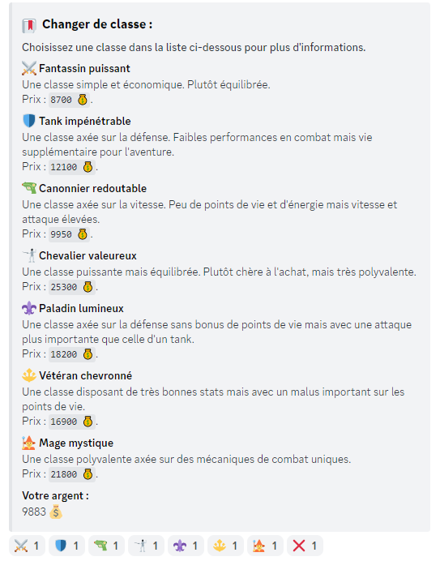

# Classes

Since the [**2.10**](https://history.draftbot.com/draftbot-v2/2.1.0) version of DraftBot, you can choose a class for your player once you have reached the **level 4**. The default class for every player is **Recruit**.

### How to choose a class ?

The choice of class depends on your level, there are 4 different ranks of classes :

* Rank 1 : Between level 4 and 15
* Rank 2 : Between level 16 and 31
* Rank 3 : Between level 32 and 47
* Rank 4 : Between level 48 and 79
* Rank 5 : Level 80 and above


There are a total of 25 classes available in the game.


Once you are at level 4, you can use the /`classes` command to change your class.

Then you have to click on the reaction corresponding to the class you want.

### Class list

.png>)

.png>)

.png>)

<figure><figcaption>
Tier 4 classes
</figcaption></figure>

<figure><figcaption>
Tier 5 classes, an improvement over the previous tier (with a new class, nonetheless!)
</figcaption></figure>


The above screenshots were taken when classes still were a paid option. Now that they're free since v4.3.3, the prices are not to be considered anymore.



However, there's a cooldown of either two weeks (for tiers 1 and 2) or a month (tier 3 and up) after choosing a class to avoid spamming class changes.


### Class statistics

The `/classesinfo` command has been added since version 2.1.1 of DraftBot to know the different statistics of the classes.

<figure><figcaption>
Everything you need to know on the go, plus more if you click on a reaction!
</figcaption></figure>
