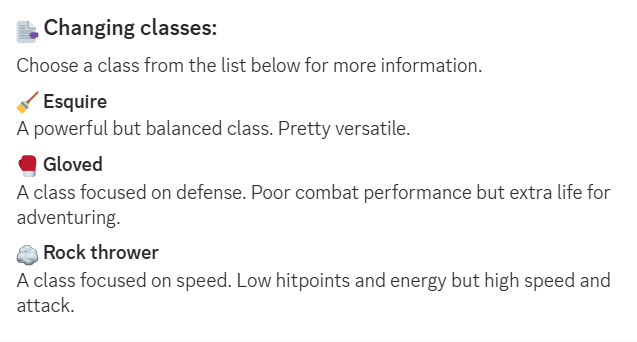
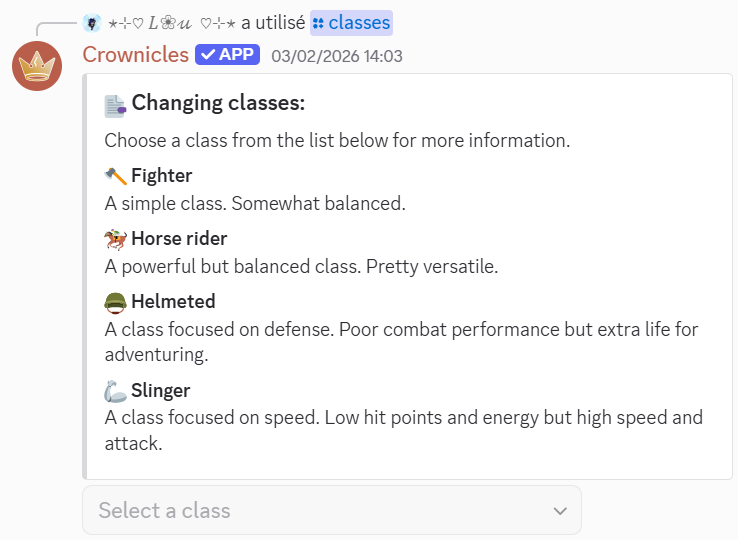
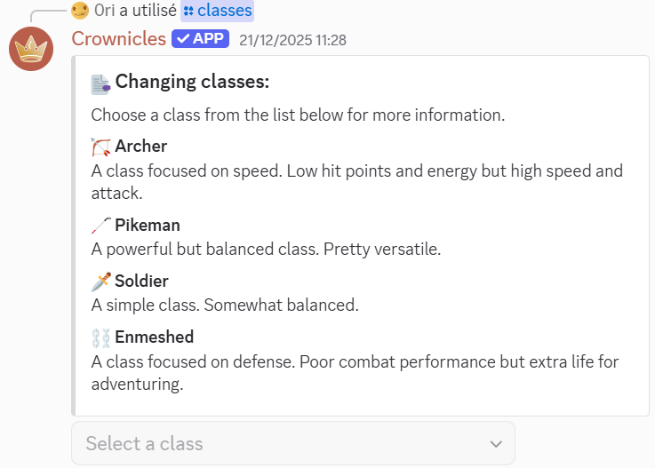
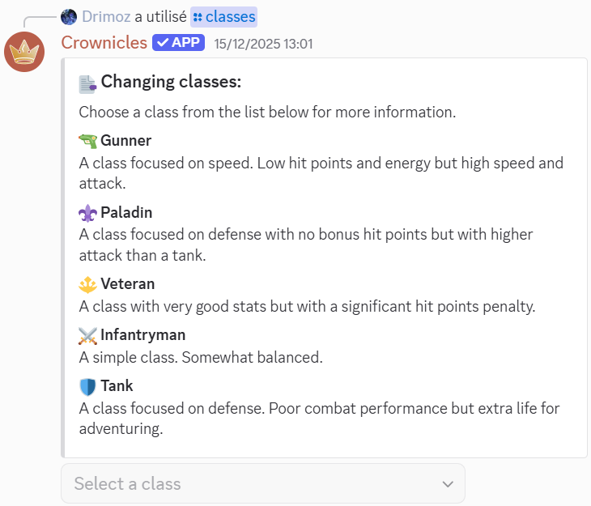
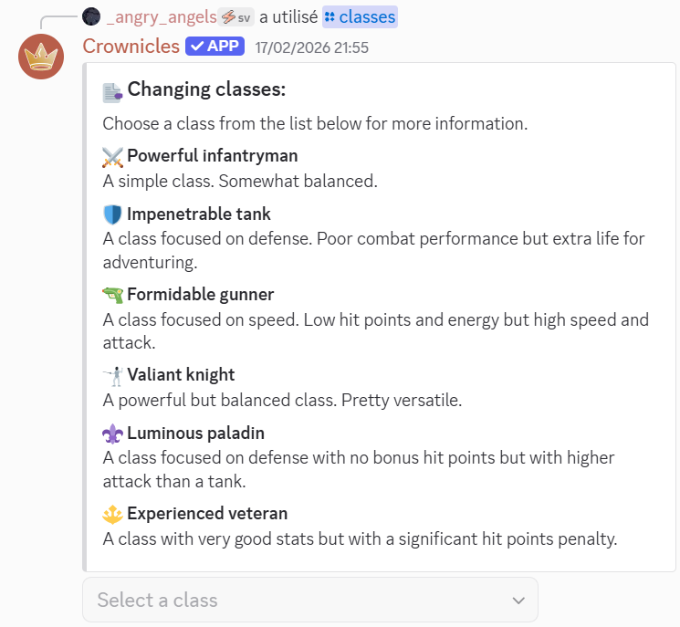
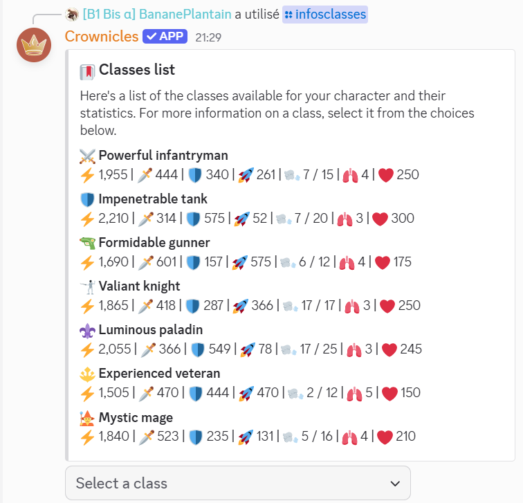

# Classes

Since the [**2.10**](https://history.draftbot.com/draftbot-v2/2.1.0) version of Crownicles, you can choose a class for your player once you have reached the **level 4**. The default class for every player is **Recruit**.

### How to choose a class ?

The choice of class depends on your level, there are 4 different ranks of classes :

* Rank 1 : Between level 4 and 15
* Rank 2 : Between level 16 and 31
* Rank 3 : Between level 32 and 47
* Rank 4 : Between level 48 and 79
* Rank 5 : Level 80 and above


There are a total of 25 classes available in the game.


Once you are at level 4, you can use the /`classes` command to change your class.

Then you have to click on the reaction corresponding to the class you want.

### Class list

<picture><source srcset="../.gitbook/assets/classes_t1_dark.png" media="(prefers-color-scheme: dark)"></picture>


The recruit class does not appear because it is the class of the player who executed the command.


<picture><source srcset="../.gitbook/assets/classes_t2_dark.png" media="(prefers-color-scheme: dark)"></picture>

<picture><source srcset="../.gitbook/assets/classes_t3_dark.png" media="(prefers-color-scheme: dark)"></picture>

<figure><picture><source srcset="../.gitbook/assets/classes_t4_dark.png" media="(prefers-color-scheme: dark)"></picture><figcaption>
Tier 4 classes
</figcaption></figure>

<figure><picture><source srcset="../.gitbook/assets/classes_t5_dark.png" media="(prefers-color-scheme: dark)"></picture><figcaption>
Tier 5 classes, an improvement over the previous tier (with a new class, nonetheless!)
</figcaption></figure>


To avoid frequent changes of class, a minimum interval is required between two changes: 

* Ranks 1 and 2: 1 week
* Ranks 3 and 4: 2 weeks
* Rank 5: 3 weeks.


### Class statistics

The `/classesinfo` command has been added since version 2.1.1 of Crownicles to know the different statistics of the classes.

<figure><picture><source srcset="../.gitbook/assets/classlist_dark.png" media="(prefers-color-scheme: dark)"></picture><figcaption>
Everything you need to know on the go, plus more in the menu!
</figcaption></figure>
