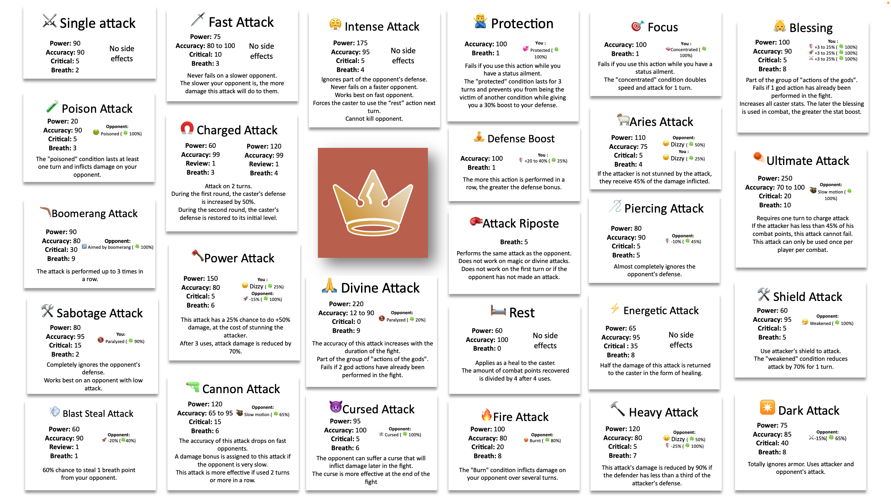

# Fights

Once you reach at level 8 you will unlock the ability to fight other players using the `/fight` command This guide will show you the basics of it.

### Before starting

In a fight, the following information are to take into account at all costs :

* :zap: The energy points
* &#x20;:dagger: The attack points
* &#x20;:shield: The defense points
* &#x20;:rocket: The speed points
* 🌬 The breath in stock
* :lungs: The breath regeration ratio


For more information about those numbers, please see the profile section.


### Fight types

#### Normal fight

A normal fight can be started with the `/fight` command. You can add a `@user` option just after the command, to specify a user to fight. If you are not the creator of the fight, and if you don't have any state alteration, you can click on the :white\_check\_mark: emoji in reaction. In these type of fights, the winner earns glory points. Take note that the energy is consumed with this kind of fight.

#### Friendly fights

The friendly fights work the same way as the normal fights but no one is losing energy nor earning glory points at the end. To start one you can run the`/fight` command, with the `friendly` option set to `true`.

### Progress of a fight

The fight is a turn by turn system. At every turn you will have to choose between 5 options, depending on the classes :

**Infantryman**: Simple attack, Piercing attack, Powerful attack, Charging attack, Protection

**Tank**: Simple attack, Intense attack, Shield atatck, Defense boost, Counter attack

**Gunner**: Quick attack, Sabotage attack, Boomerang attack, Cannon attack, Intense attack

**Knight**: Simple attack, Quick attack, Heavy attack, Blessing, Rest

**Paladin**: Simple attack, Ram attack, Ultimate attack, Shield attack, Divine attack

**Veteran**: Quick attack, Energetic attack, Charging attack, Piercing attack, Concentration

**Mage**: Poisonous attack, Fire attack, Breath-taking attack, Cursed attack, Dark attack


The above attack stay the same for the equivalent of the associated class, depending on the level.



The person with more speed gets first turn (or randomized if both fighters have the same speed).


### Attack details

The details of the various attacks can be read below:

<figure><figcaption>
That's a lot of attacks!
</figcaption></figure>

### Breath management

Almost every attack needs a certain number of breath in order to be used, as they consume this amount when it's launched successfully (even when it fails to hit the opponent). At the beginning of their turn, a fighter will see its breath stock increase by the regeneration ratio that depends on their class. The info about breath stock, regeneration and consumption can be checked using the `/classesinfo` command.


If a player doesn't have enough breath to use an attack they want to use, due to the fact that it needs more than what thay have, there is a slight chance it will still launch successfully.


### Victory conditions

The fight ends when a fighter's life drops to 0.&#x20;

A fight can also end when both fighters both lose all their energy on the same turn or when the 24th turn has ended. These conditions will trigger a draw.

When the fight ends, you'll probably lose energy, except if the fight was friendly, but it'll be recovered over time.&#x20;


If a fighter doesn't react for more than 30 seconds, the fight will be considered as over. The inactive fighter will lose this fight, and all their energy if it was a ranked one.

