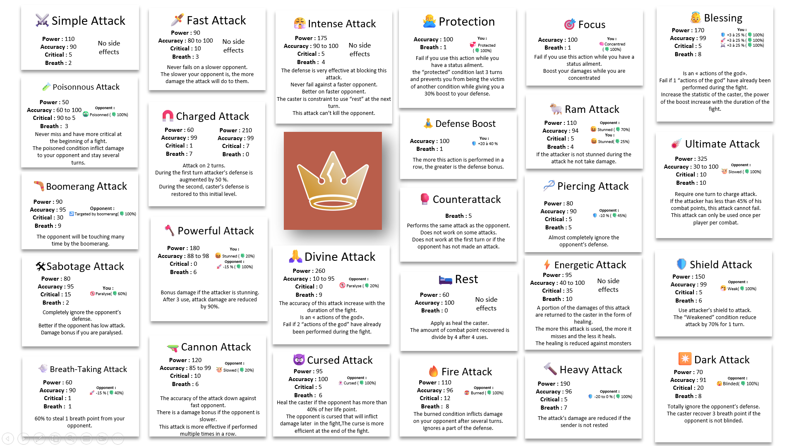
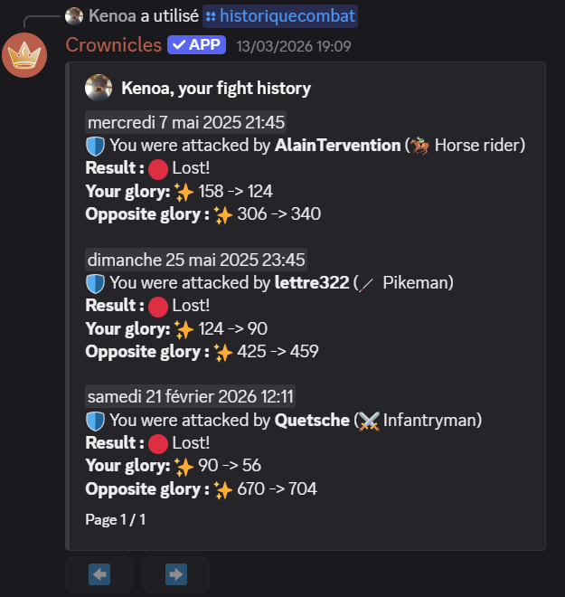

# Fights

Once you reach at level 8 you will unlock the ability to fight other players using the `/fight` command This guide will show you the basics of it.

### Before starting

In a fight, the following information are to take into account at all costs :

* :zap: The energy points
* &#x20;:dagger: The attack points
* &#x20;:shield: The defense points
* &#x20;:rocket: The speed points
* 🌬 The breath in stock
* :lungs: The breath regeration ratio


For more information about those numbers, please see the profile section.


### Fight types

#### Fight against players

A fight can be initiated using the `/fight` command. You will face an AI opponent with the class and stats of a random player (provided that their defence glory is no more than 450 points above or below your attack glory, and that you have faced them fewer than three times since the start of the season). The winner gains glory ✨, the loser loses some, and the energy lost is consumed.


You can only start a fight if you have 80% or more energy.



Your glory is divided into two parts, the sum of which makes up the glory displayed on your profile:\
-Attack glory: when you fight another player’s AI.\
-Defence glory: when your AI is attacked by another player.



At the end of each fight, you’ll receive, in addition to glory, money and points (up to 200 gold and 105 points per day).


#### Fight against monsters

Check out [mysterious islands](../notions-avancees/mysterious-islands.md).

### Progress of a fight

The fight is a turn by turn system. At every turn you will have to choose between 5 options, depending on the classes :

**Infantryman**: Simple attack, Piercing attack, Powerful attack, Charging attack, Protection

**Tank**: Simple attack, Intense attack, Shield atatck, Defense boost, Counter attack

**Gunner**: Quick attack, Sabotage attack, Boomerang attack, Cannon attack, Intense attack

**Knight**: Simple attack, Quick attack, Heavy attack, Blessing, Rest

**Paladin**: Simple attack, Ram attack, Ultimate attack, Shield attack, Divine attack

**Veteran**: Quick attack, Energetic attack, Charging attack, Piercing attack, Concentration

**Mage**: Poisonous attack, Fire attack, Breath-taking attack, Cursed attack, Dark attack


The above attack stay the same for the equivalent of the associated class, depending on the level.



The person with more speed gets first turn (or randomized if both fighters have the same speed).


### Attack details

The details of the various attacks can be read below:

<figure><figcaption>
That's a lot of attacks!
</figcaption></figure>

### Breath management

Almost every attack needs a certain number of breath in order to be used, as they consume this amount when it's launched successfully (even when it fails to hit the opponent). At the beginning of their turn, a fighter will see its breath stock increase by the regeneration ratio that depends on their class. The info about breath stock, regeneration and consumption can be checked using the `/classesinfo` command.


If a player doesn't have enough breath to use an attack they want to use, due to the fact that it needs more than what thay have, there is a slight chance it will still launch successfully.


### Victory conditions

The fight ends when a fighter's life drops to 0.&#x20;

A fight can also end when both fighters both lose all their energy on the same turn or when the 26th turn has ended. These conditions will trigger a draw.

Once a fight is over, you’ll have to wait a while before you can recover the energy ⚡ you’ve lost.


If you don't react for more than 45 seconds, the fight will be considered as over. You will automatically lose the fight and, therefore , all your energy.


### Fight history

The /`fighthistory` command displays the results of the fights you have fought as both attacker and defender.

<figure><figcaption>
Since your AI can fight for you, it might be worth finding out how your glory has evolved in your absence.
</figcaption></figure>
