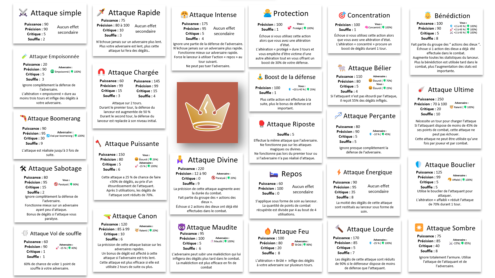

# Combats

Une fois que votre personnage a atteint le **niveau 8**, vous débloquez la capacité de faire des **combats**. Ce guide vous permet de comprendre les bases.

### Avant de commencer

Pendant un combat, vous devez impérativement prendre en compte les statistiques suivantes :

* :zap: Énergie
* :dagger: Points d'attaque
* :shield: Points de défense
* :rocket: Points de vitesse
* 🌬 Souffle
* :lungs: Récupération de souffle


Vous trouverez plus d'informations sur les statistiques dans le guide consacré au [profil](profile.md).


### Types de combats

#### Les combats classés

Un combat classé peut être lancé avec la commande `/combat`. L'option `utilisateur` permet de défier un utilisateur en particulier. Si vous n'êtes pas l'initiateur du combat et que vous n'avez pas d'altération d'état, vous pouvez accepter le combat avec la réaction :white\_check\_mark:. Dans ce type de combat, le gagnant remporte de la gloire :sparkles: et l'énergie perdue est consommée.

#### Les combats amicaux

Les combats amicaux sont similaires aux combats classés, à la seule différence que vous ne gagnez pas de gloire, et que l'énergie perdue est restaurée à la fin de ceux-ci. Ils peuvent être lancés avec l'option `amical` de la commande à `true`.

#### Les combats de monstres

Voir [#combats](../notions-avancees/pve.md#combats "mention")

### Déroulement d'un combat

Le combat est basé sur un système de tour par tour. À chaque tour, vous aurez le choix entre des attaques qui dépendent de votre classe.

Ces attaques sont réparties dans les différentes classes du jeu :&#x20;

* Fantassin : Attaque simple, Attaque perçante, Attaque puissante, Attaque chargée, Protection.
* Tank : Attaque simple, Attaque intense, Attaque riposte, Attaque bouclier, Boost de la défense.
* Canonnier : Attaque rapide, Attaque sabotage, Attaque boomerang, Attaque canon, Attaque intense.
* Chevalier : Attaque simple, Attaque rapide, Attaque lourde, Bénédiction, Repos.
* Paladin : Attaque simple, Attaque bélier, Attaque ultime, Attaque bouclier, Attaque divine.
* Vétéran : Attaque rapide, Attaque énergique, Attaque chargée, Attaque perçante, Concentration.
* Mage : Attaque empoisonnée, Attaque feu, Attaque vol de souffle, Attaque maudite, Attaque sombre.


Les attaques ci-dessus restent toujours les mêmes pour l'équivalent de la classe associée en fonction du niveau.



Le joueur le plus rapide commence toujours le combat. (En cas d'égalité, c'est aléatoire.)


### Détail des différentes attaques

Vous pouvez retrouvez le détail des attaques sur le document ci-dessous.

<figure><figcaption></figcaption></figure>

### Gestion du souffle

Chaque attaque nécessite une certaine quantité de souffle. Chaque usage de cette attaque retirera de la réserve de souffle du combattant le montant spécifié. Au début de son tour, le combattant reçoit une quantité de souffle définie par la statistique de récupération de souffle :lungs:  dépendant de sa classe. Les informations sur les réserves de souffle liées à une classe et la consommation de souffle des différentes attaques peuvent être consultées via la commande `/infosclasses`.


Si un joueur est essoufflé et tente d'utiliser une attaque qui nécessite plus de souffle que ce dont il dispose, l'attaque n'aura qu'une faible probabilité d'être lancée.


### Conditions de victoire

Dès lors que l'énergie :zap: de l'un des combattants tombe à 0, le combat s'arrête. Le joueur encore debout remporte le combat.

Un combat peut se terminer sur une égalité si le 24e tour se finit sans vainqueur ou si les deux combattants atteignent 0 :zap: au cours du même tour.

Une fois un combat terminé, vous devrez attendre un certain temps avant de récupérer l'énergie :zap:que vous avez perdu, sauf s'il s'agissait d'un combat amical.


Si un des adversaires est inactif pendant plus de 45 secondes, le combat est considéré comme terminé. Le combattant inactif perdra le combat, et donc la totalité de son énergie.

