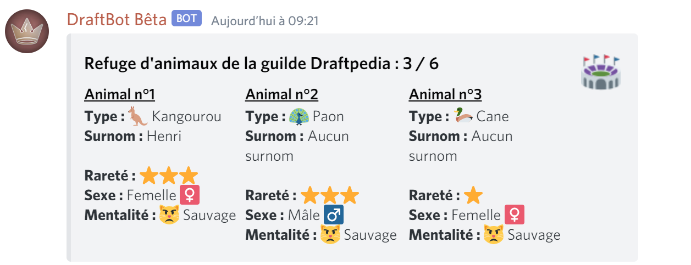

# Familiers

Depuis la version [2.1.2](https://history.draftbot.com/draftbot-v2/2.1.2) de DraftBot vous pouvez avoir un ou plusieurs **familiers**. Ils s'obtiennent dans les récompenses de [guilde ](guildes.md)en fonction du niveau de votre guilde.


Pour le moment les familiers sont purement esthétiques. Ils n'ont pas de fonction à proprement parlé, mais cela est amené à changer dans une future mise à jour.


Pour avoir les informations sur votre familier vous devez utiliser la commande `!mypet` 

Il y a 5 niveaux de **rareté** de familiers, ceux-ci sont représentés par des étoiles 

Les familiers ont un **moral**, si vous le nourrissez à intervalle régulier son moral augmentera. A contrario si vous délaissez votre familier son moral diminuera.

### Comment obtenir un familier ?

Les familiers s'obtiennent dans les récompenses de guildes `!guilddaily` avec un pourcentage défini en fonction du niveau de votre guilde.

| Niveau guilde/rareté familier | 1 | 2 | 3 | 4 | 5 |
| :--- | :--- | :--- | :--- | :--- | :--- |
| 0 | 0.9% | 0.09% | 0.009% | 0.0009% | 0.0001% |
| 10 | 0.894% | 0.0916% | 0.01091% | 0.0023% | 0.00119% |
| 20 | 0.876% | 0.0964% | 0.01664% | 0.0065% | 0.00446% |
| 30 | 0.846% | 0.1044% | 0.02619% | 0.0135% | 0.00991% |
| 40 | 0.804% | 0.1156% | 0.03956% | 0.0233% | 0.01754% |
| 50 | 0.75% | 0.13% | 0.05675% | 0.0359% | 0.02735% |
| 60 | 0.684% | 0.1476% | 0.07776% | 0.0513% | 0.03934% |
| 70 | 0.606% | 0.1684% | 0.10259% | 0.069499% | 0.053511% |
| 80 | 0.516% | 0.1924% | 0.13124% | 0.090499% | 0.069861% |
| 90 | 0.414% | 0.2196% | 1.16371% | 0.114299% | 0.088391% |
| 100 | 0.3% | 0.25% | 0.2% | 0.140899% | 0.109101% |

Vous pouvez libérer votre familier avec la commande `!petfree` 


`Attention cette action est irréversible, si vous libérez un familier c'est définitif`


### Comment nourrir mon familier ?

La nourriture va permettre d'influer sur le moral de votre animal, pour nourrir votre familier vous devez utiliser la commande `!breedpet` ou son alias `!bp`

Ne négligez pas votre familier ! Son moral baissera si vous oubliez de vous en occuper.

Il existe pour le moment 5 niveaux de moral qui correspondent à la mentalité de votre familier, ils sont classés de cette manière :

1.   Fielleux
2.   Sauvage
3.   Craintif
4.   Apprivoisé
5.   Dressé


Echanger un familier avec un autre joueur réinitialisera son moral à  Sauvage

Changer de propriétaire c'est dur à supporter pour un animal !


### Comment stocker mon familier ?

Vous avez la possibilité de stocker votre familier dans le **refuge de votre guilde**. Ou alors de le récupérer avec vous. Pour cela vous devez effectuer la commande `!pettransfer <id du familier>` exemple :`!pettransfer 1` permet de récupérer le familier n°1 du refuge.

Pour visualiser le refuge, vous pouvez utiliser la commande `!shelter`


Le refuge de votre guilde permet d'accueillir jusqu'à 6 familiers différents.


### Surnommer un familier

Vous pouvez définir un surnom pour votre familier pour rendre ce dernier unique. Pour cela, quand vous avez un familier avec vous tapez la commande `!petnickname <surnom>` exemple : `!petnickname Henri` permet de surnommer votre familier "Henri".

###  Échange de familiers

L'implémentation de cette mise à jour favorise l'interaction entre joueurs puisque vous avez la possibilité d'échanger un familier avec la commande `!pettrade <mention joueur>` exemple : `!pettrade @Heliox#1119` permet d'ouvrir l'interface d'échange de familier avec le joueur **Heliox**.

