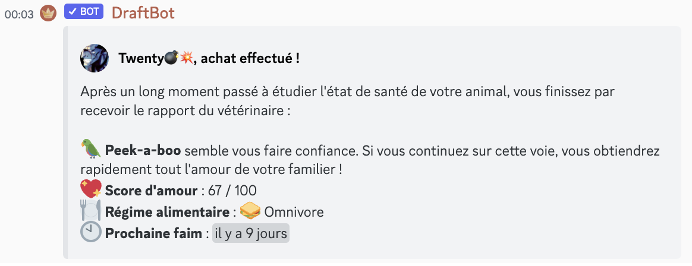
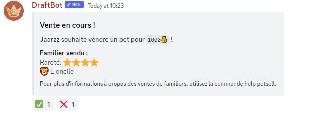

# Familiers

Depuis la version [2.1.2](https://history.draftbot.com/draftbot-v2/2.1.2) de DraftBot, vous pouvez avoir un ou plusieurs **familiers**. Ils s'obtiennent dans les récompenses de [guilde ](guildes.md)en fonction du niveau de votre guilde.

Pour avoir les informations sur votre familier, vous devez utiliser la commande `/familier`.

Il y a 5 niveaux de **rareté** de familiers, ceux-ci sont représentés par des étoiles :star: :star: :star: :star: :star:.

Les familiers ont un **moral**, si vous les nourrissez à intervalle régulier leur moral augmentera. A contrario, si vous délaissez vos familiers leur moral diminuera.

### Comment obtenir un familier ?

Les familiers s'obtiennent dans les récompenses de guilde `/bonusjournalier` avec 1% de chance ou alors dans les mini-évènements.

La probabilité d'avoir des raretés supérieures augmente avec le niveau de votre guilde.

|                               |         |          |          |          |          |
| ----------------------------- | ------- | -------- | -------- | -------- | -------- |
| Niveau guilde/rareté familier | 1:star: | 2 :star: | 3 :star: | 4 :star: | 5 :star: |
| 0                             | 90%     | 9%       | 0.9%     | 0.09%    | 0.01%    |
| 10                            | 89.4%   | 9.16%    | 1.091%   | 0.23%    | 0.119%   |
| 20                            | 87.6%   | 9.64%    | 1.664%   | 0.65%    | 0.446%   |
| 30                            | 84.6%   | 10.44%   | 2.619%   | 1.35%    | 0.991%   |
| 40                            | 80.4%   | 11.56%   | 3.956%   | 2.33%    | 1.754%   |
| 50                            | 75%     | 13%      | 5.675%   | 3.59%    | 2.735%   |
| 60                            | 68.4%   | 14.76%   | 7.776%   | 5.13%    | 3.934%   |
| 70                            | 60.6%   | 16.84%   | 10.259%  | 6.9499%  | 5.3511%  |
| 80                            | 51.6%   | 19.24%   | 13.124%  | 9.0499%  | 6.9861%  |
| 90                            | 41.4%   | 21.96%   | 16.371%  | 11.4299% | 8.8391%  |
| 100                           | 30%     | 25%      | 20%      | 14.0899% | 10.9101% |


Si un pet est obtenu dans un mini-évènement, sa rareté est générée avec les statistiques des guildes de niveau 20.


Vous pouvez libérer votre familier avec la commande `/libererfamilier`.


Attention, cette action est irréversible. Le fait de libérer un familier est définitif.


### Comment nourrir mon familier ?

#### Acheter de la nourriture.

L'achat de nourriture pour les familiers se fait dans le magasin de votre guilde. Si vous n'avez pas de guilde, vous n'aurez accès qu'à la forme la plus basique de nourriture, c'est-à-dire la friandise, pour votre animal.

.png>)

#### Donner de la nourriture

La nourriture va permettre d'influer sur le moral de votre animal. Pour nourrir votre familier, vous devez utiliser la commande `/nourrirfamilier`.

.png>)

Chaque type de nourriture fera gagner une quantité différente de points d'affection à votre familier.

* Les friandises feront gagner 1 point d'affection.
* Les steaks et salade feront gagner 3 points d'affection.
* Les soupes ultimes feront gagner 5 points d'affection.

Cependant, le type de nourriture n'a pas d'influence sur la durée pendant laquelle votre familier n'a pas faim.


La durée pendant laquelle un familier n'a pas faim dépend uniquement de la rareté du pet. Le nombre d'étoiles de rareté est égal au nombre d'heures qu'il faut attendre entre deux repas.



Certains familiers suivent un régime particulier (herbivore ou carnivore) et ne pourront donc pas profiter de certaines sources de nourritures. Ne donnez pas de salade à votre T-rex !


#### Niveaux de moral

Ne négligez pas votre familier ! Son moral baissera si vous oubliez de vous en occuper.


Le moral d'un familier baisse de deux points par jour en moyenne, cette baisse ne tient pas compte de la rareté du pet.


Il existe pour le moment 5 niveaux de moral qui correspondent à la mentalité de votre familier, ils sont classés de cette manière :

1. :smirk\_cat: Fielleux (entre 0 et 4 points d'affection)
2. :pouting\_cat: Sauvage (entre 5 et 24 points d'affection)
3. :scream\_cat: Craintif (entre 25 et 49 points d'affection)
4. :smiley\_cat: Apprivoisé (entre 50 et 99 points d'affection)
5. :heart\_eyes\_cat: Dressé (100 points d'affection)


Les animaux dressés ne perdent plus de moral et n'ont donc pas besoin d'être nourris pour être aimés (mais vous pouvez le faire quand même).



Il n'est pas possible d'effectuer certaines actions avec un familier fielleux !



Échanger un familier avec un autre joueur lui fera perdre 5 points par niveau de rareté (ou étoiles)

Vendre un familier avec un autre joueur réinitialisera son moral à :pouting\_cat: Sauvage.

Changer de propriétaire, c'est dur à supporter pour un animal !


Contre 5 gemmes, le vétérinaire de la cour vous donnera des informations sur le familier que vous possédez actuellement. La consultation s'obtient dans le [magasin de missions](missions.md#magasin-des-missions).

<figure><figcaption>
Il est toujours utile pour savoir s'il a perdu du moral ou pas de façon précise, et quand il aura faim.
</figcaption></figure>

### Comment stocker mon familier ?

Vous avez la possibilité de stocker votre familier dans le **refuge de votre guilde** ou alors de le récupérer avec vous. Pour cela, vous devez effectuer la commande `/transfererfamilier`. Exemple :`/transfererfamilier emplacement:1` permet de récupérer le familier n°1 du refuge.

Pour visualiser le refuge, vous pouvez utiliser la commande `/abriguilde`.


Le refuge de votre guilde permet d'accueillir jusqu'à 6 familiers différents.


### Comment surnommer un familier ?

Vous pouvez définir un surnom pour votre familier afin de rendre ce dernier unique. Pour cela, quand vous avez un familier avec vous tapez la commande `/surnomfamilier` exemple : `/surnomfamilier surnom:Henri` permet de surnommer votre familier "Henri".

### Comment échanger un familier ?

L'implémentation de cette mise à jour favorise l'interaction entre joueurs puisque vous avez la possibilité d'échanger un familier avec la commande `/echangefamilier`. Par exemple : `/echangefamilier utilisateur:@Heliox#1119` permet d'ouvrir l'interface d'échange de familier avec le joueur **Heliox**.

### Comment vendre un familier ?

Si vous souhaitez vous débarrasser d'un familier mais que vous n'avez pas le cœur de le libérer, (ou alors que vous aimez l'argent), il est possible de vendre le familier que vous transportez. Pour cela, vous pouvez utiliser la commande `/vendrefamilier` en précisant le prix attendu. Par exemple, pour proposer votre familier à la vente pour 1000:moneybag:, entrez la commande `/vendrefamilier prix:1000`.

<figure><figcaption>
Ici, le familier "Lionelle" va être vendu pour 1000 💰
</figcaption></figure>

Il y a des conditions importantes à respecter pour la vente de familiers :

* Il n'est pas possible de vendre un familier à un membre de sa guilde.
* Il est nécessaire d'appartenir à une guilde pour vendre un familier mais pas pour l'acheter.
* Vous ne pouvez pas vendre un pet en dessous de 100 :moneybag:, ni au dessus de 50 000 :moneybag:.


Le vendeur ne gagnera pas d'argent lors de la transaction, mais de l'expérience de guilde.


### **Liste des familiers disponibles**

|                                                                                                                                                                                                                                                                                                                                                                                                                                                                                                                                                                                                                                                                                                                                                                                                                                                                                                                                                                                                                                                                                                                                                                                                                                                                                                                                                                                                                                                                                                                                                                                                                                                                                                                                                                                                                        |                                                                                                                                                                                                                                                                                                                                                                                                                                                                                                                                                                                                                                                                                                                                                                                                                                                                                                                                                                                                                                                                                                                                                                                                                                                                                                                                                                                                                                                                                                                                                                                                                                                                                                                                                                                                                                                                                                                            |                                                                                                                                                                                                                                                                                                                                                                                                                                                                                                                                                                                                                                                                                                                                                                                                                                                                                                                                                                                                                                                                                                                                                                                                                                                                                                                                                                       |                                                                                                                                                                                                                                                                                                                                                                                                                                                                                                                                                                                                                                                                                                                                                                                                          |                                                                                                                                                                                                                                                                                                                                                                                                                                                                                                                                              |
| ---------------------------------------------------------------------------------------------------------------------------------------------------------------------------------------------------------------------------------------------------------------------------------------------------------------------------------------------------------------------------------------------------------------------------------------------------------------------------------------------------------------------------------------------------------------------------------------------------------------------------------------------------------------------------------------------------------------------------------------------------------------------------------------------------------------------------------------------------------------------------------------------------------------------------------------------------------------------------------------------------------------------------------------------------------------------------------------------------------------------------------------------------------------------------------------------------------------------------------------------------------------------------------------------------------------------------------------------------------------------------------------------------------------------------------------------------------------------------------------------------------------------------------------------------------------------------------------------------------------------------------------------------------------------------------------------------------------------------------------------------------------------------------------------------------------------- | -------------------------------------------------------------------------------------------------------------------------------------------------------------------------------------------------------------------------------------------------------------------------------------------------------------------------------------------------------------------------------------------------------------------------------------------------------------------------------------------------------------------------------------------------------------------------------------------------------------------------------------------------------------------------------------------------------------------------------------------------------------------------------------------------------------------------------------------------------------------------------------------------------------------------------------------------------------------------------------------------------------------------------------------------------------------------------------------------------------------------------------------------------------------------------------------------------------------------------------------------------------------------------------------------------------------------------------------------------------------------------------------------------------------------------------------------------------------------------------------------------------------------------------------------------------------------------------------------------------------------------------------------------------------------------------------------------------------------------------------------------------------------------------------------------------------------------------------------------------------------------------------------------------------------- | --------------------------------------------------------------------------------------------------------------------------------------------------------------------------------------------------------------------------------------------------------------------------------------------------------------------------------------------------------------------------------------------------------------------------------------------------------------------------------------------------------------------------------------------------------------------------------------------------------------------------------------------------------------------------------------------------------------------------------------------------------------------------------------------------------------------------------------------------------------------------------------------------------------------------------------------------------------------------------------------------------------------------------------------------------------------------------------------------------------------------------------------------------------------------------------------------------------------------------------------------------------------------------------------------------------------------------------------------------------------- | -------------------------------------------------------------------------------------------------------------------------------------------------------------------------------------------------------------------------------------------------------------------------------------------------------------------------------------------------------------------------------------------------------------------------------------------------------------------------------------------------------------------------------------------------------------------------------------------------------------------------------------------------------------------------------------------------------------------------------------------------------------------------------------------------------- | -------------------------------------------------------------------------------------------------------------------------------------------------------------------------------------------------------------------------------------------------------------------------------------------------------------------------------------------------------------------------------------------------------------------------------------------------------------------------------------------------------------------------------------------- |
| :star:                                                                                                                                                                                                                                                                                                                                                                                                                                                                                                                                                                                                                                                                                                                                                                                                                                                                                                                                                                                                                                                                                                                                                                                                                                                                                                                                                                                                                                                                                                                                                                                                                                                                                                                                                                                                                 | :star::star:                                                                                                                                                                                                                                                                                                                                                                                                                                                                                                                                                                                                                                                                                                                                                                                                                                                                                                                                                                                                                                                                                                                                                                                                                                                                                                                                                                                                                                                                                                                                                                                                                                                                                                                                                                                                                                                                                                               | :star::star::star:                                                                                                                                                                                                                                                                                                                                                                                                                                                                                                                                                                                                                                                                                                                                                                                                                                                                                                                                                                                                                                                                                                                                                                                                                                                                                                                                                    | :star::star::star::star:                                                                                                                                                                                                                                                                                                                                                                                                                                                                                                                                                                                                                                                                                                                                                                                 | :star::star::star::star::star:                                                                                                                                                                                                                                                                                                                                                                                                                                                                                                               |
| 
Chien🐕

Caniche🐩

Chat🐈

Chat noir 🐈⬛

Souris🐁

Hamster 🐹

Lapin 🐇

Vache 🐄

Cochon 🐷

Poule / Coq 🐔

Oiseau 🐦

Canard 🦆

Cheval 🐎

Tortue 🐢

Serpent 🐍

Lézard 🦎

Bélier / Mouton 🐑

Chèvre / Bouc 🐐

Dindon 🦃 Bonhomme de neige ⛄
 | 
Renard 🦊

Ours 🐻

Koala 🐨

Grenouille 🐸

Singe 🐒

Pingouin 🐧

Hibou 🦉

Chauve-souris 🦇

Loup 🐺

Sanglier 🐗

Otarie 🦭

Hippopotame 🦛

Lama 🦙

Cygne 🦢

Flamant rose 🦩

Raton Laveur 🦝

Putois 🦨

Blaireau 🦡

Castor 🦫

Paresseux 🦥

Tamia 🐿

Hérisson🦔️
 | 
Ours polaire 🐻❄

Panda 🐼

Scorpion 🦂

Crocodile 🐊

Éléphant 🐘

Zèbre 🦓

Rhinocéros 🦏

Dromadaire 🐪

Chameau 🐫

Girafe 🦒

Kangourou 🦘

Paon 🦚

Perroquet 🦜

Loutre 🦦 Poulpe 🐙
 | 
Tigre 🐅

Lion 🦁

Aigle 🦅

Dodo 🦤

Léopard 🐆

Mammouth 🦣

Colombe 🕊 Manchot 🐧 Bonhomme de neige ☃
 | 
Licorne 🦄

Dragon 🐉

T-rex 🦖

Stitch/Angel 🟣 Alien 👽 Canard écarlate 🦆
 |


Le Bonhomme de neige existe en deux versions :

* La version :star: qui est celle de base.
* La version :star::star::star::star: qui est une version bien plus rare.

On peut distinguer la version rare assez facilement car l'émoji qui la représente est entouré de flocons de neige !

