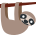
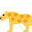

# Familiers

Depuis la version [2.1.2](https://history.draftbot.com/draftbot-v2/2.1.2) de DraftBot, vous pouvez avoir un ou plusieurs **familiers**. Ils s'obtiennent dans les récompenses de [guilde ](guildes.md)en fonction du niveau de votre guilde.


Pour le moment les familiers sont purement esthétiques. Ils n'ont pas de fonction à proprement parler, mais cela est amené à changer dans une future mise à jour.


Pour avoir les informations sur votre familier, vous devez utiliser la commande `!mypet` .

Il y a 5 niveaux de **rareté** de familiers, ceux-ci sont représentés par des étoiles ⭐ ⭐ ⭐ ⭐ ⭐ 

Les familiers ont un **moral**, si vous les nourrissez à intervalle régulier leur moral augmentera. A contrario, si vous délaissez vos familiers leur moral diminuera.

### Comment obtenir un familier ?

Les familiers s'obtiennent dans les récompenses de guildes `!guilddaily` avec 1% de chance ou alors dans un mini-évènement.

La probabilité d'avoir des raretés supérieures augmente avec le niveau de votre guilde.

| Niveau guilde/rareté familier | 1⭐  | 2 ⭐  | 3 ⭐  | 4 ⭐  | 5 ⭐  |
| :--- | :--- | :--- | :--- | :--- | :--- |
| 0 | 90% | 9% | 0.9% | 0.09% | 0.01% |
| 10 | 89.4% | 9.16% | 1.091% | 0.23% | 0.119% |
| 20 | 87.6% | 9.64% | 1.664% | 0.65% | 0.446% |
| 30 | 84.6% | 10.44% | 2.619% | 1.35% | 0.991% |
| 40 | 80.4% | 11.56% | 3.956% | 2.33% | 1.754% |
| 50 | 75% | 13% | 5.675% | 3.59% | 2.735% |
| 60 | 68.4% | 14.76% | 7.776% | 5.13% | 3.934% |
| 70 | 60.6% | 16.84% | 10.259% | 6.9499% | 5.3511% |
| 80 | 51.6% | 19.24% | 13.124% | 9.0499% | 6.9861% |
| 90 | 41.4% | 21.96% | 16.371% | 11.4299% | 8.8391% |
| 100 | 30% | 25% | 20% | 14.0899% | 10.9101% |


Si un pet est obtenu dans un mini-évènement, sa rareté est générée avec les statistiques des guildes de niveau 20.


Vous pouvez libérer votre familier avec la commande `!petfree` .


`Attention, cette action est irréversible, si vous libérez un familier, c'est définitif.`


### Comment nourrir mon familier ?

#### Acheter de la nourriture.

L'achat de nourriture pour les familiers se fait dans le magasin de votre guilde. Si vous n'avez pas de guilde, vous n'aurez accès qu'a la forme la plus basique de nourriture pour votre animal.

La nourriture va permettre d'influer sur le moral de votre animal, pour nourrir votre familier vous devez utiliser la commande `!feedpet` ou son alias `!fp`.

Chaque type de nourriture fera gagner une quantité différente de points d'affection à votre familier. 

* Les friandises feront gagner 1 point d'affection.
* Les steaks et salade feront gagner 3 points d'affection.
* Les soupes ultimes feront gagner 5 points d'affection.

Cependant, le type de nourriture n'a pas d'influence sur la durée pendant laquelle votre familier n'a pas faim.


La durée pendant laquelle un familier n'a pas faim dépend uniquement de la rareté du pet. Le nombre d'étoiles de rareté est égal au nombre d'heures qu'il faut attendre entre deux repas.


Certains familiers suivent un régime particulier \(herbivore ou carnivore\) et ne pourront donc pas profiter de certaines sources de nourritures. Ne donnez pas de salade à votre T-rex !

Ne négligez pas votre familier ! Son moral baissera si vous oubliez de vous en occuper. 


Le moral d'un familier baisse de deux points par jour en moyenne, cette baisse ne tient pas compte de la rareté du pet.



Il n'est pas possible d'effectuer certaines actions avec un familier fielleux !


Il existe pour le moment 5 niveaux de moral qui correspondent à la mentalité de votre familier, ils sont classés de cette manière :

1.  😼 Fielleux
2.  😾 Sauvage
3.  🙀 Craintif
4.  😺 Apprivoisé
5.  😻 Dressé


Les animaux dressés ne perdent plus de moral et n'ont donc pas besoin d'être nourris pour être aimé \(mais vous pouvez le faire quand même\).



Échanger ou vendre un familier avec un autre joueur réinitialisera son moral à 😾 Sauvage.

Changer de propriétaire, c'est dur à supporter pour un animal !


### Comment stocker mon familier ?

Vous avez la possibilité de stocker votre familier dans le **refuge de votre guilde**. Ou alors de le récupérer avec vous. Pour cela, vous devez effectuer la commande `!pettransfer <id du familier>` exemple :`!pettransfer 1` permet de récupérer le familier n°1 du refuge.

Pour visualiser le refuge, vous pouvez utiliser la commande `!shelter`.


Le refuge de votre guilde permet d'accueillir jusqu'à 6 familiers différents.


### Surnommer un familier

Vous pouvez définir un surnom pour votre familier afin de rendre ce dernier unique. Pour cela, quand vous avez un familier avec vous tapez la commande `!petnickname <surnom>` exemple : `!petnickname Henri` permet de surnommer votre familier "Henri".

###  Échange de familiers

L'implémentation de cette mise à jour favorise l'interaction entre joueurs puisque vous avez la possibilité d'échanger un familier avec la commande `!pettrade <mention joueur>` exemple : `!pettrade @Heliox#1119` permet d'ouvrir l'interface d'échange de familier avec le joueur **Heliox**.

### Vente de familiers

Si vous souhaitez vous débarrasser d'un familier mais que vous n'avez pas le cœur de le libérer, \(ou alors que vous aimez l'argent\), il est possible de vendre le familier que vous transportez. Pour cela, vous pouvez utiliser la commande `!petsell [prix]`.

Il y a des conditions importantes à respecter pour la vente de familier:

* Il n'est pas possible de vendre un familier à un membre de sa guilde.
* Il est nécessaire d'appartenir à une guilde pour vendre un familier mais pas pour l'acheter.


Le vendeur ne gagnera pas d'argent lors de la transaction, mais de l'expérience de guilde.


### **Liste des familiers disponibles**

<table>
  <thead>
    <tr>
      <th style="text-align:left"><b>Commun</b>
      </th>
      <th style="text-align:left"><b>Peu commun</b>
      </th>
      <th style="text-align:left"><b>Rare</b>
      </th>
      <th style="text-align:left"><b>Tr&#xE8;s rare</b>
      </th>
      <th style="text-align:left"><b>L&#xE9;gendaire</b>
      </th>
    </tr>
  </thead>
  <tbody>
    <tr>
      <td style="text-align:left">
        
Chien&#x1F415;

        
Caniche&#x1F429;

        
Chat&#x1F408;

        
Chat noir
          
        

        
Souris&#x1F401;

        
Hamster &#x1F439;

        
Lapin &#x1F407;

        
Vache &#x1F404;

        
Cochon &#x1F437;

        
Poule / Coq &#x1F414;

        
Oiseau &#x1F426;

        
Canard &#x1F986;

        
Cheval &#x1F40E;

        
Tortue &#x1F422;

        
Serpent &#x1F40D;

        
L&#xE9;zard &#x1F98E;

        
B&#xE9;lier / Mouton &#x1F411;

        
Ch&#xE8;vre / Bouc &#x1F410;

        
Dindon &#x1F983;

      </td>
      <td style="text-align:left">
        
Renard &#x1F98A;

        
Ours &#x1F43B;

        
Koala &#x1F428;

        
Grenouille &#x1F438;

        
Singe &#x1F412;

        
Pingouin &#x1F427;

        
Hibou &#x1F989;

        
Chauve-souris &#x1F987;

        
Loup &#x1F43A;

        
Sanglier &#x1F417;

        
Otarie
          
        

        
Hippopotame &#x1F99B;

        
Lama &#x1F999;

        
Cygne &#x1F9A2;

        
Flamant rose
          
        

        
Raton Laveur &#x1F99D;

        
Putois
          
        

        
Blaireau
          
        

        
Castor
          
        

        
Paresseux
          
        

        
Tamia
          
        

        
H&#xE9;risson&#x1F994;&#xFE0F;

      </td>
      <td style="text-align:left">
        
Ours polaire
          
        

        
Panda &#x1F43C;

        
Scorpion &#x1F982;

        
Crocodile &#x1F40A;

        
&#xC9;l&#xE9;phant &#x1F418;

        
Z&#xE8;bre &#x1F993;

        
Rhinoc&#xE9;ros &#x1F98F;

        
Dromadaire &#x1F42A;

        
Chameau &#x1F42B;

        
Girafe &#x1F992;

        
Kangourou &#x1F998;

        
Paon
          
        

        
P&#xE9;rroquet &#x1F99C;

        
Loutre
          
        

      </td>
      <td style="text-align:left">
        
Tigre &#x1F405;

        
Lion &#x1F981;

        
Aigle

        
Dodo
          
        

        
L&#xE9;opard
          
        

        
Mammouth
          
        

        
Colombe &#x1F54A;

      </td>
      <td style="text-align:left">
        
Licorne &#x1F984;

        
Dragon &#x1F409;

        
T-rex &#x1F996;

        
Stitch/Angel
          
        

      </td>
    </tr>
  </tbody>
</table>

