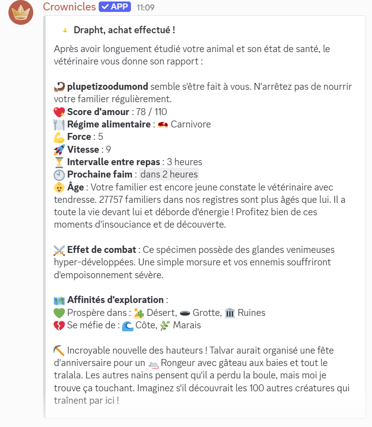
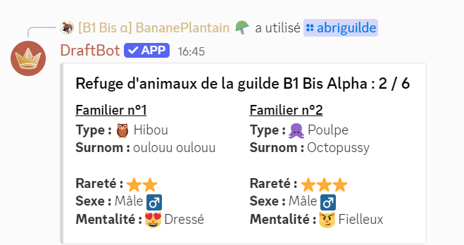
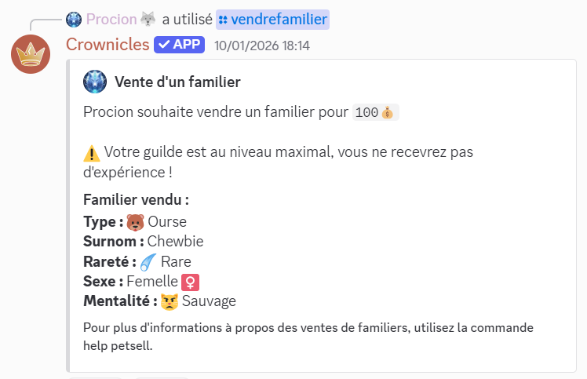
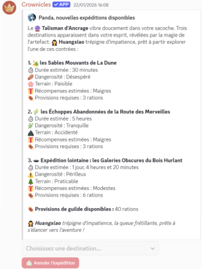

---
tags:
  - images-pas-a-jour
---

# Familiers

Depuis la version [2.1.2](https://history.crownicles.com/crownicles-v2/2.1.2) de Crownicles, vous pouvez avoir un ou plusieurs **familiers**.

Pour avoir les informations sur votre familier, vous devez utiliser la commande `/familier`.

Les niveaux de **rareté** de familiers sont les mêmes que pour les équipements (de commun à mythique).

Les familiers ont un **moral**, si vous les nourrissez à intervalle régulier leur moral augmentera. A contrario, si vous délaissez vos familiers leur moral diminuera.

### Comment obtenir un familier ?

Les familiers s'obtiennent dans les récompenses de guilde `/bonusjournalierguilde` avec 7% de chance, ou alors dans les mini-évènements.

La probabilité d'avoir des raretés supérieures augmente avec le niveau de votre guilde.

|                               |                                 |                   |                    |               |                 |               |                    |                |
| ----------------------------- | ------------------------------- | ----------------- | ------------------ | ------------- | --------------- | ------------- | ------------------ | -------------- |
| Niveau guilde/rareté familier | Commun :large\_orange\_diamond: | Peu commun :fire: | Exotique :trident: | Rare :comet:  | Spécial :dizzy: | Épique :star: | Légendaire :star2: | Mythique :gem: |
| 0-29                          | 43,76%                          | 25%               | 15%                | 10%           | 5%              | 1%            | 0,23%              | 0,02%          |
| 30-59                         | 0%                              | 44,44%            | 26,67%             | 17,78%        | 8,89%           | 1,78%         | 0,41%              | 0,04%          |
| 60-89                         | 0%                              | 0%                | 48%                | 32%           | 16%             | 3,2%          | 0,74%              | 0,06%          |
| 90-119                        | 0%                              | 0%                | 0%                 | 61,54%        | 30,77%          | 6,15%         | 1,42%              | 0,12%          |
| 120-150                       | 0%                              | 0%                | 0%                 | 0%            | 80%             | 16%           | 3,68%              | 0,32%          |


Si un familier est obtenu dans un mini-évènement, sa rareté est générée avec les statistiques des guildes de niveau 20.


Vous pouvez libérer votre familier ou un familier de l'abri de guilde avec la commande `/libererfamilier`.


Attention, cette action est irréversible. Le fait de libérer un familier est définitif.


## A quoi sert un familier ?

Un familier a les fonctions suivantes:

* Lors des mini-événements, vous interagissez avec votre familier. Il peut vous donner (ou vous faire perdre) des ressources selon son moral, gagner (ou perdre) des points d'affection ou simplement ne rien se passer.
* Lors des combats, chaque familier aidera (ou du moins essayera d'aider) son propriétaire.
* Vous pouvez envoyer votre familier explorer le monde et vous rapporter des récompenses grâce aux expéditions.

Vous pouvez également le caresser (mais cela n'a aucun effet sur son moral).

<figure><picture><source srcset="../.gitbook/assets/familier_sombre.png" media="(prefers-color-scheme: dark)"></picture><figcaption></figcaption></figure>

### Comment dresser mon familier ?

#### Acheter de la nourriture.

L'achat de nourriture pour les familiers se fait dans les villes, à l'approvisionnement de la guilde. Si vous n'avez pas de guilde, vous n'aurez accès qu'à la forme la plus basique de nourriture, c'est-à-dire la friandise, pour votre animal.

<picture><source srcset="../.gitbook/assets/Screenshot_20250617-151531.png" media="(prefers-color-scheme: dark)"></picture>


Il est aussi possible que votre familier trouve de la nourriture pendant l'aventure.



Chaque combat peut renforcer le lien d'affection avec votre familier si celui n'est pas dressé.


#### Donner de la nourriture

La nourriture va permettre d'influer sur le moral de votre animal. Pour nourrir votre familier, vous devez utiliser la commande `/nourrirfamilier`.

<figure><picture><source srcset="../.gitbook/assets/nourrirfamilier_sombre (2).png" media="(prefers-color-scheme: dark)"></picture><figcaption>
La commande /nourrirfamilier
</figcaption></figure>

Chaque type de nourriture fera gagner une quantité différente de points d'affection à votre familier.

* Les friandises feront gagner 1 point d'affection.
* Les steaks et salade feront gagner 3 points d'affection.
* Les soupes ultimes feront gagner 5 points d'affection.

Cependant, le type de nourriture n'a pas d'influence sur la durée pendant laquelle votre familier n'a pas faim.


La durée pendant laquelle un familier n'a pas faim dépend uniquement de l'espèce du familier (entre 30m et 5h).



Certains familiers suivent un régime particulier (herbivore ou carnivore) et ne pourront donc pas profiter de certaines sources de nourriture. Ne donnez pas de salade à votre T-rex !


#### Niveaux de moral

Ne négligez pas votre familier ! Son moral baissera si vous oubliez de vous en occuper.


Le moral d'un familier baisse de un point par jour en moyenne, cette baisse ne tient pas compte de la rareté du pet.


Il existe pour le moment 5 niveaux de moral qui correspondent à la mentalité de votre familier, ils sont classés de cette manière :

1. :smirk\_cat: Fielleux (entre 0 et 4 points d'affection)
2. :pouting\_cat: Sauvage (entre 5 et 24 points d'affection)
3. :scream\_cat: Craintif (entre 25 et 49 points d'affection)
4. :smiley\_cat: Apprivoisé (entre 50 et 99 points d'affection)
5. :heart\_eyes\_cat: Dressé (entre 100 et 110 points d'affection)


Il n'est pas possible d'effectuer certaines actions avec un familier fielleux !



Vendre un familier avec un autre joueur réinitialisera son moral à :pouting\_cat: Sauvage.

Changer de propriétaire, c'est dur à supporter pour un animal !


Contre 3 gemmes, le vétérinaire de la cour vous donnera des informations sur le familier que vous possédez actuellement, et lui donnera 15 points d'amour :revolving\_hearts:. La consultation s'obtient à Mergagnan ou Claire de Ville.&#x20;

<figure><picture><source srcset="../.gitbook/assets/vétérinaire_sombre.png" media="(prefers-color-scheme: dark)"></picture><figcaption>
Il est toujours utile pour savoir s'il a perdu du moral ou pas de façon précise, quand il aura faim mais encore bien plus.
</figcaption></figure>

### Comment stocker mon familier ?

Vous avez la possibilité de stocker votre familier dans le **refuge de votre guilde** ou alors de le récupérer avec vous. Pour cela, vous devez effectuer la commande `/transfererfamilier` . Un menu vous permet de choisir de déposer votre familier dans le refuge, de l'échanger contre un du refuge (ou d'annuler le transfert).

Pour visualiser le refuge, vous pouvez utiliser la commande `/abriguilde`.

<picture><source srcset="../.gitbook/assets/abriguilde_sombre.png" media="(prefers-color-scheme: dark)"></picture>


Le refuge de votre guilde permet d'accueillir jusqu'à 6 familiers différents par défaut et bien plus en l'améliorant.&#x20;


### Comment surnommer un familier ?

Vous pouvez définir un surnom pour votre familier afin de rendre ce dernier unique. Pour cela, quand vous avez un familier avec vous tapez la commande `/surnomfamilier.`Exemple : `/surnomfamilier surnom:Henri` permet de surnommer votre familier "Henri".

<picture><source srcset="../.gitbook/assets/familer_sombre.png" media="(prefers-color-scheme: dark)"></picture>

### Comment vendre un familier ?

Si vous souhaitez vous débarrasser d'un familier mais que vous n'avez pas le cœur de le libérer (ou alors que vous aimez l'argent), il est possible de vendre le familier que vous transportez. Pour cela, vous pouvez utiliser la commande `/vendrefamilier` en précisant le prix attendu. Par exemple, pour proposer votre familier à la vente pour 1000:moneybag:, entrez la commande `/vendrefamilier prix:1000`.

<figure><picture><source srcset="../.gitbook/assets/vendrefamilier_sombre.png" media="(prefers-color-scheme: dark)"></picture><figcaption>
Ici, le familier "Chewbie" va être vendu pour 100 💰
</figcaption></figure>

Il y a des conditions importantes à respecter pour la vente de familiers :

* Il n'est pas possible de vendre un familier à un membre de sa guilde.
* Il est nécessaire d'appartenir à une guilde pour vendre un familier, mais pas pour l'acheter.
* Vous ne pouvez pas vendre un familier en dessous de 100:moneybag:, ni au-dessus de 50 000 :moneybag:.


L'argent sera transféré dans la trésorerie de la guilde du vendeur, moyennant une commission de 5% (maximum 350 :moneybag:)


### **Liste des familiers disponibles**

<table><thead><tr><th></th><th></th><th></th><th></th><th></th><th></th><th></th><th width="151.2000732421875"></th></tr></thead><tbody><tr><td>Commun 🔶</td><td>Peu commun 🔥</td><td>Exotique 🔱</td><td>Rare ☄️</td><td>Spécial 💫</td><td>Épique ⭐</td><td>Légendaire 🌟</td><td>Mythique 💎</td></tr><tr><td>
Chien.ne 🐕 Caniche 🐩 Chat.te 🐈 Chat.te noir🐈‍⬛ Rongeur/Souris 🐁 Hamster 🐹 Lapin.ne 🐇

Bœuf/ Vache 🐄 Porc/Truie 🐖 Poule/Coq 🐔 Oiseau 🐦 Canard/Cane 🦆 Colombe 🕊️ Poisson 🐟 Escargot 🐌 Poussin 🐤
</td><td>Étalon/Jument 🐎 Bélier/Brebis 🐑 Bouc/Chèvre 🐐 Dindon/Dinde 🦃  Renard.e 🦊 Crapaud/Grenouille 🐸 Hibou/Chouette 🦉 Chauve-souris 🦇 Sanglier/Laie 🐗 Phoque/Otarie 🦭 Rat.e 🐀 Oie 🪿</td><td>
Tortue 🐢 Serpent 🐍 Lézard.e 🦎 Koala 🐨 Pingouin.e 🐧

Hippopotame 🦛 Lama.te 🦙 Cygne 🦢 Flamant rose 🦩 Raton.ne laveur 🦝 Putois/Mouffette 🦨 Blaireau/Blairelle 🦡 Castor 🦫 Âne.sse 🫏
</td><td>

Ours.e 🐻 Loup/Louve 🐺 Paresseux/Paresseuse 🦥 Tamia 🐿️ Hérisson.ne 🦔 Ours.e polaire 🐻‍❄️ Panda 🐼 Scorpion.ne 🦂 Crocodile 🐊 Éléphant.e 🐘 Zèbre.lle 🦓 Méduse 🪼 Crevette 🦐 Crabe 🦀
</td><td>Singe/Guenon 🐒 Rhinocéros 🦏 Dromadaire/Chamelle 🐪 Chameau/Chamelle 🐫 Girafe 🦒 Kangourou 🦘 Paon.ne 🦚 Perroquet 🦜 Loutre 🦦 Tigre.sse 🐅 Poulpe/Pieuvre 🐙 Baleine 🐋 Cerf/Biche 🦌 Bison.ne 🦬 Élan 🫎</td><td>
Lion.ne 🦁 Aigle 🦅 Dodo 🦤 Léopard.e 🐆 Mammouth 🦣 Bonhomme/Dame de neige ⛄ Manchot.e 🐧 Poisson-globe 🐡 Requin 🦈 Homard 🦞 Dauphin 🐬 Buffle d'eau 🐃 Orang-outan 🦧

Gorille 🦍
</td><td>Licorne  🦄 Dragon.ne 🐉 T-Rex 🦖 Stitch/Angel 🔵/ 🟣 Canard/Cane écarlate 🦆 Bonhomme/Dame de neige ☃️ Alien.ne 👽 Poisson tropical 🐠 Baleine 🐳 Phénix 🐦🔥 Diplodocus 🦕 Merle 🐦‍⬛ Corbeau 🐦‍⬛ Jack-o'-lantern 🎃 Fantôme 👻</td><td>
Fée 🧚

Vampire 🧛
</td></tr></tbody></table>


Le Bonhomme de neige existe en deux versions :

* La version épique.
* La version légendaire.

On peut distinguer la version la plus rare assez facilement car l'émoji qui la représente est entouré de flocons de neige !

Il y a également deux baleines dans le jeu :

* La version spécial, une baleine classique.
* La version légendaire qui se distingue par un jet d'eau sur son dos.

La Chamelle spécial se retrouve aussi deux fois :&#x20;

* En tant que femelle du Chameau :camel:&#x20;
* En tant que femelle du Dromadaire :dromedary\_camel:&#x20;

L’émoji qui la représente permet de différencier les deux animaux !


### Pouvoir des familiers en combat



Les familiers 1 :star:

\
:cat2: **chat.te** : griffe légèrement l’adversaire\
:dog2: **chien.ne** : mord légèrement l'adversaire\
:poodle: **caniche** : mord légèrement l'adversaire\
:rat: **rat.e** : mord l'adversaire en l'empoisonnant parfois\
:chicken: **poule/coq** : frappe l'adversaire de son bec\
:bird: **oiseau** : frappe l'adversaire de son bec\
:duck: **canard/cane** : frappe l'adversaire de son bec\
:goose: **oie** : frappe l'adversaire de son bec\
:pig: **cochon/truie** : charge l'adversaire\
:sheep: **bélier/brebis** : charge l'adversaire\
:goat: **chèvre/bouc** : charge l'adversaire\
:snake: **serpent** : mord et empoisonne l'adversaire\
:cow2: **boeuf/vache** : charge et étourdit l'adversaire\
:black\_cat: **chat.te noir.e** : jette une malédiction sur l'adversaire\
:snowman:**bonhomme de neige** : gèle l'adversaire\
:racehorse: **étalon/jument** : boost la vitesse de son propriétaire\
:turtle: **tortue** : augmente la défense de son propriétaire, mais le ralentit\
:lizard: **lézard** : soigne légèrement son propriétaire\
:fish: **poisson** : protège son propriétaire du feu\
:mouse2: **souris/rongeur** : effraie l'éléphant adverse\
:hamster: **hamster** : inflige des dégâts dérisoires à l'adversaire\
:rabbit2: **lapin.e** : inflige des dégâts dérisoires à l'adversaire\
:turkey: **dinde/dindon** : inflige des dégâts insignifiants à l’adversaire\
:hatching\_chick: **poussin** : inflige des dégâts insignifiants à l’adversaire\
:snail: **escargot** : ne fait absolument rien (mais il le fait bien)




Les familiers 2 :star::star:\
\
:fox: **renard.e** : mord l'adversaire\
:wolf: **loup/louve** : mord l'adversaire\
:crab: **crabe** : pince l'adversaire\
:badger: **blaireau/blairelle** : griffe légèrement l’adversaire\
:hedgehog: **hérisson.ne** : pique l'adversaire après une attaque physique\
:penguin: **pingouin.e** : fonce sur l’adversaire en glissant\
:bat: **chauve-souris** : attaque l'adversaire et soigne son propriétaire\
:boar: **sanglier/laie** : charge et étourdit l'adversaire\
:swan: **cygne** : charge l'adversaire\
:llama: **lama.te** : crache sur l'adversaire après une attaque physique\
:jellyfish: **méduse** : paralyse l'adversaire\
:frog: **grenouille/crapaud** : empoisonne l'adversaire\
:skunk: **putois/moufette** : empoisonne l'adversaire\
:raccoon: **raton laveur/ratonne** : dérobe l'arme de l'adversaire\
:monkey: **singe/guenon** : dérobe l'arme de l'adversaire\
:beaver: **castor** : boost la défense de son propriétaire\
:donkey:**âne.sse** : boost la vitesse de son propriétaire\
:owl:**hiboux/chouette** : protège son propriétaire de l'aveuglement\
:seal: **otarie/phoque** : redonne du souffle à son propriétaire\
:flamingo: **flamant rose** : inflige des dégâts insignifiants à l'adversaire\
:chipmunk: **tamia** : inflige des dégâts insignifiants à l'adversaire\
:koala: **koala** : ne fait rien (et assume pleinement)\
:sloth: **paresseux/paresseuse** : ne fait rien (et c’est déjà un exploit)\
:shrimp: **crevette** : ne fait rien (mais le cœur y est)



Les familiers 3 :star::star::star:\
\
:elephant: **éléphant.e** : resitue le souffle consommé à son propriétaire\
:zebra: **zèbre.lle** : boost la vitesse de son propriétaire\
:dromedary\_camel: **dromadaire** : boost la vitesse de son propriétaire\
:camel: **chameau/chamelle** : boost la vitesse de son propriétaire\
:moose: **élan** : vole le bouclier de l'adversaire\
:whale2: **baleine** : avale l'adversaire\
:scorpion: **scorpion.ne** : mord et empoisonne l'adversaire\
:bison: **bison.ne** : charge et étourdit l'adversaire\
:bear: **ours.e** : charge et étourdit l'adversaire\
:crocodile: **crocodile** : mord l'adversaire\
:rhino: **rhinocéros** : donne un coup de corne à l'adversaire\
:deer: **cerf/biche** : donne un coup de corne à l'adversaire\
:kangaroo: **kangourou** : assène un coup de poing à l'adversaire\
:hippopotamus: **hippopotame** : attaque sauvagement l'adversaire\
:peacock: **paon.ne** : frappe l'adversaire de son bec\
:parrot: **perroquet** : frappe l'adversaire de son bec\
:black\_bird: **merle** : frappe l'adversaire de son bec\
:otter: **loutre** : redonne du souffle à son propriétaire\
:octopus: **poulpe** : rend l'adversaire aveugle\
:giraffe: **girafe** : protège son propriétaire de l'aveuglement



Les familiers 4 :star::star::star::star:\
\
:tiger2: **tigre.sse** : griffe férocement l'adversaire\
:lion\_face: l**ion.ne** : griffe férocement l'adversaire\
:leopard: **léopard.e** : griffe férocement l'adversaire\
:eagle: **aigle** : protège son propriétaire de l'aveuglement\
:dodo: **dodo** : frappe l'adversaire de son bec\
:mammoth: **mammouth** : protège son propriétaire du froid\
:dove: **colombe** : soigne à la fois son propriétaire et l'adversaire\
:penguin: **manchot.e** : percute l'adversaire en glissant\
:snowman2: **bonhomme de neige** : gèle l'adversaire\
:dolphin: **dauphin** : protège son propriétaire du feu\
:lobster: **homard** : pince l'adversaire\
:shark: **requin** : effraie tous les poissons\
:orangutan: **orang-outan** : boost aléatoirement la vitesse la défense ou l'attaque de son propriétaire\
:gorilla: **gorille** : assène un coup de poing à l'adversaire\
:black\_bird:  **corbeau** : maudit l'adversaire\
:water\_buffalo: **buffle d'eau** : charge et étourdit l'adversaire\
:polar\_bear: **ours.e polaire** : protège son propriétaire du froid\
:blowfish: **poisson globe** : protège son propriétaire du feu\
:panda\_face: **panda** : ne fait rien (la flemme, tout simplement)

:ghost:**fantôme** : jette une malédiction sur l'adversaire

:jack\_o\_lantern:**jack-o-lantern** : son regard hypnotique pétrifie l'adversaire



Les familiers 5 ⭐⭐⭐⭐⭐&#x20;

:dragon:**dragon.ne**: brûle l'adversaire

:unicorn:**licorne**: soigne son propriétaire après une attaque magique

:t\_rex:**t-rex:** attaque sauvagement l'adversaire et inflige de légers dégâts à son propriétaire&#x20;

:blue\_circle:**stitch/angel**: attaque sauvagement l'adversaire et inflige de légers dégâts à son propriétaire

:alien: **alien.ne**: rend l'adversaire confus&#x20;

🦆 **canard écarlate/cane écarlate**: attaque sauvagement l'adversaire en fin de combat&#x20;

🐠 **poisson tropical**: protège son propriétaire du feu&#x20;

🐳 **baleine**: avale l'adversaire&#x20;

:sauropod: **diplodocus**: écrase l'adversaire&#x20;

🐦‍🔥 **phénix**: soigne son propriétaire



Les familiers mythiques :gem:

:vampire:**vampire**: soigne son adversaire à partir de l'énergie vitale de son adversaire, sa morsure fait saigner

:fairy:**fée**: soigne son propriétaire avec efficacité et régularité



### Les expéditions

Pour débloquer les expéditions,il faudra le talisman d'ancrage qui est remis par [Velanna ](../notions-avancees/mini-evenements.md#conseils-sur-les-expeditions)à partir de votre troisième rencontre si vous avez un familier nourri et non fielleux, que vous êtes au moins niveau 30, que vous appartenez à une guilde et que votre familier a déjà été présenté à [Talvar](../notions-avancees/mini-evenements.md#le-nain-fan-des-animaux).

Les expéditions coûtent des provisions (jusqu'à 32) et ont une durée (jusqu'à 3 jours) mais rapportent des jetons, de l'argent, de l'expérience, des points et un équipement en cas de succès partiel ou total.


Pensez à vérifier l’entrepôt de la guilde avant de laisser partir votre familier en expédition. Si ce dernier n'a pas assez de provisions ses chances de succès sont considérablement diminuées.


Pour commencer une expédition, le joueur doit posséder un familier nourri et avec 50 points d'amour ou plus et un talisman d'ancrage. Il vous suffira ensuite de cliquer sur le bouton :map:**Expédition** pour qu'apparaisse un menu qui vous proposera trois destinations.

<figure><picture><source srcset="../.gitbook/assets/expedition_generation_entier_sombre.png" media="(prefers-color-scheme: dark)"></picture><figcaption>
C'est parti pour l'aventure
</figcaption></figure>


Chaque expédition a une plage de durée définie : moins d'une heure pour la première, moins de 10h pour la deuxième et 12h à 3j pour la troisième. Chaque familier possède une statistique de vitesse, comprise entre 1 et 30, qui peut raccourcir ou allonger la durée finale.



Si vous décidez d'annuler le départ en expédition et à partir de la deuxième fois en 7j, votre familier perdra considérablement confiance en vous et ce de plus en plus.


Avant de choisir une expédition, il faut savoir que son taux de réussite et ses récompenses dépend de pleins de facteurs.

| Dangerosité                                                                                                                                                                                         | Terrain                                                                                                                                                                                            |
| --------------------------------------------------------------------------------------------------------------------------------------------------------------------------------------------------- | -------------------------------------------------------------------------------------------------------------------------------------------------------------------------------------------------- |
| 
-Tranquille 🌿 (0–10) -Serein ☀️ (11-20) -Hasardeux 🌤️ (21–32) -Risqué ⚡ (33–45) -Dangereux 🔥 (46–58) -Périlleux ⚠️ (59-72) -Mortel 💀 (73–86) -Désespéré ⚰️ (87–100)
 | 
-Paisible 🌸(0-20) -Praticable 🌲(21-40) -Accidenté ⛰️ (41-60) -Hostile 🏔️ (61-80) -Périlleux 🌋(81-100)
 |


Le type de terrain influence la difficulté du terrain, en effet une grotte est plus souvent hostile et une plaine plus souvent paisible mais aussi les récompenses : certains terrains donne plus d'expérience, d'autre plus de points ou d'argent.


Pour augmenter vos chances de réussite de vos expéditions, en plus de regarder la difficulté et le terrain, vous pouvez:

* Dresser votre familier.
* Choisir un familier avec une meilleure statistique de force.
* Envoyer votre familier dans un lieu qu'il apprécie particulièrement
* Vérifier que l’entrepôt de votre guilde contient suffisamment de provisions.

Une fois l'expédition terminée:

<table><thead><tr><th width="304.39996337890625">Échec</th><th width="443.4000244140625">Succès</th></tr></thead><tbody><tr><td>L'expédition est un échec:  le familier perd 3 points d'affection.</td><td>
Vous recevrez: 

-des jetons (si vous avez de la place),

-de l'argent, 

-de l'expérience, 

-des points,

-un équipement,

-des matériaux.

Ensuite, les récompenses estimées, la probabilité de succès et les rations utilisées permettent de statuer sur la valeur de ces récompenses (quantité de ressources ou qualité de l'équipement).

Un terrain apprécié par le familier permet de récupérer 100% des récompenses, là où un terrain neutre ne gagne que 80% et détesté 25%. 

Les expéditions mentionnant un trésor en jetons possèdent un multiplicateur de jetons.
</td></tr></tbody></table>


Quand votre familier est en expédition, il n'est pas considéré comme équipé, il ne vous assistera pas pendant les mini-événements, les combats (attaque et défense) et sur les îles mystérieuses.



Les jetons en récompenses des expéditions peuvent vous faire dépasser la limite de 20.



Vous pouvez trouver au cours de vos expéditions avec une petite probabilité un talisman de clonage (certains expéditions parle de ce talisman ce qui se traduit par un multiplicateur x10). Ce puissant artefact crée un double de votre familier qui vous aidera dans les mini-événements et les combats en défense.

