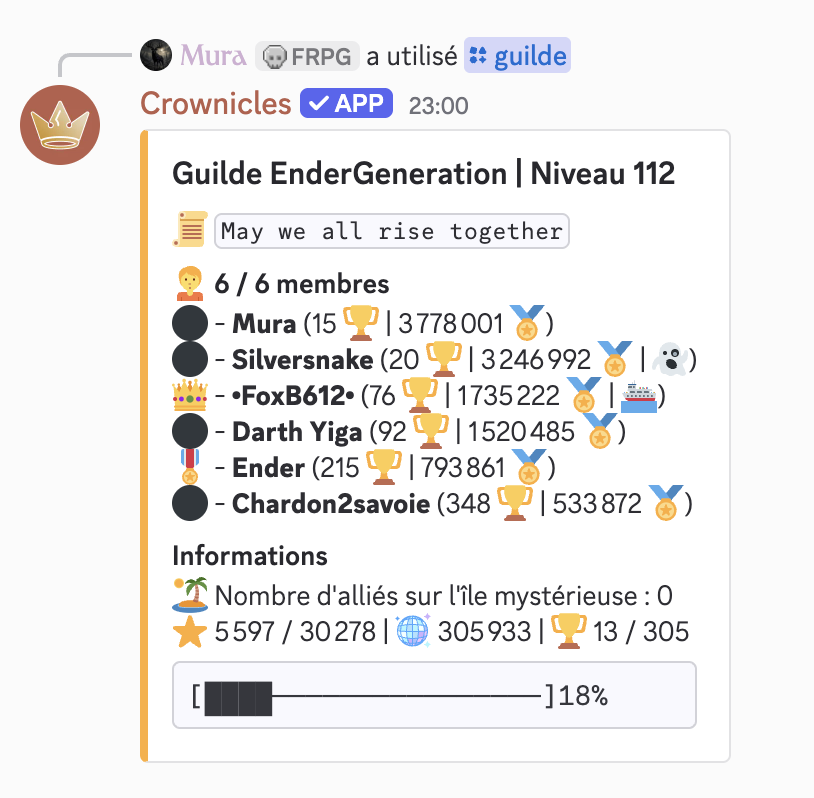
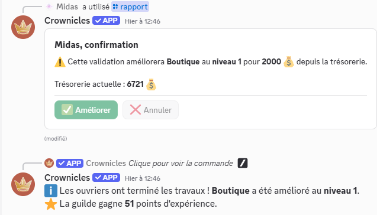
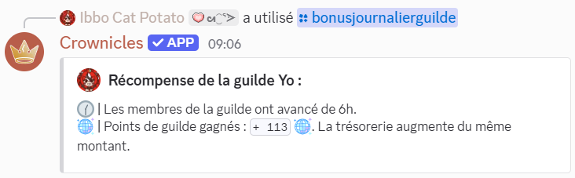
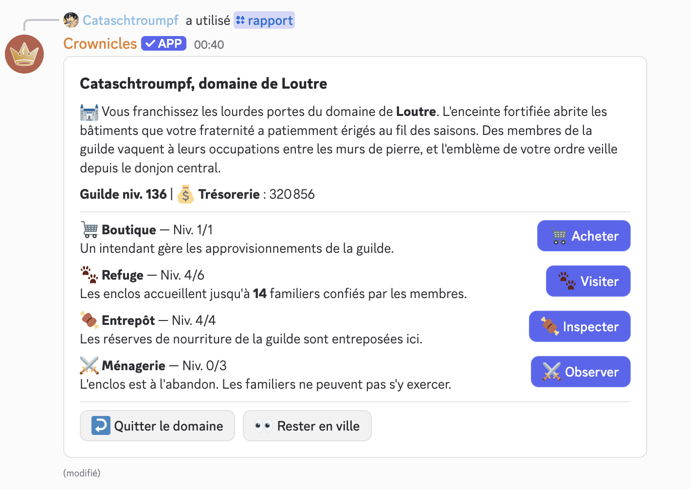
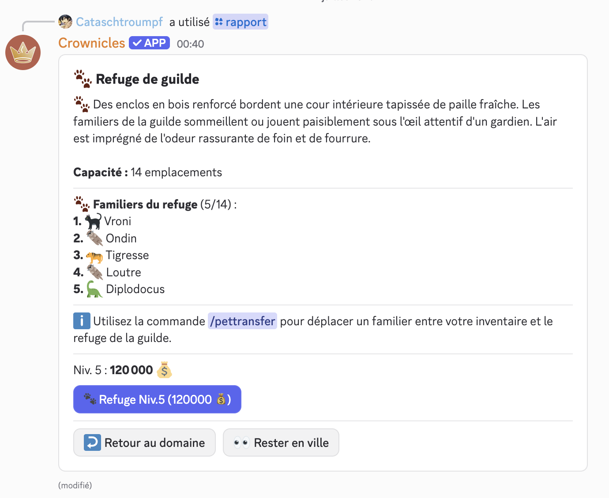

# Guildes

Une guilde permet de réunir jusqu'à 6 personnes, afin de gagner des récompenses journalières de plus en plus conséquentes à mesure de l'augmentation du niveau de la guilde (sauf les niveaux au-dessus de 100 qui sont essentiellement cosmétiques) . Le niveau maximum d'une guilde est 150.

### Comment créer une guilde ?

Créer une guilde est possible à l'aide de la commande `/creationguilde`. Cela vous coûtera 5 000 pièces d'argent.

Vous pouvez ajouter une description à votre guilde avec la commande `/descriptionguilde`.


Le nom d'une guilde est unique, il doit respecter un certain nombre de règles :

* Utiliser au moins une lettre
* Ne pas mettre plus de 2 espaces consécutifs
* Les caractères spéciaux ne sont pas autorisés
* Entre 2 et 14 caractères
* Ne doit pas déjà être pris



Il est impossible de renommer une guilde. Soyez donc certain de vouloir donner tel nom à votre guilde avant de valider la commande !


### Comment rejoindre une guilde ?

Tous les joueurs ayant atteint le niveau 10 peuvent rejoindre une guilde. Seul le chef de guilde et l'aîné peuvent inviter des joueurs dans leur guilde grâce à la commande `/invitationguilde`.


Un salon destiné à recueillir les annonces de recrutement est disponible sur le discord du bot.


### Comment voir les statistiques d'une guilde ?

La commande `/guilde` permet d'afficher les informations de la guilde de la personne effectuant la commande. Elle affiche ainsi le nom de la guilde, son niveau, sa barre d'expérience, ses membres ainsi que ceux présents sur le [bateau](../notions-avancees/mini-evenements.md#voyage-vers-les-iles-mysterieuses) :ferry:, sur une [île mystérieuse](../notions-avancees/iles-mysterieuses.md) :island:ou les inactifs :ghost:.

Il existe également 3 options à cette commande:

* `guilde` Permet de voir les informations d'une guilde à partir de son nom.
* `utilisateur` Permet de voir les informations d'une guilde à partir du nom d'un de ses membres.
* `classement` Permet de voir les informations d'une guilde à partir du classement d'un de ses membres.

<figure><picture><source srcset="../.gitbook/assets/guilde_sombre.png" media="(prefers-color-scheme: dark)"></picture><figcaption>
Affichage d'une guilde
</figcaption></figure>

### Monter de niveau une guilde:

Chaque guilde possède une barre d'expérience :star:, dont les paliers sont les mêmes que ceux des joueurs, à ceci près que le niveau de guilde est limité à 150. Chaque membre peut contribuer à faire augmenter ce niveau.&#x20;

#### Dans les mini-événements

Lors d'un mini-événement de ce [type](../notions-avancees/mini-evenements.md#gagner-de-lexperience-de-guilde), vous pouvez gagner de l'expérience de guilde.

#### En améliorant les bâtiments de guilde

A chaque amélioration d'un bâtiment de guilde, celle-ci gagne de l'expérience :star:. Plus l'amélioration coûte cher, plus la récompense est grande. 20% du prix est converti en expérience, avec 1 000 :moneybag: donnant entre 50 et 450 :star:.&#x20;

<figure><picture><source srcset="../.gitbook/assets/AmeliorationGuilde_sombre.png" media="(prefers-color-scheme: dark)"></picture><figcaption>
Amélioration d'un bâtiment du domaine de guilde 🏰
</figcaption></figure>

#### En vainquant des monstres

En explorant les :island: [îles mystérieuses](../notions-avancees/iles-mysterieuses.md), les joueurs d'une guilde lui rapportent de l'expérience :star: à chaque monstre vaincu.&#x20;

#### Dans les récompenses quotidiennes

Toutes les 22h, il est possible d'utiliser la commande `/bonusjournalierguilde` afin d'obtenir une récompense qui peut être de l'expérience de guilde, de l'argent… Le type de récompense varie en fonction du niveau de votre guilde. La guilde reçoit en plus quelques points de guilde :mirror\_ball:, dont la même somme est versée dans la trésorerie.&#x20;

<figure><picture><source srcset="../.gitbook/assets/BonusJournalierGuilde_sombre.png" media="(prefers-color-scheme: dark)"></picture><figcaption>
Un bonus de guilde
</figcaption></figure>


Les valeurs exprimées dans le tableau ci-dessous sont les pourcentages de probabilité de recevoir telle récompense de guilde selon son niveau.


| Niveau de la guilde | Un peu d'argent | Expérience de guilde | Expérience personnelle | Soin des altérations d'état | Gain de vie | Régénération totale de la vie | Avancement du temps | Badge guilde puissante | Badge guilde très puissante  | 5 friandises pour les familiers |
| ------------------- | --------------- | -------------------- | ---------------------- | --------------------------- | ----------- | ----------------------------- | ------------------- | ---------------------- | ---------------------------- | ------------------------------- |
| 0-9                 | 35              | 15                   | 0                      | 20                          | 5           | 0                             | 0                   | 0                      | 0                            | 25                              |
| 10-19               | 35              | 15                   | 1                      | 19                          | 5           | 0,2                           | 1                   | 0                      | 0                            | 23,8                            |
| 20-29               | 35              | 15                   | 2                      | 18                          | 5           | 0,3                           | 2                   | 0                      | 0                            | 22,7                            |
| 30-39               | 35              | 15                   | 4                      | 17                          | 5           | 0,4                           | 3                   | 0                      | 0                            | 20,6                            |
| 40-49               | 35              | 15                   | 6                      | 16                          | 5           | 0,5                           | 4                   | 0                      | 0                            | 18,5                            |
| 50-59               | 35              | 15                   | 8                      | 15                          | 5           | 0,6                           | 5                   | 1                      | 0                            | 15,4                            |
| 60-69               | 35              | 15                   | 10                     | 14                          | 5           | 0,7                           | 6                   | 1                      | 0                            | 13,3                            |
| 70-79               | 35              | 15                   | 15                     | 13                          | 5           | 0,8                           | 7                   | 1                      | 0                            | 8,2                             |
| 80-89               | 35              | 15                   | 20                     | 12                          | 5           | 0,9                           | 8                   | 1                      | 0                            | 3,1                             |
| 90-99               | 35              | 15                   | 20                     | 10                          | 5           | 1                             | 10                  | 1                      | 0                            | 3                               |
| 100-149             | 35              | 15                   | 20                     | 10                          | 5           | 1                             | 10                  | 1                      | 1                            | 2                               |
| 150                 | 40              | 0                    | 30                     | 10                          | 5           | 1                             | 10                  | 1                      | 1                            | 2                               |


Le badge guilde très puissante :mirror\_ball: ne dépend pas uniquement du niveau de la guilde mais également de son classement. Pour plus de détails, se référer à [Badges](../notions-avancees/badges.md) ou [Îles mystérieuses](../notions-avancees/iles-mysterieuses.md#classement-des-guildes).



Vous avez également une petite chance de trouver en plus un [familier](familiers.md).


### Mettre un aîné ?

Vous pouvez mettre un aîné pour votre guilde avec la commande `/aineguilde`. L'aîné pourra alors recruter des gens et modifier la description de votre guilde. Bien sûr si celui-ci vous énerve vous pouvez le retirer avec la commande `/supprimeraineguilde`.

### Qu'est-ce que le domaine de guilde ?&#x20;

Le domaine de guilde est un ensemble de bâtiments que le chef de guilde peut installer dans une ville et améliorer, afin de fournir à ses membres des services de meilleur qualité. \
Tout d'abord, le chef de guilde doit installer son domaine dans une ville, grâce au :office\_worker:notaire. Cette action est gratuite. Il peut améliorer divers bâtiments. Le coût sera directement puisé dans une trésorerie commune. &#x20;

<figure><picture><source srcset="../.gitbook/assets/DomaineGuilde_sombre.png" media="(prefers-color-scheme: dark)"></picture><figcaption>
Les différents bâtiments d'un domaine de guilde 🏰
</figcaption></figure>

🛒 La boutique

La boutique s'achète pour 2 000 :moneybag:. Elle permet aux différents membres de participer au trésor commun et d'acheter de la nourriture de guilde.&#x20;

Les friandises :candy: coûtent 20 :moneybag:, les viandes :meat\_on\_bone: et salades :leafy\_green: pour 250 :moneybag: et le prix des soupes ultimes :stew: culmine à 600 :moneybag:. Les stocks peuvent être renouvelés dans toutes les villes.&#x20;

A chaque don à la trésorerie, l'intendant demande une commission de 5%, avec un maximum de 350 :moneybag:.&#x20;


Lorsque vous achetez de la nourriture, l'intendant vous propose de rembourser la somme utilisée, sans demander de commission.&#x20;


🐾 Le refuge 

Ce bâtiment permet de voir les différents familiers de la guilde. Il est aussi visible avec la commande `/abriguilde` , et permet de stocker initialement 6 familiers.&#x20;

Chaque amélioration de ce bâtiment augmente de 2 les places disponibles, allant jusqu'à 18 places au niveau 6, moyennant un coût et un niveau minimum de la guilde. Le niveau maximal coûte 430k :moneybag:.

<table><thead><tr><th width="97">Niveau</th><th width="140.5">Coût</th><th width="152.5">Niveau requis</th><th>Places disponibles</th></tr></thead><tbody><tr><td>1</td><td>10 000 💰 </td><td>15</td><td>8</td></tr><tr><td>2</td><td>20 000 💰 </td><td>40</td><td>10</td></tr><tr><td>3</td><td>40 000 💰 </td><td>75</td><td>12</td></tr><tr><td>4</td><td>80 000 💰 </td><td>100</td><td>14</td></tr><tr><td>5</td><td>120 000 💰 </td><td>120</td><td>16</td></tr><tr><td>6</td><td>160 000 💰 </td><td>150</td><td>18</td></tr></tbody></table>

🍖 L'entrepôt

Ce bâtiment permet de voir le stockage en nourriture de la guilde. Il est aussi visible avec la commande `/entrepotguilde` .&#x20;

Les stocks initiaux sont de 150 :candy:, 90 :meat\_on\_bone: & :leafy\_green: et 30 :stew:. Chaque niveau augmente le stockage et permet une production de nourriture (entre parenthèse dans le tableau ci dessous sont les approvisionnements quotidiens gratuits et automatiques).&#x20;

<table><thead><tr><th width="97">Niveau</th><th width="110">Coût</th><th width="136.5">Niveau requis</th><th width="116">Friandises</th><th width="111">Viandes &#x26; salades</th><th width="98">Soupes ultimes</th></tr></thead><tbody><tr><td>1</td><td>40 000 💰 </td><td>15</td><td>250 (+3)</td><td>150</td><td>50</td></tr><tr><td>2</td><td>60 000 💰 </td><td>40</td><td>400 (+4)</td><td>240 </td><td>80 </td></tr><tr><td>3</td><td>100 000 💰 </td><td>75</td><td>700 (+5)</td><td>420 (+1)</td><td>140</td></tr><tr><td>4</td><td>120 000 💰 </td><td>100</td><td>1000 (+6)</td><td>600 (+2)</td><td>200 (+1)</td></tr></tbody></table>

⚔️ La ménagerie

Ce bâtiment permet d'entrainer les familiers du refuge, leur faisant gagner automatiquement des points d'amour :two\_hearts: chaque jour.&#x20;

<table><thead><tr><th width="110">Niveau</th><th width="149.5">Coût</th><th width="142">Niveau requis</th><th width="284">Gain quotidien d'affection</th></tr></thead><tbody><tr><td>1</td><td>150 000 💰 </td><td>50</td><td>+1 💕 par jour</td></tr><tr><td>2</td><td>300 000 💰 </td><td>100</td><td>+2 💕 par jour</td></tr><tr><td>3</td><td>600 000 💰 </td><td>150</td><td>+3 💕 par jour</td></tr></tbody></table>

<figure><picture><source srcset="../.gitbook/assets/RefugeGuilde_sombre.png" media="(prefers-color-scheme: dark)"></picture><figcaption>
Interface d'amélioration du refuge de la guilde 🐾
</figcaption></figure>


Le domaine de guilde peut être déplacé dans une autre ville pour 100 000 :moneybag:.


### Comment participer à la trésorerie ?

Il y a 3 moyens de faire augmenter le trésor commun d'une guilde :&#x20;

* Donner de l'argent par la boutique, en se rendant au domaine de la guilde
* En récompense quotidienne avec `/bonusjournalierguilde`&#x20;
* En gagnant des points de guilde :mirror\_ball:, notamment sur les :island: îles mystérieuses. Chaque point gagné donne en plus 1 :moneybag: dans la trésorerie.


À sa création, la guilde débute avec une trésorerie équivalent à son coût de création soit 5 000 :moneybag:.&#x20;



Perdre des points de guilde :mirror\_ball: ne diminue pas la trésorerie.&#x20;


### Comment quitter une guilde ?

Il est possible à tout moment de quitter une guilde avec la commande `/quitterguilde`.\
Le chef de la guilde peut aussi utiliser la commande `/exclureguilde` pour expulser un membre de la guilde.


Si un chef de guilde part de sa guilde, le statut de chef est transféré à l'aîné de la guilde. S'il n'y a pas d'aîné, la guilde est dissoute.

