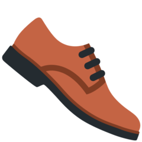
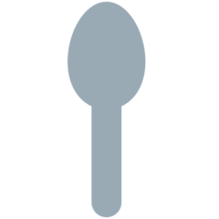
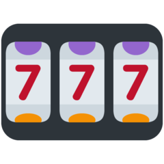
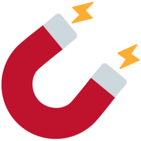
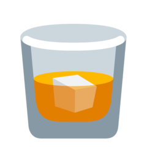
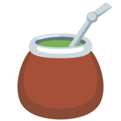

# Équipements

## Obtenir des équipements

### Niveaux de rareté

*  **Basique** 🔸 `l'item possédé en début de jeu` 
*  **Commun** 🔶 **** `43,75% (1 item / 3)` 
*  **Peu commun** 🔥 `25% (1 item / 4)` 
*  **Exotique** 🔱 `15% (1 item / 7)` 
*  **Rare** ☄ `10% (1 item / 10)` 
*  **Spécial** 💫 `5% (1 item / 20)` 
*  **Épique** ⭐ `1% (1 item / 100)` 
*  **Légendaire** 🌟 `0,24% (1 item / 417)` 
*  **Mythique** 💎 `0,01% (1 item / 10 000)`

### Valeur des équipements

La valeur des équipements est calculée principalement en fonction de la rareté de l'équipement.

## Liste des équipements

### Liste des armes

| Symbole | Nom | Attaque | Rareté |
| :--- | :--- | :--- | :--- |
|  🥒  | Cornichon | 3 dégâts | Commun |
|   🌿  | Branche souple | 3 dégâts | Commun |
|  🌹  | Bouquet de rose | 3 dégâts | Commun |
|  🍴  | Fourchette/couteau | 4 dégâts | Commun |
|  🦗  | Bâton | 4 dégâts | Commun |
|  ⚒  | Outils usés | 5 dégâts | Commun |
|  🗝  | Clé rouillée | 5 dégâts | Commun |
|  ⛏  | Pioche abimée  | 5 dégâts  | Commun |
|  🔨  | Marteau | 6 dégâts | Commun |
|  🏉  | Balle de Fluxball | 6 dégâts  | Commun |
|  👊  | Poing renforcé | 7 dégâts | Commun |
|  🤛    | Griffe de main  | 7 dégâts  | Commun |
|  🏒  | Crosse de Hockey | 8 dégâts | Commun |
|  🥊  | Gant de boxe | 9 dégâts | Commun |
|  ❄  | Boule de neige | 11 dégâts | Commun |
|    | Rasoir | 12 dégâts | Commun |
|  🎸  | Guitare lourde | 7 dégâts | Peu commun |
|  📌  | Percingasiteur | 8 dégâts | Peu commun |
|  💺  | Chaise | 8 dégâts | Peu commun |
|  🎣  | Canne à pêche de débutant | 9 dégâts | Peu commun |
|  🦴  | Gourdin | 11 dégâts | Peu commun |
|  🏹  | Tueuse de loup | 11 dégâts | Peu commun |
|  🔪  | Couteau ancien | 12 dégâts | Peu commun |
|  🔪  | Épée en bois | 12 dégâts | Peu commun |
|  ☂  | Parapluie | 14 dégâts | Peu commun |
|  🔪  | Couteau simple | 15 dégâts | Peu commun |
|  📕  | Gros livre | 17 dégâts | Peu commun |
|  🔪  | Vieux couteau | 19 dégâts | Peu commun |
|  🧱  | Brique | 15 dégâts | Exotique |
|  ✂  | Ciseaux | 16 dégâts | Exotique |
|  👨👨👦👦  | Pouvoir de l'amitié  | 18 dégâts | Exotique  |
|  🧯  | Extincteur  | 20 dégâts | Exotique  |
|  ⛏  | Pioche | 22 dégâts | Exotique |
|  🦴  | Massue | 22 dégâts | Exotique |
|   🗡  | Dague fragile | 24 dégâts | Exotique |
|  🔪  | Couteau de débutant | 27 dégâts | Exotique |
|    | Boomerang | 30 dégâts | Exotique |
|  🏹  | Arc de novice | 33 dégâts | Exotique |
|  🥢  | Pew Pew  | 37 dégâts | Exotique |
|  🍌  | Banane | 26 dégâts | Rare |
|  🔫  | Pistolet déchargé | 26 dégâts | Rare |
|  💉  | Seringue | 29 dégâts | Rare |
|  🕯  | Brûleur | 38 dégâts | Rare |
|  🎣  | Canne à pêche | 38 dégâts | Rare |
|  💉  | Seringue contaminée  | 41 dégâts | Rare |
|  ⚔  | Epée de débutant | 41 dégâts | Rare |
|  🏹  | Arc de soldat  | 45 dégâts | Rare |
|  ⚔  | Epée en fer | 50 dégâts | Rare |
|   🗡  | Dague | 55 dégâts | Rare |
|  ⚔  | Double dagues | 60 dégâts | Rare |
|    | Hachoir | 60 dégâts | Rare |
|  💉  | Seringue sale | 48 dégâts | Spécial |
|  🍳  | Poële  | 52 dégâts | Spécial |
|  🔨  | Marteau de guerre | 62 dégâts | Spécial |
|  🎣  | Canne à pêche de maître | 67 dégâts | Spécial |
|  🏹  | Arc de chevalier | 73 dégâts | Spécial |
|  💣  | Bombe | 87 dégâts | Spécial |
|  🏹  | Arc | 87 dégâts | Spécial |
|  ⚔  | Epée sharpness 4 | 87 dégâts | Spécial |
|  ⚔  | Epées doubles | 94 dégâts | Spécial |
|  📕  | Vieux grimoire | 70 dégâts | Epique |
|  🗡  | Epée Kokiri | 89 dégâts | Epique |
|  ⚔  | Beat saber  | 96 dégâts | Epique |
|  ⚔  | Épée d'Ines | 96 dégâts | Epique |
|  ⚡  | Lame de charge | 113 dégâts | Epique  |
|  ⚡  | Foudre de Zeus | 122 dégâts | Epique |
|  ⚔  | Épée royale  | 132 dégâts | Epique |
|  🔫  | Pistolet chargé | 143 dégâts | Epique |
|  🔫  | Pistolet pan pan QQ | 125 dégâts  | Légendaire |
|  ☣  | Arme biologique  | 134 dégâts | Légendaire |
|  ⚔  | Épée de Ragnell | 145 dégâts | Légendaire |
|  🏹  | Arc du Héros | 182 dégâts | Légendaire |
|  ☄  | L'âme du diable  | 182 dégâts | Légendaire |
|  ⚔  | Epée en diamant | 196 dégâts | Légendaire |
|  ⚔  | Master Sword | 196 dégâts | Légendaire |
|  🗡  | Sabre | 212 dégâts | Légendaire |
|   ✨  | Sceptre aux 100 sorts  | 174 dégâts  | Mythique |
|    | Sabotage d'oxygène | 203 dégâts | Mythique  |
|  💣  | Bombe Atomique | 219 dégâts | Mythique |

### Liste des armures/boucliers

| Symbole | Nom | Défense | Rareté |
| :--- | :--- | :--- | :--- |
|  🧥  | Manteau | 3 défense  | Commun |
|  🥼  | Blouse de laboratoire | 3 défense  | Commun |
|  🛡  | Bouclier de débutant | 4 défense  | Commun |
|  🛡  | Bouclier solide  | 6 défense  | Commun |
|  🛡  | Égide contrefait  | 6 défense  | Commun |
|  ⛑  | Casque de chantier  | 7 défense  | Commun |
|  🛡  | Bouclier renforcé | 9 défense  | Commun |
|  🛡  | Petit bouclier  | 11 défense  | Commun |
|  ⛑  | Casque de guerre | 12 défense  | Commun |
|  🚮  | Seau en fer | 7 défense  | Peu commun |
|  🛡  | Bouclier en bois  | 9 défense  | Peu commun |
|  🛡  | Bouclier simple  | 11 défense  | Peu commun |
|    | Gilet de sécurité  | 12 défense  | Peu commun |
|  🛡  | Scutum | 14 défense  | Peu commun |
|  🏉  | Bouclier de Brennus | 15 défense  | Peu commun |
|    | Tenue de combat | 19 défense  | Peu commun |
|  🐢  | Carapace de Franklin | 22 défense  | Peu commun |
|  🛡  | Bouclier usé  | 16 défense  | Exotique |
|  ☂  | Parapluie de self défense  | 18 défense  | Exotique |
|  🛡  | Bouclier  | 20 défense  | Exotique |
|  🛡  | Bouclier de guerre | 22 défense  | Exotique |
|  🛡  | Rondache | 22 défense  | Exotique |
|  🏕  | Tente | 22 défense  | Exotique |
|  🛡  | Bouclier de solitude  | 27 défense  | Exotique |
|  🛡  | Bouclier rouillé | 29 défense  | Rare |
|    | Plexiglas | 31 défense  | Rare |
|  🛡  | Bouclier lourd | 34 défense  | Rare |
|  🛡  | Bouclier de fer | 38 défense  | Rare |
|  🛡  | Bouclier de gladiateur  | 41 défense  | Rare |
|  🛡  | Lumière de Node  | 45 défense  | Rare |
|  🛡  | Bouclier de Lynel | 55 défense  | Rare |
|  🛡  | Égide puissante  |  _Undefined_ | Spécial |
|  🥼  | Kimono renforcé | 48 défense  | Spécial |
|  💪  | Bras mécanique  | 67 défense  | Spécial |
|  ♟  | Voie des pions  | 73 défense  | Spécial |
|  ✳  | Champ de force  | 79 défense  | Spécial |
|  🛡   | Bouclier royal | 87 défense  | Spécial |
|  🧱  | Mur | 94 défense  | Spécial |
|  ⛩  | Forteresse japonaise  | 0 défense  | Épique |
|  👨⚖  | Jurisprudence | 89 défense  | Épique |
|  🥼  | Kimono de maître | 96 défense  | Épique |
|  🤺  | Armure de fer | 113 défense  | Épique |
|  🌞  | Bouclier solaire  | 113 défense  | Épique |
|  🛡  | Bouclier puissant | 132 défense  | Épique |
|  🤖  | Casque de robot  | 143 défense  | Épique |
|  🛡  | Bouclier de maître | 169 défense  | Légendaire |
|  👁🗨  | Bouclier déflecteur d'Engi | 182 défense  | Légendaire |
|  👨👨👦👦  | Bouclier humain  | 196 défense  | Légendaire |
|  🛡  | Convention de Genève  | 212 défense  | Légendaire |
|  🛡  | Bouclier ultime | 212 défense  | Légendaire |
|  🛡  | Bouclier à pointe | 174 défense  | Mythique |
|  ⛑  | Blindage du major | 203 défense  | Mythique |
|  🛡  | Bouclier en vibranium  | 219 défense  | Mythique |

### Liste des objets 

#### ❌ Aucun effet  

| Symbole | Nom | Effet | Rareté |
| :--- | :--- | :--- | :--- |
|  🍂  | Feuilles mortes  | Aucun effet  | Commun |
|  🛢  | Baril métallique  | Aucun effet | Commun |
|  🕯  | Vieille bougie  | Aucun effet | Commun |

#### ❤ Bonus de vie 

| Symbole  | Nom | Effet | Rareté  |
| :--- | :--- | :--- | :--- |
|  🍎  | Pomme rouge | Vie + 1  | Peu commun |
|  🍏  | Pomme verte  | Vie + 2  | Exotique |
|  ✨  | Chapelet mythique  | Vie + 3  | Exotique  |
|    | Pansement | Vie + 4  | Rare |
|  ♥  | Réceptacle de cœur  | Vie + 6  | Spécial |
|  🍌  | Banan'ase split  | Vie + 7  | Épique  |
|  🧴  | Gel hydroalcoolique  | Vie + 7  | Épique  |
|  👼  | Bague de l'ange sans vie | Vie + 8  | Épique  |
|  🏳  | Drapeau de la paix | Vie + 9  | Légendaire |
|  👼  | Bénédiction du ciel | Vie + 10  | Légendaire |
|  🎷  | Saxo magique  | Vie + 11 | Mythique  |

####  Bonus de vitesse 

| Symbole | Nom | Effet | Rareté |
| :--- | :--- | :--- | :--- |
|    | Pot en terre cuite  | Vitesse + 1 pendant le prochain combat | Commun |
|    | Livre d'incantations volume 1 | Vitesse + 5  pendant le prochain combat | Commun |
|    | Savon glissant  | Vitesse + 7 pendant le prochain combat | Peu commun |
|    | Chaussure de sport  | Vitesse + 15 pendant le prochain combat | Peu commun |
|    | Boule de verre magique  | Vitesse + 25 pendant le prochain combat | Exotique  |
|    | Feuille de vent  | Vitesse + 41 pendant le prochain combat | Exotique  |
|    | Skis glissants | Vitesse + 63 pendant le prochain combat | Rare |
|    | Jambe mécanique  | Vitesse + 87 pendant le prochain combat | Spécial |
|    | Fleur de l'espoir  | Vitesse + 105 pendant le prochain combat | Épique |
|    | Bottes Pégases  | Vitesse + 108 pendant le prochain combat | Légendaire |
|    | Nimbus 2000 | Vitesse + 151 pendant le prochain combat | Mythique |

####  Bonus d'attaque 

| Symbole | Nom | Effet | Rareté |
| :--- | :--- | :--- | :--- |
|    | Livre d'incantations volume 2  | Attaque + 15 pendant le prochain combat | Peu commun |
|    | Cor de chasse | Attaque + 27 pendant le prochain combat | Exotique |
|    | Pouvoir de Nayru | Attaque + 38 pendant le prochain combat | Rare |
|    | Chat aux yeux lasers mignon | Attaque + 57 pendant le prochain combat | Spécial |
|    | Drapeau de la mort  | Attaque + 85 pendant le prochain combat | Épique |
|    | Diamant kératinisé | Attaque + 132 pendant le prochain combat | Légendaire |
|    | Guitare terrifiante  | Attaque + 137 pendant le prochain combat | Mythique |

####  Bonus de défense 

| Symbole | Nom | Effet | Rareté |
| :--- | :--- | :--- | :--- |
|    | Cuillère de Kyu | Défense + 9 pour le prochain combat | Commun |
|    | Ours en peluche | Défense + 14 pour le prochain combat | Peu commun |
|    | Citrouille | Défense + 15 pour le prochain combat | Peu commun |
|    | Livre d'incantations volume 3 | Défense + 25 pour le prochain combat | Exotique |
|    | Bout d'obsidienne  | Défense + 42 pour le prochain combat | Rare |
|    | Fleur royale | Défense + 59 pour le prochain combat | Spécial |
|    | Lune mojaro | Défense + 90 pour le prochain combat | Épique |
|    | Amulette cyclonique | Défense + 143 pour le prochain combat | Légendaire |

####  Bonus de temps

| Symbole | Nom | Effet | Rareté |
| :--- | :--- | :--- | :--- |
|    | Pomme du grand arbre  | Avance le temps plus rapidement pendant 15 minutes | Spécial |
|    | Kyuran | Avance le temps plus rapidement pendant 45 minutes | Épique |
|    | Accélérateur de particules  | Avance le temps plus rapidement pendant 1 heure | Légendaire |
|    | Étoile filante | Avance le temps plus rapidement pendant 1 heure 15 | Légendaire |
|    | L'horloge du lapin | Avance le temps plus rapidement pendant 2 heures | Mythique |

####  Bonus d'argent 

| Symbole | Nom | Effet | Rareté |
| :--- | :--- | :--- | :--- |
|    | Clé rouillée | Argent + 25 | Commun |
|    | Super médaille | Argent + 47 | Peu commun |
|    | Dé magique | Argent + 60 | Exotique  |
|    | Gros portefeuille | Argent + 94 | Exotique |
|    | Machine à sous  | Argent + 142 | Rare |
|    | Livre d'incantations volume 4 | Argent + 152 | Rare |
|    | Chaine magique  | Argent + 207 | Spécial |
|    | Urne de minotaure ornée  | Argent + 256 | Épique |
|    | Carte de crédit  | Argent + 294 | Épique |
|    | Amulette de Midas | Argent + 378 | Légendaire |
|    | Magnet | Argent + 466 | Légendaire |

### Liste des potions 

#### Aucun effet 

| Symbole | Nom | Effet | Rareté |
| :--- | :--- | :--- | :--- |
|    | Potion périmée  | Aucun effet | Commun |
|    | Potion douteuse  | Aucun effet | Commun |
|    | Eau purifiée  | Aucun effet | Commun |
|    | Vin rouge  | Aucun effet | Commun |

#### Bonus de vie

| Symbole | Nom | Effet | Rareté |
| :--- | :--- | :--- | :--- |
|    | Biberon | Vie + 1 | Commun |
|    | Potion puante | Vie + 7 | Commun |
|    | Potion morvique | Vie + 1 | Peu commun |
|    | Soupe de grand mère | Vie + 10 | Peu commun |
|    | Potion simple | Vie + 17 | Exotique |
|    | Potion rouge | Vie + 53 | Spécial |
|    | Bisous'koup | Vie + 70 | Spécial |
|    | Potion de guérison | Vie + 80 | Spécial |
|    | Potion acide | Vie + 84 | Épique |
|    | Potion de soin | Vie + 100 | Épique |
|    | Potion de soin ultime | Vie + 215 | Légendaire |
|    | Essence de volaille n°5 | Vie + 270 | Mythique |

#### Bonus de vitesse

| Symbole | Nom | Effet | Rareté |
| :--- | :--- | :--- | :--- |
|    | Thé | Vitesse + 1 pendant le prochain combat | Commun |
|    | Café | Vitesse + 1 pendant le prochain combat | Commun |
|    | Boisson tropicale | Vitesse + 8 pendant le prochain combat | Peu commun |
|    | Jus de chaussette | Vitesse + 15 pendant le prochain combat | Peu commun |
|    | Potion secouée | Vitesse + 25 pendant le prochain combat | Peu commun |
|    | Potion verte | Vitesse + 45 pendant le prochain combat | Exotique |
|    | Potion fumante | Vitesse + 88 pendant le prochain combat | Rare |
|    | Potion de vitesse | Vitesse + 200 pendant le prochain combat | Spécial |
|    | Grande potion | Vitesse + 255 pendant le prochain combat | Légendaire |

#### Bonus d'attaque

| Symbole | Nom | Effet | Rareté |
| :--- | :--- | :--- | :--- |
|    | Alcool | Attaque + 5 pendant le prochain combat | Commun |
|    | Larmes de l'adversaire | Attaque + 20 pendant le prochain combat | Peu commun |
|    | Potion de force | Attaque + 45 pendant le prochain combat | Exotique |
|    | Potion | Attaque + 60 pendant le prochain combat | Rare |
|    | Potion explosive | Attaque + 65 pendant le prochain combat | Rare |
|    | Potion magique | Attaque + 135 pendant le prochain combat | Spécial |
|    | Potion de sang de loup | Attaque + 178 pendant le prochain combat | Légendaire |

#### Bonus de défense

| Symbole | Nom | Effet | Rareté |
| :--- | :--- | :--- | :--- |
|    | Verre de lait | Défense + 5 pour le prochain combat | Commun |
|    | Potion bleue | Défense + 15 pour le prochain combat | Peu commun |
|    | Potion sombre | Défense + 90 pour le prochain combat | Rare |
|    | Super potion | Défense + 190 pour le prochain combat | Épique |

#### Bonus de temps

| Symbole | Nom | Effet | Rareté |
| :--- | :--- | :--- | :--- |
|    | Jus | Avance le temps plus rapidement pendant 1 heure | Rare |
|    | Mélange d’Erythroxylum coca | Avance le temps plus rapidement pendant 1 heure | Rare |
|    | Kyurburant | Avance le temps plus rapidement pendant 2 heures | Spécial |
|    | Glaçons fondus  | Avance le temps plus rapidement pendant 3 heures | Spécial |
|    | Sake | Avance le temps plus rapidement pendant 4 heures | Épique |
|    | Champagne sabré | Avance le temps plus rapidement pendant 6 heures | Épique |
|    | Maté | Avance le temps plus rapidement pendant 7 heures | Épique |
|    | Potion violette | Avance le temps plus rapidement pendant 12 heures | Légendaire |
|    | Potion ultime | Avance le temps plus rapidement pendant 20 heures | Légendaire  |

