# Équipements

### Obtenir des équipements

### Niveaux de rareté

1.  **Basique**  ️ `Rareté de l'item possédé en début de jeu` 
2.  **Commun**  `43,75% (1 item / 3)` 
3.  **Peu commun**  `25% (1 item / 4)` 
4.  **Exotique**  `15% (1 item / 7)` 
5.  **Rare**  `10% (1 item / 10)` 
6.  **Spécial**  `5% (1 item / 20)` 
7.  **Épique**  `1% (1 item / 100)` 
8.  **Légendaire**  `0,24% (1 item / 417)` 
9.  **Mythique**  `0,01% (1 item / 10 000)`

### Valeur des équipements

La valeur des équipements est calculée principalement en fonction de la rareté de l'équipement.

### Liste des équipements

#### Liste des armes

| Symbole | Nom | Valeur | Rareté |
| :--- | :--- | :--- | :--- |
|    | Cornichon | 3 dégât | Commun |
|    | Branche souple | 3 dégât | Commun |
|    | Bouquet de rose | 3 dégât | Commun |
|  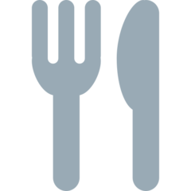  | Fourchette/couteau | 4 dégâts | Commun |
|  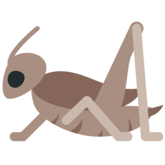  | Bâton | 4 dégâts | Commun |
|  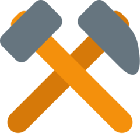  | Outils usés | 5 dégâts | Commun |
|     | Clé rouillée | 5 dégâts | Commun |
|     | Pioche abimée  | 5 dégats  | Commun |
|   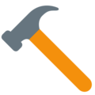  | Marteau | 6 dégâts | Commun |
|     | Balle de Fluxball | 6 dégats  | Commun |
|    | Poing renforcé | 7 dégâts | Commun |
|      | Griffe de main  | 7 dégats  | Commun |
|    | Crosse de Hockey | 8 dégâts | Commun |
|    | Gant de boxe | 9 dégâts | Commun |
|    | Boule de neige | 11 dégâts | Commun |
|    | Rasoir | 12 dégâts | Commun |
|    | Guitare lourde | 7 dégâts | Peu commun |
|    | Percingasiteur | 8 dégâts | Peu commun |
|    | Chaise | 8 dégâts | Peu commun |
|    | Canne à pêche de débutant | 9 dégâts | Peu commun |
|    | Gourdin | 11 dégâts | Peu commun |
|    | Tueuse de loup | 11 dégâts | Peu commun |
|  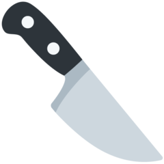  | Couteau ancien | 12 dégâts | Peu commun |
|    | Épée en bois | 12 dégâts | Peu commun |
|    | Parapluie | 14 dégâts | Peu commun |
|    | Couteau simple | 15 dégâts | Peu commun |
|    | Gros livre | 17 dégâts | Peu commun |
|    | Vieux couteau | 19 dégâts | Peu commun |
|    | Brique | 15 dégâts | Exotique |
|    | Ciseaux | 16 dégâts | Exotique |
|    | Pouvoir de l'amitié  | 18 dégâts | Exotique  |
|  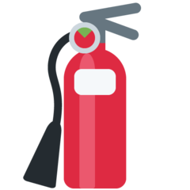  | Extincteur  | 20 dégâts | Exotique  |
|    | Pioche | 22 dégâts | Exotique |
|    | Massue | 22 dégâts | Exotique |
|  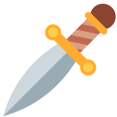  | Dague fragile | 24 dégâts | Exotique |
|    | Couteau de débutant | 27 dégâts | Exotique |
|     | Boomerang | 30 dégâts | Exotique |
|     | Arc de novice | 33 dégâts | Exotique |
|   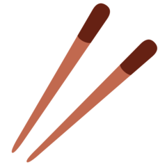  | Pew Pew  | 37 dégâts | Exotique |
|    | Banane | 26 dégâts | Rare |
|    | Pistolet vide | 26 dégâts | Rare |
|  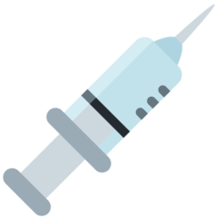  | Seringue | 29 dégâts | Rare |
|    | Brûleur | 38 dégâts | Rare |
|    | Canne à pêche | 38 dégâts | Rare |
|    | Seringue contaminée  | 41 dégâts | Rare |
|  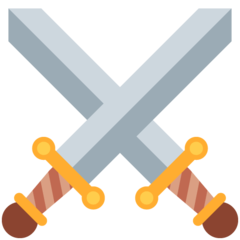  | Epée de débutant | 41 dégâts | Rare |
|    | Arc de soldat  | 45 dégâts | Rare |
|    | Epée en fer | 50 dégâts | Rare |
|    | Dague | 55 dégâts | Rare |
|    | Double dagues | 60 dégâts | Rare |
|    | Hachoir | 60 | Rare |
|    | Seringue sale | 48 dégâts | Spécial |
|    | Poële  | 52 dégâts | Spécial |
|    | Marteau de guerre | 62 dégâts | Spécial |
|    | Canne à pêche de maître | 67 dégâts | Spécial |
|    | Arc de chevalier | 73 dégâts | Spécial |
|    | Bombe | 87 dégâts | Spécial |
|    | Arc | 87 dégâts | Spécial |
|    | Epée sharpness 4 | 87 dégâts | Spécial |
|    | Epées doubles | 94 dégâts | Spécial |
|    | Vieux grimoire | 70 dégâts | Epique |
|    | Epée Kokiri | 89 dégâts | Epique |
|    | Beat saber  | 96 dégâts | Epique |
|    | Épée nisse  | 96 dégâts | Epique |
|    | Lame de charge | 113 dégâts | Epique  |
|    | Foudre de Zeus | 122 dégâts | Epique |
|    | Épée royale  | 132 dégâts | Epique |
|    | Pistolet chargé | 143 dégâts | Epique |
|    | Pistolet pan pan QQ | 125 dégâts  | Légendaire |
|    | Arme biologique  | 134 dégâts | Légendaire |
|    | Épée de Ragnell | 145 dégâts | Légendaire |
|    | Arc du Héros | 182 dégâts | Légendaire |
|    | L'âme du diable  | 182 dégâts | Légendaire |
|    | Epée en diamant | 196 dégâts | Légendaire |
|    | Master Sword | 196 dégâts | Légendaire |
|     | Sabre | 212 dégâts | Légendaire |
|    | Sceptre aux 100 sorts  | 174 dégâts  | Mythique |
|    | Sabotage d'oxygène | 203 dégâts | Mythique  |
|    | Bombe Atomique | 219 dégâts | Mythique |

#### Liste des armures/boucliers

| Symbole | Nom | Valeur | Rareté |
| :--- | :--- | :--- | :--- |
|    | Manteau | 3 défense  | Commun |
|    | Blouse de laboratoire | 3 défense  | Commun |
|    | Bouclier de débutant | 4 défense  | Commun |
|    | Bouclier solide  | 6 défense  | Commun |
|    | Égide contrefait  | 6 défense  | Commun |
|    | Casque de chantier  | 7 défense  | Commun |
|    | Bouclier renforcé | 9 défense  | Commun |
|    | Petit bouclier  | 11 défense  | Commun |
|    | Casque de guerre | 12 défense  | Commun |
|  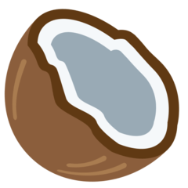  | Seau en fer | 7 défense  | Peu commun |
|    | Bouclier en bois  | 9 défense  | Peu commun |
|    | Bouclier simple  | 11 défense  | Peu commun |
|  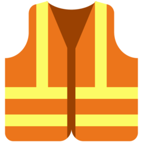  | Gilet de sécurité  | 12 défense  | Peu commun |
|    | Scutum | 14 défense  | Peu commun |
|    | Bouclier de Brennus | 15 défense  | Peu commun |
|  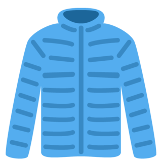  | Tenue de combat | 19 défense  | Peu commun |
|    | Carapace de Franklin | 22 défense  | Peu commun |
|    | Bouclier usé  | 16 défense  | Exotique |
|    | Parapluie de self defense  | 18 défense  | Exotique |
|    | Bouclier  | 20 défense  | Exotique |
|    | Bouclier de guerre | 22 défense  | Exotique |
|    | Rondache | 22 défense  | Exotique |
|    | Tente | 22 défense  | Exotique |
|    | Bouclier de solitude  | 27 défense  | Exotique |
|    | Bouclier rouillé | 29 défense  | Rare |
|    | Plexiglas | 31 défense  | Rare |
|    | Bouclier lourd | 34 défense  | Rare |
|    | Bouclier de fer | 38 défense  | Rare |
|    | Bouclier de gladiateur  | 41 défense  | Rare |
|    | Lumière de Node  | 45 défense  | Rare |
|    | Bouclier de Lynel | 55 défense  | Rare |
|    | Égide puissante  |  _Undefined_ | Spécial |
|    | Kimono renforcé | 48 défense  | Spécial |
|  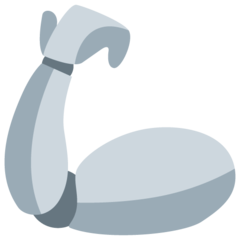  | Bras mécanique  | 67 défense  | Spécial |
|    | Voie des pions  | 73 défense  | Spécial |
|    | Champ de force  | 79 défense  | Spécial |
|    | Bouclier royal | 87 défense  | Spécial |
|    | Mur | 94 défense  | Spécial |
|    | Forteresse japonaise  | 0 défense  | Épique |
|    | Jurisprudence | 89 défense  | Épique |
|  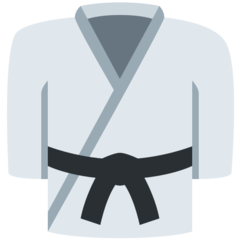  | Kimono de maître | 96 défense  | Épique |
|  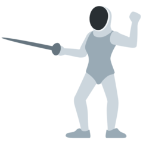  | Armure de fer | 113 défense  | Épique |
|    | Bouclier solaire  | 113 défense  | Épique |
|    | Bouclier puissant | 132 défense  | Épique |
|    | Casque de robot  | 143 défense  | Épique |
|    | Bouclier de maître | 169 défense  | Légendaire |
|    | Bouclier déflecteur d'Engi | 182 défense  | Légendaire |
|    | Bouclier humain  | 196 défense  | Légendaire |
|    | Convention de Genève  | 212 défense  | Légendaire |
|    | Bouclier ultime | 212 défense  | Légendaire |
|    | Bouclier à pointe | 174 défense  | Mythique |
|    | Blindage du major | 203 défense  | Mythique |
|    | Bouclier en vibranium  | 219 défense  | Mythique |

