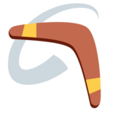
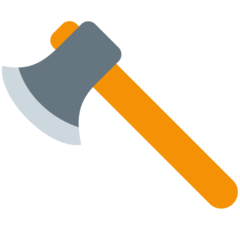
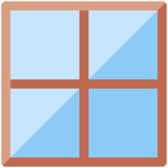
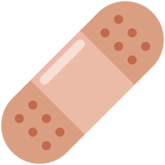
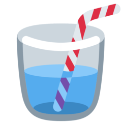

# Équipements

## Obtenir des équipements

### Niveaux de rareté

* Basique :small\_orange\_diamond: `l'item possédé en début de jeu`
* Commun :large\_orange\_diamond: `43,75% (1 item / 3)`
* Peu commun :fire: `25% (1 item / 4)`
* Exotique :trident: `15% (1 item / 7)`
* Rare :comet: `10% (1 item / 10)`
* Spécial :dizzy: `5% (1 item / 20)`
* Épique :star: `1% (1 item / 100)`
* Légendaire :star2: `0,23% (1 item / 435)`
* Mythique :gem: `0,02% (1 item / 5 000)`

### Valeur et puissance des équipements

La valeur des équipements est calculée principalement en fonction de la rareté de l'équipement.

Il en va de même pour la puissance des équipements. Cependant, la puissance d'un équipement peut être limitée par la puissance d'un joueur. Par exemple, un joueur ayant très peu d'attaque, ne sera pas en capacité de profiter de toutes les capacités d'une arme très puissante. Cette limitation sera affichée pour le joueur dans son inventaire.&#x20;

.png>)

## Liste des équipements

### Liste des armes

| Symbole                                   | Nom                       | Stats        | Rareté     |
| ----------------------------------------- | ------------------------- | ------------ | ---------- |
| :cucumber:                                | Cornichon                 | :dagger:3    | Commun     |
| :herb:                                    | Branche souple            | :dagger:3    | Commun     |
| :rose:                                    | Bouquet de rose           | :dagger:3    | Commun     |
| :fork\_and\_knife:                        | Fourchette/couteau        | :dagger:4    | Commun     |
| :cricket:                                 | Bâton                     | :dagger:4    | Commun     |
| :hammer\_pick:                            | Outils usés               | :dagger:5    | Commun     |
| :key2:                                    | Clé rouillée              | :dagger:5    | Commun     |
| :pick:                                    | Pioche abimée             | :dagger:5    | Commun     |
| :hammer:                                  | Marteau                   | :dagger:6    | Commun     |
| :rugby\_football:                         | Balle de Fluxball         | :dagger:6    | Commun     |
| :punch:                                   | Poing renforcé            | :dagger:7    | Commun     |
| :left\_facing\_fist:                      | Griffe de main            | :dagger:7    | Commun     |
| :hockey:                                  | Crosse de Hockey          | :dagger:8    | Commun     |
| :boxing\_glove:                           | Gant de boxe              | :dagger:9    | Commun     |
| :snowflake:                               | Boule de neige            | :dagger:11   | Commun     |
|          | Rasoir                    | :dagger:12   | Commun     |
| :guitar:                                  | Guitare lourde            | :dagger:7    | Peu commun |
| :pushpin:                                 | Percingasiteur            | :dagger:8    | Peu commun |
| :seat:                                    | Chaise                    | :dagger:8    | Peu commun |
| :fishing\_pole\_and\_fish:                | Canne à pêche de débutant | :dagger:9    | Peu commun |
| :face\_with\_symbols\_over\_mouth:        | Injures                   | :dagger:9    | Peu commun |
| :bone:                                    | Gourdin                   | :dagger:11   | Peu commun |
| :bow\_and\_arrow:                         | Tueuse de loup            | :dagger:11   | Peu commun |
| :knife:                                   | Couteau ancien            | :dagger:12   | Peu commun |
| :knife:                                   | Épée en bois              | :dagger:12   | Peu commun |
| :umbrella2:                               | Parapluie                 | :dagger:14   | Peu commun |
| :knife:                                   | Couteau simple            | :dagger:15   | Peu commun |
| :closed\_book:                            | Gros livre                | :dagger:17   | Peu commun |
| :knife:                                   | Vieux couteau             | :dagger:19   | Peu commun |
| :bricks:                                  | Brique                    | :dagger:15   | Exotique   |
| :scissors:                                | Ciseaux                   | :dagger:16   | Exotique   |
| :family\_mmbb:                            | Pouvoir de l'amitié       | :dagger:18   | Exotique   |
| :fire\_extinguisher:                      | Extincteur                | :dagger:20   | Exotique   |
| :pick:                                    | Pioche                    | :dagger:22   | Exotique   |
| :bone:                                    | Massue                    | :dagger:22   | Exotique   |
| :dagger:                                  | Dague fragile             | :dagger:24   | Exotique   |
| :knife:                                   | Couteau de débutant       | :dagger:27   | Exotique   |
|      | Boomerang                 | :dagger:30   | Exotique   |
| :bow\_and\_arrow:                         | Arc de novice             | :dagger:33   | Exotique   |
| :chopsticks:                              | Pew Pew                   | :dagger:37   | Exotique   |
| :banana:                                  | Banane                    | :dagger:26   | Rare       |
| :gun:                                     | Pistolet déchargé         | :dagger:26   | Rare       |
| :syringe:                                 | Seringue                  | :dagger:29   | Rare       |
| :candle:                                  | Brûleur                   | :dagger:38   | Rare       |
| :fishing\_pole\_and\_fish:                | Canne à pêche             | :dagger:38   | Rare       |
| :syringe:                                 | Seringue contaminée       | :dagger:41   | Rare       |
| :crossed\_swords:                         | Épée de débutant          | :dagger:41   | Rare       |
| :bow\_and\_arrow:                         | Arc de soldat             | :dagger:45   | Rare       |
| :crossed\_swords:                         | Épée en fer               | :dagger:50   | Rare       |
| :dagger:                                  | Dague                     | :dagger:55   | Rare       |
| :crossed\_swords:                         | Double dagues             | :dagger:60   | Rare       |
|            | Hachoir                   | :dagger:60   | Rare       |
| :syringe:                                 | Seringue sale             | :dagger:48   | Spécial    |
| :cooking:                                 | Poêle                     | :dagger:52   | Spécial    |
| :hammer:                                  | Marteau de guerre         | :dagger:62   | Spécial    |
| :fishing\_pole\_and\_fish:                | Canne à pêche de maître   | :dagger:67   | Spécial    |
| :bow\_and\_arrow:                         | Arc de chevalier          | :dagger:73   | Spécial    |
| :bomb:                                    | Bombe                     | :dagger:87   | Spécial    |
| :bow\_and\_arrow:                         | Arc                       | :dagger:87   | Spécial    |
| :crossed\_swords:                         | Épée sharpness 4          | :dagger:87   | Spécial    |
| :crossed\_swords:                         | Épées doubles             | :dagger:94   | Spécial    |
| :closed\_book:                            | Vieux grimoire            | :dagger:70   | Epique     |
| :dagger:                                  | Épée Kokiri               | :dagger:89   | Epique     |
| :crossed\_swords:                         | Beat saber                | :dagger:96   | Epique     |
| :crossed\_swords:                         | Ines'word                 | :dagger:96   | Epique     |
| :zap:                                     | Lame de charge            | :dagger:113  | Epique     |
| :zap:                                     | Foudre de Zeus            | :dagger:122  | Epique     |
| :crossed\_swords:                         | Épée royale               | :dagger:132  | Epique     |
| :gun:                                     | Pistolet chargé           | :dagger:143  | Epique     |
| :gun:                                     | Pistolet pan pan QQ       | :dagger:125  | Légendaire |
| :biohazard:                               | Arme biologique           | :dagger:134  | Légendaire |
| :crossed\_swords:                         | Épée de Ragnell           | :dagger:145  | Légendaire |
| :bow\_and\_arrow:                         | Arc du Héros              | :dagger:182  | Légendaire |
| :comet:                                   | L'âme du diable           | :dagger:182  | Légendaire |
| :crossed\_swords:                         | Épée en diamant           | :dagger:196  | Légendaire |
| :crossed\_swords:                         | Épée de maître            | :dagger:196  | Légendaire |
| :dagger:                                  | Sabre                     | :dagger:212  | Légendaire |
| :sparkles:                                | Sceptre aux 100 sorts     | :dagger:174  | Mythique   |
|  | Sabotage d'oxygène        | :dagger:203  | Mythique   |
| :bomb:                                    | Bombe Atomique            | :dagger:239  | Mythique   |

### Liste des armures/boucliers

| Symbole                                  | Nom                        | Statistiques                       | Rareté     |
| ---------------------------------------- | -------------------------- | ---------------------------------- | ---------- |
| :coat:                                   | Manteau                    | :shield:3                          | Commun     |
| :lab\_coat:                              | Blouse de laboratoire      | :shield:3                          | Commun     |
| :shield:                                 | Bouclier de débutant       | :shield:4                          | Commun     |
| :shield:                                 | Bouclier solide            | :shield:6                          | Commun     |
| :shield:                                 | Égide contrefaite          | :dagger:6 :shield:6                | Commun     |
| :helmet\_with\_cross:                    | Casque de chantier         | :shield:7                          | Commun     |
| :put\_litter\_in\_its\_place:            | Seau en fer                | :shield:7                          | Peu commun |
| :shield:                                 | Bouclier renforcé          | :shield:9                          | Commun     |
| :shield:                                 | Bouclier en bois           | :shield:9                          | Peu commun |
| :shield:                                 | Petit bouclier             | :shield:11                         | Commun     |
| :shield:                                 | Bouclier simple            | :shield:11                         | Peu commun |
| :helmet\_with\_cross:                    | Casque de guerre           | :shield:12                         | Commun     |
|  | Gilet de sécurité          | :shield:12                         | Peu commun |
| :shield:                                 | Scutum                     | :shield:14                         | Peu commun |
| :rugby\_football:                        | Bouclier de Brennus        | :shield:15                         | Peu commun |
| :shield:                                 | Bouclier usé               | :shield:16                         | Exotique   |
| :umbrella2:                              | Parapluie d'auto défense   | :shield:18                         | Exotique   |
| .png>)   | Tenue de combat            | :shield:19                         | Peu commun |
| :shield:                                 | Bouclier                   | :shield:20                         | Exotique   |
| :turtle:                                 | Carapace de Franklin       | :shield:22 :rocket:-10             | Peu commun |
| :shield:                                 | Bouclier de guerre         | :shield:22                         | Exotique   |
| :shield:                                 | Rondache                   | :shield:22                         | Exotique   |
| :camping:                                | Tente                      | :shield:22 :rocket:-25             | Exotique   |
| :shield:                                 | Bouclier de solitude       | :shield:27                         | Exotique   |
| :shield:                                 | Bouclier rouillé           | :shield:29                         | Rare       |
|        | Plexiglas                  | :dagger:10 :shield:31              | Rare       |
| :shield:                                 | Bouclier lourd             | :shield:34                         | Rare       |
| :shield:                                 | Bouclier de fer            | :shield:38                         | Rare       |
| :moyai:                                  | Nam nam                    | :dagger:38 :shield:38 :rocket:-10  |            |
| :shield:                                 | Bouclier de gladiateur     | :shield:41                         | Rare       |
| :shield:                                 | Lumière de Node            | :shield:45                         | Rare       |
| :lab\_coat:                              | Kimono renforcé            | :shield:48                         | Spécial    |
| :shield:                                 | Bouclier de Lynel          | :shield:55                         | Rare       |
| :shield:                                 | Égide puissante            | :dagger:106 :shield:40             | Spécial    |
| :muscle:                                 | Bras mécanique             | :shield:67                         | Spécial    |
| :chess\_pawn:                            | Voie des pions             | :shield:73                         | Spécial    |
| :eight\_spoked\_asterisk:                | Champ de force             | :shield:79                         | Spécial    |
| :shield:                                 | Bouclier royal             | :shield:87                         | Spécial    |
| :bricks:                                 | Mur                        | :shield:94                         | Spécial    |
| :shinto\_shrine:                         | Forteresse japonaise       | :dagger:50 :shield:64              | Épique     |
| :man\_judge:                             | Jurisprudence              | :dagger:45 :shield:89 :rocket:-40  | Épique     |
| :lab\_coat:                              | Kimono de maître           | :shield:96                         | Épique     |
| :person\_fencing:                        | Armure de fer              | :shield:113                        | Épique     |
| :sun\_with\_face:                        | Bouclier solaire           | :shield:113                        | Épique     |
| :shield:                                 | Bouclier puissant          | :shield:132                        | Épique     |
| :robot:                                  | Casque de robot            | :shield:143                        | Épique     |
| :shield:                                 | Bouclier de maître         | :shield:169                        | Légendaire |
| :eye\_in\_speech\_bubble:                | Bouclier déflecteur d'Engi | :shield:182                        | Légendaire |
| :family\_mmbb:                           | Bouclier humain            | :shield:196                        | Légendaire |
| :shield:                                 | Convention de Genève       |  :dagger:-40 :shield:232           | Légendaire |
| :helmet\_with\_cross:                    | Blindage du major          | :shield:203                        | Mythique   |
| :shield:                                 | Bouclier ultime            | :shield:212                        | Légendaire |
| :shield:                                 | Bouclier à pointes         | :dagger:15 :shield:174 :rocket:-20 | Mythique   |
| :shield:                                 | Bouclier en vibranium      | :shield:219                        | Mythique   |

### Liste des objets

#### :x: Aucun effet

| Symbole        | Nom              | Effet       | Rareté |
| -------------- | ---------------- | ----------- | ------ |
| :fallen\_leaf: | Feuilles mortes  | Aucun effet | Commun |
| :oil:          | Baril métallique | Aucun effet | Commun |
| :candle:       | Vieille bougie   | Aucun effet | Commun |

#### :heart: Bonus de vie

| Symbole                               | Nom                      | Effet                     | Rareté     |
| ------------------------------------- | ------------------------ | ------------------------- | ---------- |
| :apple:                               | Pomme rouge              | :heart: Vie + 1 par jour  | Peu commun |
| :green\_apple:                        | Pomme verte              | :heart: Vie + 2 par jour  | Exotique   |
| :sparkles:                            | Chapelet mythique        | :heart: Vie + 3 par jour  | Exotique   |
|  | Pansement                | :heart: Vie + 4 par jour  | Rare       |
| :hearts:                              | Réceptacle de cœur       | :heart: Vie + 6 par jour  | Spécial    |
| :banana:                              | Banan'ase split          | :heart: Vie + 7 par jour  | Épique     |
| :squeeze\_bottle:                     | Gel hydroalcoolique      | :heart: Vie + 7 par jour  | Épique     |
| :angel:                               | Bague de l'ange sans vie | :heart: Vie + 8 par jour  | Épique     |
| :flag\_white:                         | Drapeau de la paix       | :heart: Vie + 9 par jour  | Légendaire |
| :angel:                               | Bénédiction du ciel      | :heart: Vie + 10 par jour | Légendaire |
| :saxophone:                           | Saxo magique             | :heart: Vie + 11 par jour | Mythique   |

####  Bonus de vitesse

| Symbole                             | Nom                           | Effet                                       | Rareté     |
| ----------------------------------- | ----------------------------- | ------------------------------------------- | ---------- |
|  | Pot en terre cuite            | :rocket: Vitesse +1 pendant les combats     | Commun     |
| :closed\_book:                      | Livre d'incantations volume 1 | :rocket: Vitesse +5  pendant les combats    | Commun     |
| :soap:                              | Savon glissant                | :rocket: Vitesse +7  pendant les combats    | Peu commun |
| :athletic\_shoe:                    | Chaussure de sport            | :rocket: Vitesse +15  pendant les combats   | Peu commun |
| :crystal\_ball:                     | Boule de verre magique        | :rocket: Vitesse +25  pendant les combats   | Exotique   |
| :four\_leaf\_clover:                | Feuille de vent               | :rocket: Vitesse +41  pendant les combats   | Exotique   |
| :skier:                             | Skis glissants                | :rocket: Vitesse +63  pendant les combats   | Rare       |
| :leg:                               | Jambe mécanique               | :rocket: Vitesse +87  pendant les combats   | Spécial    |
| :blossom:                           | Fleur de l'espoir             | :rocket: Vitesse +105  pendant les combats  | Épique     |
| :mans\_shoe:                        | Bottes Pégases                | :rocket:+ Vitesse +108  pendant les combats | Légendaire |
| :broom:                             | Nimbus 2000                   | :rocket: Vitesse +151 pendant les combats   | Mythique   |

#### :crossed\_swords: Bonus d'attaque

| Symbole                | Nom                           | Effet                                     | Rareté     |
| ---------------------- | ----------------------------- | ----------------------------------------- | ---------- |
| :blue\_book:           | Livre d'incantations volume 2 | :dagger: Attaque +15 pendant les combats  | Peu commun |
| :trumpet:              | Cor de chasse                 | :dagger: Attaque +27 pendant les combats  | Exotique   |
| :small\_blue\_diamond: | Pouvoir de Nayru              | :dagger: Attaque +38 pendant les combats  | Rare       |
| :joy\_cat:             | Chat aux yeux lasers mignon   | :dagger: Attaque +57 pendant les combats  | Spécial    |
| :flag\_black:          | Drapeau de la mort            | :dagger: Attaque +85 pendant les combats  | Épique     |
| :gem:                  | Diamant kératinisé            | :dagger: Attaque +132 pendant les combats | Légendaire |
| :guitar:               | Guitare terrifiante           | :dagger: Attaque +137 pendant les combats | Mythique   |

#### :shield: Bonus de défense

| Symbole                          | Nom                           | Effet                                     | Rareté     |
| -------------------------------- | ----------------------------- | ----------------------------------------- | ---------- |
| :spoon:                          | Cuillère de Kyu               | :shield: Défense +9 pendant les combats   | Commun     |
| :bear:                           | Ours en peluche               | :shield: Défense +14 pendant les combats  | Peu commun |
|  | Citrouille                    | :shield: Défense +15 pendant les combats  | Peu commun |
| :orange\_book:                   | Livre d'incantations volume 3 | :shield: Défense +25 pendant les combats  | Exotique   |
| :new\_moon:                      | Bout d'obsidienne             | :shield: Défense +42 pendant les combats  | Rare       |
| :white\_flower:                  | Fleur royale                  | :shield: Défense +59 pendant les combats  | Spécial    |
| :full\_moon\_with\_face:         | Lune mojaro                   | :shield: Défense +90 ppendant les combats | Épique     |
| :cyclone:                        | Amulette cyclonique           | :shield: Défense +143 pendant les combats | Légendaire |

#### :clock10: Bonus de temps

| Symbole         | Nom                        | Effet                                              | Rareté     |
| --------------- | -------------------------- | -------------------------------------------------- | ---------- |
| :apple:         | Pomme du grand arbre       | Avance le temps plus rapidement pendant 15 minutes | Spécial    |
| :book:          | Kyuran                     | Avance le temps plus rapidement pendant 45 minutes | Épique     |
| :movie\_camera: | Accélérateur de particules | Avance le temps plus rapidement pendant 1 heure    | Légendaire |
| :stars:         | Étoile filante             | Avance le temps plus rapidement pendant 1 heure 15 | Légendaire |
| :clock12:       | L'horloge du lapin         | Avance le temps plus rapidement pendant 2 heures   | Mythique   |

####  Bonus d'argent

| Symbole                             | Nom                           | Effet        | Rareté     |
| ----------------------------------- | ----------------------------- | ------------ | ---------- |
| :key2:                              | Clé rouillée                  | Argent + 25  | Commun     |
| :military\_medal:                   | Super médaille                | Argent + 47  | Peu commun |
| :game\_die:                         | Dé magique                    | Argent + 60  | Exotique   |
| :military\_medal:                   | Gros portefeuille             | Argent + 94  | Exotique   |
| :slot\_machine:                     | Machine à sous                | Argent + 142 | Rare       |
| :green\_book:                       | Livre d'incantations volume 4 | Argent + 152 | Rare       |
| :chains:                            | Chaine magique                | Argent + 207 | Spécial    |
|  | Urne de minotaure ornée       | Argent + 256 | Épique     |
| :credit\_card:                      | Carte de crédit               | Argent + 294 | Épique     |
| :large\_orange\_diamond:            | Amulette de Midas             | Argent + 378 | Légendaire |
| :magnet:                            | Magnet                        | Argent + 466 | Légendaire |

### Liste des potions

#### Aucun effet

| Symbole          | Nom             | Effet       | Rareté |
| ---------------- | --------------- | ----------- | ------ |
| :tea:            | Potion périmée  | Aucun effet | Commun |
| :test\_tube:     | Potion douteuse | Aucun effet | Commun |
| :potable\_water: | Eau purifiée    | Aucun effet | Commun |
| :wine\_glass:    | Vin rouge       | Aucun effet | Commun |

#### Bonus de vie

| Symbole                                       | Nom                     | Effet     | Rareté     |
| --------------------------------------------- | ----------------------- | --------- | ---------- |
| :baby\_bottle:                                | Biberon                 | Vie + 1   | Commun     |
| :test\_tube:                                  | Potion puante           | Vie + 7   | Commun     |
| :test\_tube:                                  | Potion morvique         | Vie + 1   | Peu commun |
| :stew:                                        | Soupe de grand mère     | Vie + 10  | Peu commun |
|     | Potion simple           | Vie + 17  | Exotique   |
|     | Potion rouge            | Vie + 53  | Spécial    |
|    | Bisous'koup             | Vie + 70  | Spécial    |
|    | Potion de guérison      | Vie + 80  | Spécial    |
|  | Potion acide            | Vie + 84  | Épique     |
|    | Potion de soin          | Vie + 100 | Épique     |
|    | Potion de soin ultime   | Vie + 215 | Légendaire |
| :hatching\_chick:                             | Essence de volaille n°5 | Vie + 270 | Mythique   |

#### Bonus de vitesse

| Symbole                                             | Nom               | Effet                                    | Rareté     |
| --------------------------------------------------- | ----------------- | ---------------------------------------- | ---------- |
| :tea:                                               | Thé               | Vitesse + 1 pendant le prochain combat   | Commun     |
| :coffee:                                            | Café              | Vitesse + 1 pendant le prochain combat   | Commun     |
| :tropical\_drink:                                   | Boisson tropicale | Vitesse + 8 pendant le prochain combat   | Peu commun |
|           | Jus de chaussette | Vitesse + 15 pendant le prochain combat  | Peu commun |
| .png>) | Potion secouée    | Vitesse + 25 pendant le prochain combat  | Peu commun |
|           | Potion verte      | Vitesse + 45 pendant le prochain combat  | Exotique   |
|           | Potion fumante    | Vitesse + 88 pendant le prochain combat  | Rare       |
| .png>) | Potion de vitesse | Vitesse + 200 pendant le prochain combat | Spécial    |
| :battery:                                           | jus de batterie   | Vitesse + 212 pendant le prochain combat | épique     |
|          | Grande potion     | Vitesse + 255 pendant le prochain combat | Légendaire |

#### Bonus d'attaque

| Symbole                                             | Nom                    | Effet                                    | Rareté     |
| --------------------------------------------------- | ---------------------- | ---------------------------------------- | ---------- |
| :tumbler\_glass:                                    | Alcool                 | Attaque + 5 pendant le prochain combat   | Commun     |
| :tea:                                               | Larmes de l'adversaire | Attaque + 20 pendant le prochain combat  | Peu commun |
| .png>) | Potion de force        | Attaque + 45 pendant le prochain combat  | Exotique   |
|           | Potion                 | Attaque + 60 pendant le prochain combat  | Rare       |
| .png>) | Potion explosive       | Attaque + 65 pendant le prochain combat  | Rare       |
|            | Potion magique         | Attaque + 135 pendant le prochain combat | Spécial    |
| :wolf:                                              | Potion de sang de loup | Attaque + 178 pendant le prochain combat | Légendaire |

#### Bonus de défense

| Symbole                                    | Nom           | Effet                                 | Rareté     |
| ------------------------------------------ | ------------- | ------------------------------------- | ---------- |
| :milk:                                     | Verre de lait | Défense + 5 pour le prochain combat   | Commun     |
|   | Potion bleue  | Défense + 15 pour le prochain combat  | Peu commun |
|   | Potion sombre | Défense + 90 pour le prochain combat  | Rare       |
|  | Super potion  | Défense + 190 pour le prochain combat | Épique     |

#### Bonus de temps

| Symbole                                       | Nom                         | Effet                                             | Rareté     |
| --------------------------------------------- | --------------------------- | ------------------------------------------------- | ---------- |
| :tea:                                         | Jus                         | Avance le temps plus rapidement pendant 1 heure   | Rare       |
| :herb:                                        | Mélange d’Erythroxylum coca | Avance le temps plus rapidement pendant 1 heure   | Rare       |
| :fuelpump:                                    | Kyurburant                  | Avance le temps plus rapidement pendant 2 heures  | Spécial    |
|              | Glaçons fondus              | Avance le temps plus rapidement pendant 3 heures  | Spécial    |
|               | Sake                        | Avance le temps plus rapidement pendant 4 heures  | Épique     |
| :champagne:                                   | Champagne sabré             | Avance le temps plus rapidement pendant 6 heures  | Épique     |
| :coconut:                                     | Maté                        | Avance le temps plus rapidement pendant 7 heures  | Épique     |
|  | Potion violette             | Avance le temps plus rapidement pendant 12 heures | Légendaire |
|   | Potion ultime               | Avance le temps plus rapidement pendant 20 heures | Légendaire |
