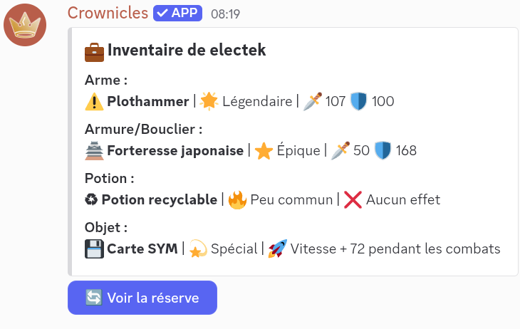
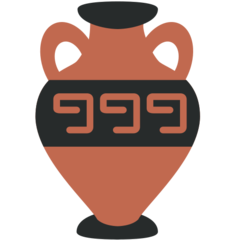
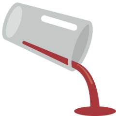

# Équipements

## Obtenir des équipements

### Niveaux de rareté

* Basique :small\_orange\_diamond: `équipement possédé au début du jeu`
* Commun :large\_orange\_diamond: `43,75% (~1 équipement/2)`
* Peu commun :fire: `25% (1 équipement/4)`
* Exotique :trident: `15% (~1 équipement/7)`
* Rare :comet: `10% (1 équipement/10)`
* Spécial :dizzy: `5% (1 équipement/20)`
* Épique :star: `1% (1 équipement/100)`
* Légendaire :star2: `0,23% (~1 équipement/435)`
* Mythique :gem: `0,02% (1 équipement/5000)`


Vous pouvez aussi les voir avec la commande `/rareté` !


### Valeur et puissance des équipements

La valeur des équipements est calculée principalement en fonction de leur rareté.

Il en va de même pour leur puissance. Cependant, la puissance d'un équipement peut être limitée par la puissance d'un joueur. Par exemple, un joueur ayant très peu d'attaque ne sera pas en capacité de profiter de toutes les capacités d'une arme très puissante. Cette limitation sera affichée pour le joueur dans son inventaire.&#x20;

<picture><source srcset="../.gitbook/assets/inventaire_sombre.png" media="(prefers-color-scheme: dark)"></picture>

## Liste des équipements

### Liste des armes

<table><thead><tr><th>Symbole</th><th width="205.266357421875">Nom</th><th width="128">Stats</th><th>Rareté</th></tr></thead><tbody><tr><td>🥒</td><td>Cornichon</td><td>🗡️3 </td><td>Commun</td></tr><tr><td>🌿</td><td>Branche souple</td><td>🗡️3 </td><td>Commun</td></tr><tr><td>💐</td><td>Bouquet de roses</td><td>🗡️3 </td><td>Commun</td></tr><tr><td>🍴</td><td>Fourchettecouteau</td><td>🗡️4 </td><td>Commun</td></tr><tr><td>🦗</td><td>Bâton</td><td>🗡️4 </td><td>Commun</td></tr><tr><td>⚒️</td><td>Outils usés</td><td>🗡️5 </td><td>Commun</td></tr><tr><td>🔧</td><td>Clé rouillée</td><td>🗡️5 </td><td>Commun</td></tr><tr><td>⛏️</td><td>Pioche abimée</td><td>🗡️5 </td><td>Commun</td></tr><tr><td>🔨</td><td>Marteau</td><td>🗡️6 </td><td>Commun</td></tr><tr><td>🏉</td><td>Ballon de Fluxball</td><td>🗡️6 </td><td>Commun</td></tr><tr><td>👊</td><td>Poing renforcé</td><td>🗡️7 </td><td>Commun</td></tr><tr><td>🤛</td><td>Griffe </td><td>🗡️7 🛡️-20 🚀10</td><td>Commun</td></tr><tr><td>🏒</td><td>Crosse</td><td>🗡️8 </td><td>Commun</td></tr><tr><td>🥊</td><td>Gant de boxe</td><td>🗡️9</td><td>Commun</td></tr><tr><td>❄️</td><td>Boule de neige</td><td>🗡️11 </td><td>Commun</td></tr><tr><td>🤬 </td><td>Injures</td><td>🗡️11</td><td>Commun</td></tr><tr><td>🪒</td><td>Rasoir</td><td>🗡️12 </td><td>Commun</td></tr><tr><td>🎸</td><td>Guitare lourde</td><td>🗡️7 🚀-10</td><td>Peu commun</td></tr><tr><td>📌</td><td>Percingasiteur</td><td>🗡️8 </td><td>Peu commun</td></tr><tr><td>🪑</td><td>Chaise</td><td>🗡️8 </td><td>Peu commun</td></tr><tr><td>🎣</td><td>Canne à pêche de débutant</td><td>🗡️9 </td><td>Peu commun</td></tr><tr><td>🦗</td><td>Assomoire</td><td>🗡️11 </td><td>Peu commun</td></tr><tr><td>🏹</td><td>Transperceur</td><td>🗡️11 </td><td>Peu commun</td></tr><tr><td>🔪</td><td>Couteau ancien</td><td>🗡️12 </td><td>Peu commun</td></tr><tr><td>⚔️</td><td>Épée en bois</td><td>🗡️12 </td><td>Peu commun</td></tr><tr><td>☂️</td><td>Parapluie de grand-mère</td><td>🗡️14 🛡️10</td><td>Peu commun</td></tr><tr><td>🔪</td><td>Couteau simple</td><td>🗡️15 </td><td>Peu commun</td></tr><tr><td>📕</td><td>Gros livre</td><td>🗡️17 </td><td>Peu commun</td></tr><tr><td>🔪</td><td>Vieux couteau</td><td>🗡️19 </td><td>Peu commun</td></tr><tr><td>🧱</td><td>Brique</td><td>🗡️15 </td><td>Exotique</td></tr><tr><td>✂️</td><td>Ciseaux</td><td>🗡️16 </td><td>Exotique</td></tr><tr><td>🫂</td><td>Pouvoir de l'amitié</td><td>🗡️18 🛡️20 🚀15</td><td>Exotique</td></tr><tr><td>🧯</td><td>Extincteur</td><td>🗡️20 </td><td>Exotique</td></tr><tr><td>⛏️</td><td>Pioche</td><td>🗡️22 </td><td>Exotique</td></tr><tr><td>🔧</td><td>Masse</td><td>🗡️22 🚀-10</td><td>Exotique</td></tr><tr><td>🗡️</td><td>Dague fragile</td><td>🗡️24 </td><td>Exotique</td></tr><tr><td>🔪</td><td>Couteau de débutant</td><td>🗡️27</td><td>Exotique</td></tr><tr><td>🪃</td><td>Boomerang</td><td>🗡️30 🚀20</td><td>Exotique</td></tr><tr><td>🗯️</td><td>Lame de l'aura argentée</td><td>🗡️33</td><td>Exotique</td></tr><tr><td>🏹</td><td>Arc de novice</td><td>🗡️33 🛡️-10 🚀5</td><td>Exotique</td></tr><tr><td>🥢</td><td>Pew Pew</td><td>🗡️37 </td><td>Exotique</td></tr><tr><td>🍌</td><td>Banane</td><td>🗡️26 </td><td>Rare</td></tr><tr><td>🔫</td><td>Pistolet vide</td><td>🗡️26 </td><td>Rare</td></tr><tr><td>🦄</td><td>Corne de Licorne</td><td>🗡️26 🚀52</td><td>Rare</td></tr><tr><td>💉</td><td>Seringue</td><td>🗡️29 </td><td>Rare</td></tr><tr><td>🍴</td><td>Torchon du Cuisinier</td><td>🗡️31 🛡️15</td><td>Rare</td></tr><tr><td>🪓</td><td>Hachoir</td><td>🗡️36</td><td>Rare</td></tr><tr><td>🕯️</td><td>Brûleur</td><td>🗡️38 </td><td>Rare</td></tr><tr><td>🎣</td><td>Canne à pêche</td><td>🗡️38 </td><td>Rare</td></tr><tr><td>💉</td><td>Seringue infectée</td><td>🗡️41 </td><td>Rare</td></tr><tr><td>⚔️</td><td>Épée de débutant</td><td>🗡️41 </td><td>Rare</td></tr><tr><td>🏹</td><td>Arc de soldat</td><td>🗡️45 🛡️-20 🚀10</td><td>Rare</td></tr><tr><td>⚔️</td><td>Épée en fer</td><td>🗡️50 </td><td>Rare</td></tr><tr><td>🗡️</td><td>Dague</td><td>🗡️55 </td><td>Rare</td></tr><tr><td>🪓</td><td>Ashoir</td><td>🗡️60  🚀-10</td><td>Rare</td></tr><tr><td>⚔️</td><td>Paire de dagues</td><td>🗡️60 </td><td>Rare</td></tr><tr><td>💉</td><td>Seringue sale</td><td>🗡️48 </td><td>Spécial</td></tr><tr><td>🍳</td><td>Poêle</td><td>🗡️52 </td><td>Spécial</td></tr><tr><td>❤️</td><td>Pouvoir de l'amour</td><td>🗡️52 🛡️90 🚀23</td><td>Spécial</td></tr><tr><td>🔨</td><td>Marteau de combat</td><td>🗡️62 🚀-10</td><td>Spécial</td></tr><tr><td>🎣</td><td>Canne à pêche de maître</td><td>🗡️67 </td><td>Spécial</td></tr><tr><td>🏹</td><td>Arc de chevalier</td><td>🗡️73 🛡️-30 🚀20</td><td>Spécial</td></tr><tr><td>💀</td><td>Poudre de Squelette</td><td>🗡️79</td><td>Spécial</td></tr><tr><td>💣</td><td>Bombe</td><td>🗡️87 </td><td>Spécial</td></tr><tr><td>🏹</td><td>Arc</td><td>🗡️87 🛡️-30 🚀20</td><td>Spécial</td></tr><tr><td>⚔️</td><td>Épée sharpness 4</td><td>🗡️87 </td><td>Spécial</td></tr><tr><td>⚔️</td><td>Épées doubles</td><td>🗡️104 🛡️30  🚀-50</td><td>Spécial</td></tr><tr><td>📕</td><td>Vieux grimoire</td><td>🗡️70 </td><td>Épique</td></tr><tr><td>🐾</td><td>Griffe de chat enragé</td><td>🗡️70</td><td>Épique</td></tr><tr><td>💉</td><td>Seringue contaminée</td><td>🗡️76</td><td>Épique</td></tr><tr><td>🪛</td><td>Tournevis sonique</td><td>🗡️82 🚀55</td><td>Épique</td></tr><tr><td>🗡️</td><td>Épée Kokiri</td><td>🗡️89 </td><td>Épique</td></tr><tr><td>🪶</td><td>Aile gauche d'Icare</td><td>🗡️89 🚀30</td><td>Épique</td></tr><tr><td>⚔️</td><td>Beat Saber</td><td>🗡️96 </td><td>Épique</td></tr><tr><td>⚔️</td><td>Ines'word</td><td>🗡️96 </td><td>Épique</td></tr><tr><td>🗡️</td><td>Exagide</td><td>🗡️96 🛡️30</td><td>Épique</td></tr><tr><td>🎭</td><td>Masque Mojaro</td><td>🗡️104 🛡️15</td><td>Épique</td></tr><tr><td>⚡</td><td>Volto-hache</td><td>🗡️113 🛡️-20</td><td>Épique</td></tr><tr><td>⚡</td><td>Foudre de Zeus</td><td>🗡️122 </td><td>Épique</td></tr><tr><td>⚔️</td><td>Épée royale</td><td>🗡️132 </td><td>Épique</td></tr><tr><td>🔫</td><td>Pistolet chargé</td><td>🗡️143 </td><td>Épique</td></tr><tr><td>🐉</td><td>Épée du dragon</td><td>🗡️99 🛡️117 🚀18</td><td>Légendaire</td></tr><tr><td>⚠️</td><td>Plothammer</td><td>🗡️107 🛡️100</td><td>Légendaire</td></tr><tr><td>❄️</td><td>Épée de givre</td><td>🗡️115 🛡️50</td><td>Légendaire</td></tr><tr><td>🔫</td><td>Pistolet pan pan QQ</td><td>🗡️125 </td><td>Légendaire</td></tr><tr><td>🦠</td><td>Bio-arme</td><td>🗡️134 </td><td>Légendaire</td></tr><tr><td>⚔️</td><td>Épée de Ragnell</td><td>🗡️145 </td><td>Légendaire</td></tr><tr><td>⚛️</td><td>Electektron</td><td>🗡️145  🚀45</td><td>Légendaire</td></tr><tr><td>🔥🐦</td><td>Lame du Phoenix</td><td>🗡️169</td><td>Légendaire</td></tr><tr><td>🏹</td><td>Arc du héros</td><td>🗡️182 🛡️-35 🚀25</td><td>Légendaire</td></tr><tr><td>☄️</td><td>Âme du démon</td><td>🗡️182 </td><td>Légendaire</td></tr><tr><td>⚔️</td><td>Épée en diamant</td><td>🗡️196 </td><td>Légendaire</td></tr><tr><td>⚔️</td><td>Épée de maître</td><td>🗡️196 </td><td>Légendaire</td></tr><tr><td>🗡️</td><td>Sabre</td><td>🗡️212 </td><td>Légendaire</td></tr><tr><td>🎮</td><td>Game Over</td><td>🗡️162 🛡️70</td><td>Mythique</td></tr><tr><td>✨</td><td>Sceptre aux 100 sorts</td><td>🗡️174 🚀50</td><td>Mythique</td></tr><tr><td>🍭</td><td>Baguette de Fibonacci</td><td>🗡️188 🛡️20 🚀20</td><td>Mythique</td></tr><tr><td>🤿</td><td>Sabotage de l'oxygène</td><td>🗡️203 </td><td>Mythique</td></tr><tr><td>💣</td><td>Bombe atomique</td><td>🗡️239 🚀-40</td><td>Mythique</td></tr></tbody></table>

### Liste des armures/boucliers

<table><thead><tr><th>Symbole</th><th width="261.19677734375">Nom</th><th>Statistiques</th><th>Rareté</th></tr></thead><tbody><tr><td>🧥</td><td>Manteau</td><td>🛡️3</td><td>Commun</td></tr><tr><td>🥼</td><td>Blouse de protection</td><td>🛡️3 </td><td>Commun</td></tr><tr><td>🛡️</td><td>Bouclier de débutant</td><td>🛡️4 </td><td>Commun</td></tr><tr><td>🛡️</td><td>Bouclier solide</td><td>🛡️6 </td><td>Commun</td></tr><tr><td>🛡️</td><td>Égide contrefaite</td><td>🗡️6 🛡️6</td><td>Commun</td></tr><tr><td>⛑️</td><td>Casque de sécurité</td><td>🛡️7 </td><td>Commun</td></tr><tr><td>🛡️</td><td>Bouclier résistant</td><td>🛡️9</td><td>Commun</td></tr><tr><td>🛡️</td><td>Petit bouclier</td><td>🛡️11 </td><td>Commun</td></tr><tr><td>⛑️</td><td>Casque de guerre</td><td>🛡️21 🚀-10</td><td>Commun</td></tr><tr><td>🚮</td><td>Seau en métal</td><td>🛡️7 </td><td>Peu commun</td></tr><tr><td>🛡️</td><td>Bouclier en bois</td><td>🛡️9 </td><td>Peu commun</td></tr><tr><td>🛡️</td><td>Bouclier simple</td><td>🛡️11</td><td>Peu commun</td></tr><tr><td>🦺</td><td>Veste de sécurité</td><td>🛡️12 </td><td>Peu commun</td></tr><tr><td>🛡️</td><td>Scutum</td><td>🛡️14 </td><td>Peu commun</td></tr><tr><td>🏉</td><td>Bouclier de Brennus</td><td>🛡️15 </td><td>Peu commun</td></tr><tr><td>🧥</td><td>Doudoune de combat</td><td>🛡️19 🚀10</td><td>Peu commun</td></tr><tr><td>🐢</td><td>Carapace de Franklin</td><td>🛡️22 🚀-10</td><td>Peu commun</td></tr><tr><td>🧙</td><td>Chapeau Magique</td><td>🗡️15 🛡️15 🚀10</td><td>Exotique</td></tr><tr><td>🛡️</td><td>Bouclier usé</td><td>🛡️16 </td><td>Exotique</td></tr><tr><td>☂️</td><td>Parapluie d'auto défense</td><td>🛡️18 </td><td>Exotique</td></tr><tr><td>🛡️</td><td>Bouclier</td><td>🛡️20 </td><td>Exotique</td></tr><tr><td>🛡️</td><td>Bouclier de guerrier</td><td>🛡️22 </td><td>Exotique</td></tr><tr><td>🛡️</td><td>Rondache</td><td>🛡️22 </td><td>Exotique</td></tr><tr><td>🏕️</td><td>Tente de protection</td><td>🛡️22 🚀-25</td><td>Exotique</td></tr><tr><td>🛡️</td><td>Bouclier de la solitude</td><td>🛡️27 </td><td>Exotique</td></tr><tr><td>🛡️</td><td>Bouclier rouillé</td><td>🛡️29 </td><td>Rare</td></tr><tr><td>🪟</td><td>Plexiglas</td><td>🗡️10 🛡️31</td><td>Rare</td></tr><tr><td>🛡️</td><td>Bouclier lourd</td><td>🛡️34 </td><td>Rare</td></tr><tr><td>🛡️</td><td>Bouclier en fer</td><td>🛡️38 </td><td>Rare</td></tr><tr><td>🗿</td><td>Nam nam</td><td>🗡️38 🛡️38 🚀-10</td><td>Rare</td></tr><tr><td>🛡️</td><td>Bouclier de gladiateur</td><td>🛡️41</td><td>Rare</td></tr><tr><td>🛡️</td><td>Lumière de Node</td><td>🛡️45 </td><td>Rare</td></tr><tr><td>🛡️</td><td>Bouclier de Lynel</td><td>🛡️55 </td><td>Rare</td></tr><tr><td>🛡️</td><td>Bouclier gigantesque</td><td>🛡️60 🚀-35</td><td>Rare</td></tr><tr><td>🤡</td><td>Autodérision</td><td>🛡️60 🗡️-25</td><td>Rare</td></tr><tr><td>🍃</td><td>Bouclier du vent</td><td>🛡️44 🚀36</td><td>Spécial</td></tr><tr><td>🥼</td><td>Kimono renforcé</td><td>🛡️48</td><td>Spécial</td></tr><tr><td>🛡️</td><td>Égide puissante</td><td>🗡️60 🛡️62</td><td>Spécial</td></tr><tr><td>💪</td><td>Bras mécanique</td><td>🛡️67 </td><td>Spécial</td></tr><tr><td>♟️</td><td>Rangée de pions</td><td>🛡️73 🗡️-15</td><td>Spécial</td></tr><tr><td>🧞</td><td>Lampe Magique</td><td>🗡️10 🛡️73</td><td>Spécial</td></tr><tr><td>✳️</td><td>Champ de force</td><td>🛡️79 </td><td>Spécial</td></tr><tr><td>🛡️</td><td>Bouclier royal</td><td>🛡️87 </td><td>Spécial</td></tr><tr><td>🧱</td><td>Mur</td><td>🗡️-20 🛡️99 🚀-20</td><td>Spécial</td></tr><tr><td>🪙</td><td>Jurisprudence</td><td>🗡️45 🛡️104 🚀-40 </td><td>Épique</td></tr><tr><td>🪶</td><td>Aile droite d'Icare</td><td>🛡️89 🚀30</td><td>Épique</td></tr><tr><td>🥼</td><td>Kimono de maître</td><td>🛡️96 </td><td>Épique</td></tr><tr><td>🤺</td><td>Armure de fer</td><td>🛡️113 </td><td>Épique</td></tr><tr><td>🌞</td><td>Bouclier solaire</td><td>🛡️113 </td><td>Épique</td></tr><tr><td>🛡️</td><td>Bouclier puissant</td><td>🛡️122</td><td>Épique</td></tr><tr><td>🤖</td><td>Casque de robot</td><td>🛡️132</td><td>Épique</td></tr><tr><td>⛩️</td><td>Forteresse japonaise</td><td>🗡️50 🛡️168</td><td>Épique</td></tr><tr><td>🛡️</td><td>Bouclier de givre</td><td>🛡️115 🚀50</td><td>Légendaire</td></tr><tr><td>✨</td><td>Cri UwUrlant</td><td>🗡️45 🛡️156</td><td>Légendaire</td></tr><tr><td>🛡️</td><td>Bouclier de maître</td><td>🛡️169 </td><td>Légendaire</td></tr><tr><td>👁️‍🗨️</td><td>Bouclier déflecteur Engi</td><td>🛡️182 </td><td>Légendaire</td></tr><tr><td>👪</td><td>Bouclier humain</td><td>🛡️196 </td><td>Légendaire</td></tr><tr><td>🛡️</td><td>Convention de Genève</td><td> 🗡️-40 🛡️232</td><td>Légendaire</td></tr><tr><td>🛡️</td><td>Bouclier ultime</td><td>🛡️212</td><td>Légendaire</td></tr><tr><td>🧔</td><td>Giga Chad</td><td>🗡️85 🛡️111</td><td>Mythique</td></tr><tr><td>⛑️</td><td>Blindage du major</td><td>🛡️203 </td><td>Mythique</td></tr><tr><td>🛡️</td><td>Bouclier à pointes</td><td>🗡️15 🛡️174 🚀-20</td><td>Mythique</td></tr><tr><td>🛡️</td><td>Bouclier en vibranium</td><td>🛡️219 </td><td>Mythique</td></tr></tbody></table>

### Liste des objets

#### :x: Aucun effet

| Symbole        | Nom              | Effet       | Rareté |
| -------------- | ---------------- | ----------- | ------ |
| :fallen\_leaf: | Feuilles mortes  | Aucun effet | Commun |
| :oil:          | Baril métallique | Aucun effet | Commun |
| :candle:       | Vieille bougie   | Aucun effet | Commun |

#### :heart: Bonus de vie

| Symbole             | Nom                      | Effet                     | Rareté     |
| ------------------- | ------------------------ | ------------------------- | ---------- |
| :apple:             | Pomme rouge              | :heart: Vie + 1 par jour  | Peu commun |
| :green\_apple:      | Pomme verte              | :heart: Vie + 2 par jour  | Exotique   |
| :sparkles:          | Chapelet mythique        | :heart: Vie + 3 par jour  | Exotique   |
| :adhesive\_bandage: | Pansement                | :heart: Vie + 4 par jour  | Rare       |
| :chocolate\_bar:    | Chocobrie                |  :heart:Vie + 5 par jour  | Spécial    |
| :hearts:            | Réceptacle de cœur       | :heart: Vie + 6 par jour  | Spécial    |
| :squeeze\_bottle:   | Gel Hydro-Alcoolique     | :heart: Vie + 7 par jour  | Épique     |
| :banana:            | Banan'ase split          | :heart: Vie + 9 par jour  | Épique     |
| :angel:             | Bague de l'ange sans vie | :heart: Vie + 11 par jour | Épique     |
| :flag\_white:       | Drapeau de la paix       | :heart: Vie + 14 par jour | Légendaire |
| :angel:             | Bénédiction du ciel      | :heart: Vie + 15 par jour | Légendaire |
| :saxophone:         | Saxo magique             | :heart: Vie + 16 par jour | Mythique   |

####  Bonus de vitesse

| Symbole                                                            | Nom                           | Effet                                      | Rareté     |
| ------------------------------------------------------------------ | ----------------------------- | ------------------------------------------ | ---------- |
|  | Pot en terre cuite            | :rocket: Vitesse +1 pendant les combats    | Commun     |
| :closed\_book:                                                     | Livre d'incantations volume 1 | :rocket: Vitesse +5  pendant les combats   | Commun     |
| :soap:                                                             | Savon glissant                | :rocket: Vitesse +7  pendant les combats   | Peu commun |
| :athletic\_shoe:                                                   | Chaussure de course           | :rocket: Vitesse +15  pendant les combats  | Peu commun |
| :crystal\_ball:                                                    | Boule de verre magique        | :rocket: Vitesse +25  pendant les combats  | Exotique   |
| :frog:                                                             | Talisman de Grenouille        | :rocket: Vitesse +36 pendant les combats   | Exotique   |
| :four\_leaf\_clover:                                               | Feuille de vent               | :rocket: Vitesse +41  pendant les combats  | Rare       |
| :globe\_with\_meridians:                                           | Fibre optique                 | :rocket: Vitesse +56 pendants les combats  | Rare       |
| :skier:                                                            | Skis glissants                | :rocket: Vitesse +63  pendant les combats  | Spécial    |
| :floppy\_disk:                                                     | Carte SYM                     | :rocket:Vitesse + 72 pendant les combats   | Spécial    |
| :mechanical\_leg:                                                  | Jambe mécanique               | :rocket: Vitesse +87  pendant les combats  | Épique     |
| :taxi:                                                             | Kars                          | :rocket: Vitesse +104 pendant les combats  | Épique     |
|  :hiking\_boot:                                                    | Bottes de Pégase              | :rocket: Vitesse +128  pendant les combats | Légendaire |
| :blossom:                                                          | Fleur de l'espoir             | :rocket: Vitesse +145 pendant les combats  | Légendaire |
| :broom:                                                            | Nimbus 2000                   | :rocket: Vitesse +151 pendant les combats  | Mythique   |

#### :crossed\_swords: Bonus d'attaque

| Symbole                | Nom                           | Effet                                     | Rareté     |
| ---------------------- | ----------------------------- | ----------------------------------------- | ---------- |
| 🐟                     | Poisson mort                  | :dagger: Attaque +1 pendant les combats   | Commun     |
| :roll\_of\_paper:      | Roulo PQ                      | :dagger:Attaque +3 pendant les combats    | Commun     |
| :high\_heel:           | Chaussures à talon            | :dagger:Attaque +10 pendant les combats   | Commun     |
| :blue\_book:           | Livre d'incantations volume 2 | :dagger: Attaque +15 pendant les combats  | Peu commun |
| :bricks:               | Lego                          | :dagger:Attaque + 17 pendant les combats  | Peu commun |
| :trumpet:              | Cor de chasse                 | :dagger: Attaque +27 pendant les combats  | Exotique   |
| :small\_blue\_diamond: | Pouvoir de Nayru              | :dagger: Attaque +38 pendant les combats  | Rare       |
| :guitar:               | Guitare électrique            | :dagger:Attaque +51 pendant les combats   | Rare       |
| :joy\_cat:             | Chat aux yeux lasers mignon   | :dagger: Attaque +57 pendant les combats  | Spécial    |
| :pick:                 | Pied de biche                 | :dagger:Attaque +64 pendant les combats   | Spécial    |
| :flag\_black:          | Drapeau de la mort            | :dagger: Attaque +85 pendant les combats  | Épique     |
| :cockroach:            | Script de Easy                | :dagger:Attaque +107 pendant les combats  | Épique     |
| :gem:                  | Diamant Kéraunique            | :dagger: Attaque +143 pendant les combats | Légendaire |
| :eye:                  | Œil de Fatalis                | :dagger: Attaque +144 pendant les combats | Mythique   |
| :guitar:               | Guitare terrifiante           | :dagger: Attaque +151 pendant les combats | Mythique   |

#### :shield: Bonus de défense

| Symbole                  | Nom                           | Effet                                     | Rareté     |
| ------------------------ | ----------------------------- | ----------------------------------------- | ---------- |
| :spoon:                  | Kyuillère                     | :shield: Défense +9 pendant les combats   | Commun     |
| :bear:                   | Ours en peluche               | :shield: Défense +14 pendant les combats  | Peu commun |
| :jack\_o\_lantern:       | Citrouille                    | :shield: Défense +15 pendant les combats  | Peu commun |
| :orange\_book:           | Livre d'incantations volume 3 | :shield: Défense +25 pendant les combats  | Exotique   |
| :new\_moon:              | Bout d'obsidienne             | :shield: Défense +42 pendant les combats  | Rare       |
| :white\_flower:          | Fleur royale                  | :shield: Défense +59 pendant les combats  | Spécial    |
| :four\_leaf\_clover:     | Trèfle à 4 Feuilles           | :shield:Défense +69 pendant les combats   | Spécial    |
| :full\_moon\_with\_face: | Lune de Mojaro                | :shield: Défense +90 pendant les combats  | Épique     |
| :star2:                  | Étoile du Destin              | :shield:Défense +132 pendant les combats  | Légendaire |
| :cyclone:                | Amulette cyclonique           | :shield: Défense +143 pendant les combats | Légendaire |
| :ringed\_planet:         | Anneaux de défense            | :shield: Défense +151 pendant les combats | Mythique   |

#### :zap:Bonus d'énergie

| Symbole           | Nom                        | Effet                       | Rareté     |
| ----------------- | -------------------------- | --------------------------- | ---------- |
| :meat\_on\_bone:  | Nourriture pour chien      | :zap:Énergie + 15 par jour  | Commun     |
| :battery:         | Batterie faible            | :zap:Énergie + 22 par jour  | Commun     |
| :hot\_pepper:     | Piment                     | :zap:Énergie + 63 par jour  | Commun     |
| :bed:             | Lit                        | :zap:Énergie + 111 par jour | Peu commun |
| :battery:         | Batterie pleine            | :zap:Énergie + 264 par jour | Exotique   |
| :robot:           | Figurine Buzz l'éclair     | :zap:Énergie + 289 par jour | Exotique   |
| :headphones:      | Musique                    | :zap:Énergie + 442 par jour | Rare       |
| :roller\_coaster: | Ticket de montagnes russes | :zap:Énergie + 527 par jour | Spécial    |
| :sunny:           | Soleil                     | :zap:Énergie + 618 par jour | Spécial    |
| :dna:             | Programme de dopage        | :zap:Énergie + 799 par jour | Épique     |
| :heart:           | Cœur artificiel            | :zap:Énergie + 813 par jour | Épique     |
| :health\_worker:  | Docteur de poche           | :zap:Énergie + 955 par jour | Légendaire |
| :electric\_plug:  | Défibrillateur             | :zap:Énergie + 969 par jour | Mythique   |

#### :clock10: Bonus de temps

| Symbole              | Nom                        | Effet                                                        | Rareté     |
| -------------------- | -------------------------- | ------------------------------------------------------------ | ---------- |
| :apple:              | Pomme du grand arbre       | :clock10: Avance le temps plus rapidement pendant 20 minutes | Spécial    |
| :rocket:             | Fusée en Carton            | :clock10:Avance le temps plus rapidement pendant 30 minutes  | Spécial    |
| :notes:              | Harmonica du temps         | :clock10: Avance le temps plus rapidement pendant 40 minutes | Épique     |
| :book:               | Kyuran                     | :clock10: Avance le temps plus rapidement pendant 55 minutes | Épique     |
| :movie\_camera:      | Accélérateur de particules | :clock10: Avance le temps plus rapidement pendant 1 heure 10 | Légendaire |
| :stars:              | Étoile filante             | :clock10: Avance le temps plus rapidement pendant 1 heure 25 | Légendaire |
| :satellite\_orbital: | Spoutnik                   | :clock10: Avance le temps plus rapidement pendant 1 heure 35 | Légendaire |
| :blue\_square:       | Tardis                     | :clock10: Avance le temps plus rapidement pendant 1 heure 50 | Mythique   |
| :clock12:            | Horloge du lapin           | :clock10: Avance le temps plus rapidement pendant 2 heures   | Mythique   |

####  Bonus d'argent

| Symbole           | Nom                           | Effet                           | Rareté     |
| ----------------- | ----------------------------- | ------------------------------- | ---------- |
| :key2:            | Clé rouillée                  | :moneybag: Argent +25 par jour  | Commun     |
| :moneybag:        | Médaille du mérite            | :moneybag: Argent +47 par jour  | Peu commun |
| :game\_die:       | Dé magique                    | :moneybag: Argent +60 par jour  | Exotique   |
| :military\_medal: | Bourse du voleur              | :moneybag: Argent +94 par jour  | Exotique   |
| :slot\_machine:   | Machine à sous                | :moneybag: Argent +142 par jour | Rare       |
| :green\_book:     | Livre d'incantations volume 4 | :moneybag: Argent +152 par jour | Rare       |
| :man\_detective:  | Voltou                        | :moneybag: Argent +184 par jour | Spécial    |
| :chains:          | Chaînes magiques              | :moneybag: Argent +207 par jour | Spécial    |
| :amphora:         | Urne ornée du minotaure       | :moneybag: Argent +256 par jour | Épique     |
| :credit\_card:    | Carte bancaire                | :moneybag: Argent +294 par jour | Épique     |
| :orange\_square:  | Amulette de Midas             | :moneybag: Argent +342 par jour | Légendaire |
| :magnet:          | Aimant                        | :moneybag: Argent +386 par jour | Légendaire |
| :office:          | Multinationale                | :moneybag: Argent +401 par jour | Mythique   |

### Liste des potions

#### Aucun effet

| Symbole                                                                                 | Nom                 | Effet       | Rareté     |
| --------------------------------------------------------------------------------------- | ------------------- | ----------- | ---------- |
| :bubble\_tea:                                                                           | Bubble tea          | Aucun effet | Commun     |
| :droplet:                                                                               | Eau purifiée        | Aucun effet | Commun     |
| :wine\_glass:                                                                           | Vin rouge           | Aucun effet | Commun     |
| :test\_tube:                                                                            | Potion douteuse     | Aucun effet | Commun     |
| :tea:                                                                                   | Potion périmée      | Aucun effet | Commun     |
|                | Potion renversée    | Aucun effet | Commun     |
| :ocean:                                                                                 | Eau de Mer          | Aucun effet | Peu commun |
| :recycle:                                                                               | Potion recyclable   | Aucun effet | Peu commun |
|                           | Potion vide         | Aucun effet | Peu commun |
| :hotsprings:                                                                            | Eau bouillante      | Aucun effet | Exotique   |
| :black\_nib:                                                                            | Encre               | Aucun effet | Exotique   |
| :non-potable\_water:                                                                    | Potion non potable  | Aucun effet | Exotique   |
| :bed:                                                                                   | Bave sur l'oreiller | Aucun effet | Rare       |
| :sweat\_drops:                                                                          | Sueur               | Aucun effet | Spécial    |
| 

 | Potion renversante  | Aucun effet | Épique     |
| :mount\_fuji:                                                                           | Super Nariwa        | Aucun effet | Légendaire |
| :beverage\_box:                                                                         | Jus de pomme        | Aucun effet | Mythique   |

#### Bonus de vie

| Symbole                                                                    | Nom                     | Effet             | Rareté     |
| -------------------------------------------------------------------------- | ----------------------- | ----------------- | ---------- |
| :baby\_bottle:                                                             | Biberon                 | :heart: Vie + 1   | Commun     |
| :fondue:                                                                   | Fondue hivernale        | :heart: Vie + 3   | Commun     |
| :test\_tube:                                                               | Potion puante           | :heart: Vie + 7   | Commun     |
| :test\_tube:                                                               | Potion morvique         | :heart: Vie + 1   | Peu commun |
| :stew:                                                                     | Soupe de grand mère     | :heart: Vie + 10  | Peu commun |
| :piñata:                                                                   | Friandwill              | :heart: Vie + 15  | Peu commun |
|     | Potion simple           | :heart: Vie + 17  | Exotique   |
|     | Potion rouge            | :heart: Vie + 53  | Spécial    |
|    | Bizous'koup             | :heart: Vie + 70  | Spécial    |
|    | Potion de guérison      | :heart: Vie + 80  | Spécial    |
|  | Potion acide            | :heart: Vie + 84  | Épique     |
|    | Potion de soin          | :heart: Vie + 100 | Épique     |
|    | Potion de soin ultime   | :heart: Vie + 215 | Légendaire |
| :hatching\_chick:                                                          | Essence de volaille n°5 | :heart: Vie + 270 | Mythique   |

#### Bonus de vitesse

| Symbole                                                                          | Nom                      | Effet                                            | Rareté     |
| -------------------------------------------------------------------------------- | ------------------------ | ------------------------------------------------ | ---------- |
| :tea:                                                                            | Thé                      | :rocket: Vitesse +1 pendant le prochain combat   | Commun     |
| :coffee:                                                                         | Café                     | :rocket: Vitesse +2 pendant le prochain combat   | Commun     |
| :tropical\_drink:                                                                | Boisson tropicale        | :rocket: Vitesse +8 pendant le prochain combat   | Commun     |
| :beverage\_box:                                                                  | Jus d'orange             | :rocket: Vitesse +1 pendant le prochain combat   | Peu commun |
|           | Jus de chaussettes       | :rocket: Vitesse +15 pendant le prochain combat  | Peu commun |
|  | Potion secouée           | :rocket: Vitesse +25 pendant le prochain combat  | Peu commun |
|           | Potion verte             | :rocket: Vitesse +45 pendant le prochain combat  | Exotique   |
|           | Potion fumante           | :rocket: Vitesse +88 pendant le prochain combat  | Rare       |
| :thunder\_cloud\_rain:                                                           | Jus d'orage              | :rocket: Vitesse +138 pendant le prochain combat | Spécial    |
|  | Potion de vitesse        | :rocket: Vitesse +200 pendant le prochain combat | Spécial    |
| :snail:                                                                          | Bave d'escargot          | :rocket: Vitesse + 1 pendant le prochain combat  | Épique     |
| :battery:                                                                        | Jus de batterie          | :rocket: Vitesse +212 pendant le prochain combat | Épique     |
|          | Grande potion            | :rocket: Vitesse +255 pendant le prochain combat | Légendaire |
| :bricks:                                                                         | Potion de dureté extrême | :rocket: Vitesse +327 pendant le prochain combat | Mythique   |

#### Bonus d'attaque

| Symbole                                                                          | Nom                      | Effet                                                     | Rareté     |
| -------------------------------------------------------------------------------- | ------------------------ | --------------------------------------------------------- | ---------- |
| :tumbler\_glass:                                                                 | Alcool                   | :crossed\_swords: Attaque +5 pendant le prochain combat   | Commun     |
| :tea:                                                                            | Larmes de l'adversaire   | :crossed\_swords: Attaque +20 pendant le prochain combat  | Peu commun |
|  | Potion de force          | :crossed\_swords: Attaque +45 pendant le prochain combat  | Exotique   |
|           | Potion                   | :crossed\_swords: Attaque +60 pendant le prochain combat  | Rare       |
|  | Potion explosive         | :crossed\_swords: Attaque +65 pendant le prochain combat  | Rare       |
|           | Potion magique           | :crossed\_swords: Attaque +135 pendant le prochain combat | Spécial    |
| :wolf:                                                                           | Potion de sang de loup   | :crossed\_swords: Attaque +178 pendant le prochain combat | Épique     |
| 🧌                                                                               | Bave de Troll            | :crossed\_swords:Attaque +187 pendant le prochain combat  | Épique     |
| :hot\_pepper:                                                                    | Huile de ghost pepper    | :crossed\_swords:Attaque +243 pendant le prochain combat  | Légendaire |
| 🩸                                                                               | Potion de sang de dragon | :crossed\_swords: Attaque +312 pendant le prochain combat | Mythique   |

#### Bonus de défense

| Symbole                                                                 | Nom                 | Effet                                           | Rareté     |
| ----------------------------------------------------------------------- | ------------------- | ----------------------------------------------- | ---------- |
| :milk:                                                                  | Verre de lait       | :shield: Défense +10 pour le prochain combat    | Commun     |
|  | Potion bleue        | :shield: Défense +25 pour le prochain combat    | Peu commun |
| :canned\_food:                                                          | Jus de banane       | :shield: Défense +35 pendant le prochain combat | Peu commun |
| :beer:                                                                  | Breuvage du courage | :shield:Défense +69 pendant le prochain combat  | Exotique   |
|  | Potion sombre       | :shield: Défense +90 pour le prochain combat    | Rare       |
| :chocolate\_bar:                                                        | Tablette ChocoChoc  | :shield:Défense +158 pour le prochain combat    | Spécial    |
| :peanuts:                                                               | Huile de noix       | :shield: Défense +169 pour le prochain combat   | Spécial    |
|  | Super potion        | :shield: Défense +190 pour le prochain combat   | Épique     |
| :canned\_food:                                                          | Jus de kiwi         | :shield:Défense +256 pendant le prochain combat | Légendaire |
| :canned\_food:                                                          | Épinards            | :shield: Défense +261 pour le prochain combat   | Mythique   |

#### Bonus d'énergie

| Symbole                                                            | Nom                | Effet               | Rareté     |
| ------------------------------------------------------------------ | ------------------ | ------------------- | ---------- |
| :shower:                                                           | Eau de douche      | :zap:Énergie + 12   | Commun     |
| :coffee:                                                           | Expresso           | :zap:Énergie + 24   | Commun     |
| :closed\_umbrella:                                                 | Gouttes de pluie   | :zap:Énergie + 61   | Commun     |
| :cactus:                                                           | Jus de cactus      | :zap:Énergie + 112  | Peu commun |
|  | Potion à bulles    | :zap:Énergie + 199  | Peu commun |
| :cold\_face:                                                       | Eau de stalactites | :zap:Énergie + 362  | Exotique   |
| :ocean:                                                            | Potion de la mer   | :zap:Énergie + 802  | Rare       |
| :soap:                                                             | Eau savonneuse     | :zap:Énergie + 852  | Rare       |
| :cocktail:                                                         | Cocktail tonique   | :zap:Énergie + 963  | Spécial    |
|    | Rosée du matin     | :zap:Énergie + 1024 | Spécial    |
| :pirate\_flag:                                                     | Rhum               | :zap:Énergie + 1504 | Épique     |
| :honey\_pot:                                                       | Miel               | :zap:Énergie + 1669 | Épique     |
| :syringe:                                                          | Substance inconnue | :zap:Énergie + 1775 | Épique     |
| :motor\_scooter:                                                   | SP 95              | :zap:Énergie + 1874 | Légendaire |
| :volcano:                                                          | Larme de Titan     | :zap:Énergie + 1899 | Légendaire |
| :feather:                                                          | Essence de phénix  | :zap:Énergie + 2048 | Mythique   |

#### Bonus de temps

| Symbole                                                                    | Nom                       | Effet                                                       | Rareté     |
| -------------------------------------------------------------------------- | ------------------------- | ----------------------------------------------------------- | ---------- |
| :potato:                                                                   | Jus de Pomme de Terre     | :clock10:Avance le temps plus rapidement pendant 15 minutes | Exotique   |
| :tea:                                                                      | Jus                       | :clock10: Avance le temps plus rapidement pendant 1 heure   | Rare       |
| :herb:                                                                     | Breuvage à base de coca   | :clock10: Avance le temps plus rapidement pendant 1 heure   | Rare       |
| :fuelpump:                                                                 | Kyurburant                | :clock10: Avance le temps plus rapidement pendant 2 heures  | Spécial    |
| :cup\_with\_straw:                                                         | Glaçons fondus            | :clock10: Avance le temps plus rapidement pendant 3 heures  | Spécial    |
| :sake:                                                                     | Saké                      | :clock10: Avance le temps plus rapidement pendant 4 heures  | Épique     |
| :champagne:                                                                | Champagne sabré           | :clock10: Avance le temps plus rapidement pendant 6 heures  | Épique     |
| :coconut:                                                                  | Maté                      | :clock10: Avance le temps plus rapidement pendant 7 heures  | Épique     |
|  | Potion violette           | :clock10: Avance le temps plus rapidement pendant 12 heures | Légendaire |
|   | Potion ultime             | :clock10: Avance le temps plus rapidement pendant 20 heures | Légendaire |
| :skull\_crossbones:                                                        | Potion de la mort qui tue | :clock10:Avance le temps plus rapidement pendant 40 heures  | Mythique   |
