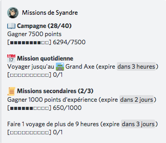
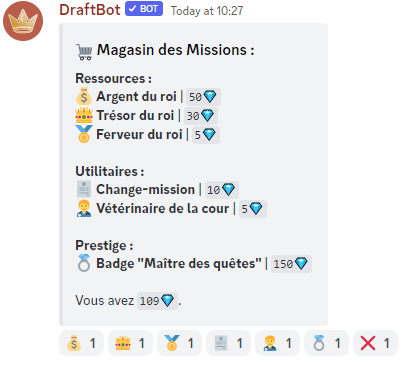

# Missions

Les missions sont des objectifs à réaliser afin de gagner de l'expérience et des gemmes. Pour afficher vos missions en cours, saisissez la commande `/missions`.


Vous avez également la possibilité d'afficher les missions en cours d'un autre joueur. Utilisez les options `utilisateur` ou `classement` de la commande `/missions` pour cibler un autre joueur. Par exemple, `/missions classement:1337` affichera les missions du joueur classé 1337ème.


### Catégories de mission

Il existe trois catégories de mission :

* Les missions de campagne : celles-ci ne changent pas et sont prédéfinies : il y en a 60 et leur difficulté évolue avec le joueur.
* Les missions quotidiennes : comme leur nom l'indique, celles-ci changent chaque jour et permettent au joueur de gagner des récompenses autrement que par les quêtes de campagne.
* Les missions secondaires sont un autre moyen d'obtenir des récompenses, celles-ci peuvent se trouver occasionnellement dans des [mini-évènements](report.md#mini-evenements).

Les missions secondaires s'obtiennent avec un [mini-évènement](report.md#mini-evenements) précis, ressemblant à cela :

### Magasin des missions 

Les gemmes gagnées en remplissant des missions peuvent être dépensées dans le magasin des missions. Le magasin des missions s'affiche grâce à la commande `/magasinmissions`.

Celui-ci se divise en 3 catégories :



* L'argent du roi permet de recevoir une quantité d'argent aléatoire entre 5150 et 7850 :moneybag:. Celui-ci coûte 50 gemmes.
* Le trésor du roi vous octroie un objet ayant pour rareté minimale Spécial. Celui-ci coûte 30 gemmes.
* La ferveur du roi vous donne 1000 points mais ne peut être utilisée qu'une fois par semaine. Celle-ci coûte 5 gemmes.



* Le remplace-mission permet, comme son nom l'indique, de passer une mission secondaire et de la remplacer par une nouvelle choisie aléatoirement. Celui-ci coûte 10 gemmes.
* Le vétérinaire de la cour permet de récupérer des informations sur le familier que vous avez actuellement. Celui-ci coûte 5 gemmes.



* Le badge Maître des quêtes est un badge unique permettant de montrer votre investissement dans les missions. Vous pouvez vous le procurer pour 150 gemmes.



<figure><figcaption>
Affiche du magasin de missions
</figcaption></figure>
