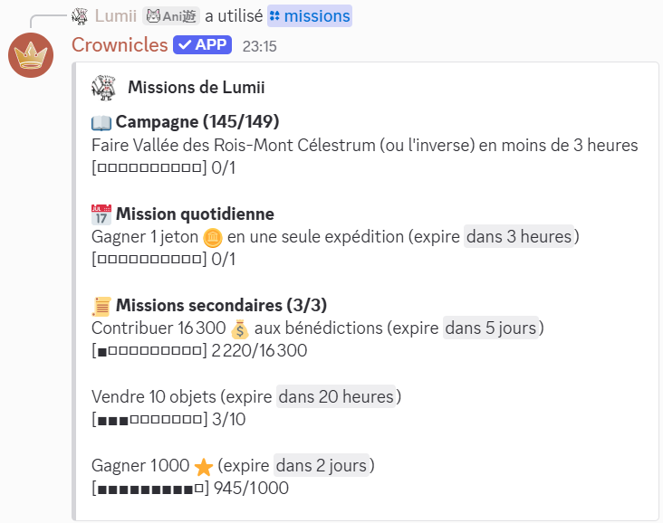

# Missions

Les missions sont des objectifs à réaliser afin de gagner de l'expérience et des gemmes. Pour afficher vos missions en cours, saisissez la commande `/missions`.


Vous avez également la possibilité d'afficher les missions en cours d'un autre joueur. Utilisez les options `utilisateur` ou `classement` de la commande `/missions` pour cibler un autre joueur. Par exemple, `/missions classement:1337` affichera les missions du joueur classé 1337ème.


### Catégories de mission

Il existe trois catégories de mission :

* Les missions de campagne :book: : celles-ci ne changent pas et sont prédéfinies : il en existe 149 et leur difficulté évolue avec le joueur.
* Les missions quotidiennes :calendar: : comme leur nom l'indique, celles-ci changent chaque jour et permettent au joueur de gagner des récompenses autrement que par les quêtes de campagne.
* Les missions secondaires :scroll: sont un autre moyen d'obtenir des récompenses et peuvent se trouver occasionnellement dans des [mini-évènements](../notions-avancees/mini-evenements.md#trouver-une-mission).


Finir la campagne vous récompensera par un [familier](familiers.md) mythique : la fée.


<figure><picture><source srcset="../.gitbook/assets/missions149_sombre.png" media="(prefers-color-scheme: dark)"></picture><figcaption>
Affichage de la commande /missions
</figcaption></figure>

Les missions secondaires s'obtiennent avec un [mini-évènement](report.md#mini-evenements) précis, ressemblant à cela :

<figure><picture><source srcset="../.gitbook/assets/Capture d&#x27;écran 2025-06-19 190037.png" media="(prefers-color-scheme: dark)"></picture><figcaption>
Obtention d'une mission secondaire
</figcaption></figure>

### Mise à jour de la campagne

Lors d'une mise à jour de la campagne :book:, les missions ajoutées ne sont pas nécessairement situées en fin de progression et peuvent être ajoutées au milieu.

Pour garantir l'équité entre les joueurs concernant les gains :chart\_with\_upwards\_trend: des missions et permettre à tous de faire toutes les missions, la campagne amène le joueur qui a terminé une quête :book: à **la première mission non accomplie**, qui peut être antérieure à celle qu'il vient de terminer. Il retrouvera sa position la plus haute après avoir accompli toutes les missions intermédiaires ajoutées entre temps.&#x20;

### Dépenser ses gemmes 

Les gemmes peuvent être gagnées dans les missions de campagne et journalières mais pas dans les missions secondaires. Elles peuvent être dépensées dans divers services, que ce soit au marché royal du Château, chez les vétérinaires de Mergagnan et Claire de Ville ou pour payer le capitaine du bateau en direction des [iles-mysterieuses.md](../notions-avancees/iles-mysterieuses.md "mention").

Les achats se divisent en 3 catégories :



* L'argent du roi :moneybag:permet de recevoir une quantité d'argent aléatoire entre 5150 et 7850 :moneybag:. Il coûte 50 gemmes.
* Le trésor du roi :crown: vous octroie un objet ayant pour rareté minimale Spécial. Il coûte 30 gemmes.
* La ferveur du roi :medal: vous donne 1 000 points mais ne peut être utilisée qu'une fois par semaine. Elle coûte 5 gemmes.

Ces achats sont situés sur le :gem: marché royal du Château du Roi.



* Le change-mission :receipt: permet, comme son nom l'indique, de passer une mission secondaire :scroll: et de la remplacer par une nouvelle choisie aléatoirement. Celui-ci est d'abord gratuit puis augmente de 1 :gem: par utilisation. Le coût est réinitialisé chaque semaine, disponible au marché royal.
* Les vétérinaires :health\_worker: permettent de récupérer des informations sur le familier que vous avez actuellement. Celui-ci coûte 3 gemmes, et est disponible à Mergagnan et Claire de Ville.
* Les gemmes :gem: servent aussi à appliquer des [enchantements](../notions-avancees/materiaux-et-enchantements.md#les-enchantements) ou améliorer un équipement au niveau 5.&#x20;



* Le badge Maître des quêtes :ring: est un badge unique permettant de montrer votre investissement dans les missions. Vous pouvez vous le procurer pour 150 gemmes au marché royal.&#x20;



<figure><picture><source srcset="../.gitbook/assets/MarcheRoyal_sombre.png" media="(prefers-color-scheme: dark)"></picture><figcaption>
Affichage du marché royal
</figcaption></figure>
