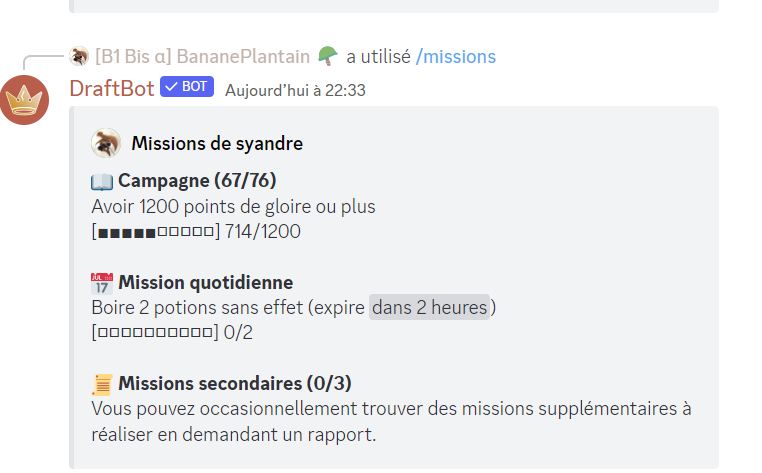

# Missions

Les missions sont des objectifs à réaliser afin de gagner de l'expérience et des gemmes. Celles-ci peuvent se décomposer en 3 catégories :

* Les missions de campagne : celles-ci ne changent pas et sont prédéfinies : il y en a 40 et leur difficulté évolue avec le joueur.
* Les missions quotidiennes : comme leur nom l'indique, celles-ci changent chaque jour et permettent au joueur de gagner des récompenses autrement que par les quêtes de campagne.
* Les missions secondaires sont un autre moyen d'obtenir des récompenses, celles-ci peuvent se trouver occasionnellement dans des [mini-évènements](report.md#mini-evenements).

Les missions secondaires s'obtiennent avec un [mini-évènement](report.md#mini-evenements) précis, ressemblant à ça :

Les gemmes gagnées peuvent être dépensées dans le magasin des missions. Celui-ci se divise en 3 catégories :



* L'argent du roi permet de recevoir une quantité d'argent aléatoire entre 2200 et 2800 :moneybag:. Celui-ci coûte 50 gemmes.
* Le trésor du roi vous octroie un objet ayant pour rareté minimale Spécial. Celui-ci coûte 30 gemmes.
* La ferveur du roi vous donne 1000 points mais ne peut être utilisée qu'une fois par semaine. Celle-ci coûte 5 gemmes.



* Le passe-mission permet, comme son nom l'indique, de passer une mission. Celui-ci coûte 10 gemmes.
* Le vétérinaire de la cour permet de récupérer des informations sur le pet que vous avez actuellement. Celui-ci coûte 5 gemmes.



* Le badge Maître des quêtes est un badge unique permettant de montrer votre investissement dans les missions. Vous pouvez vous le procurer pour 150 gemmes.



