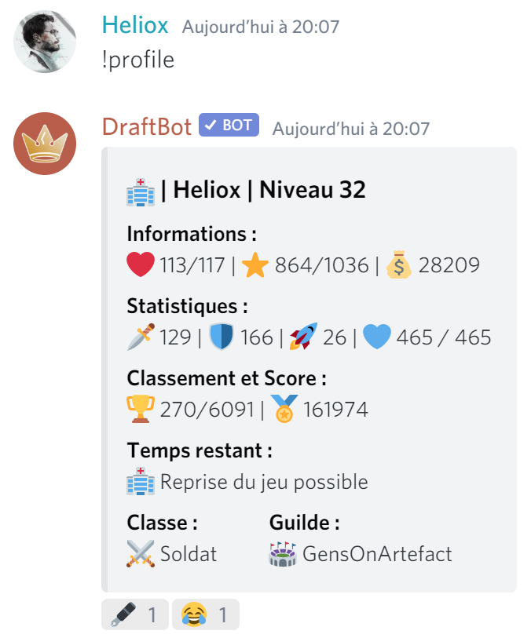

# Profil

Comme quasiment tous les Role-Playing games, votre personnage possède un profil servant à afficher ses différentes statistiques. Pour accéder à votre profil vous devez utiliser la commande `!profile`  
Vous pouvez aussi utiliser la variante `!profile <@user>` pour accéder au profil d'un autre joueur.


Vous pouvez aussi utiliser l'alias `!p` et sa variante `!p <@user>` pour ouvrir le profil.


L'inventaire d'un joueur se décompose donc de cette façon :

### Informations

Ce sont les informations générales de votre personnage.

*  Points de vie
*  Points d'expérience
*  Argent du jeu

### Statistiques

Cette ligne corresponds aux statistiques liées aux [combats](combats.md). On y retrouve :

*  Points d'attaque
*  Points de défense 
*  Points de vitesse
*  Points de combat


Attention à ne pas confondre lespoints de vie et lespoints de combat, ils n'ont pas la même utilité.


### Classement et Score 

*  Votre place de classement sur le nombre total de joueurs
*  Points de classement

### Temps restant 

Cette ligne affiche le statut actuel de votre joueur. Si vous avez une [altération d'état](alterations-detat.md) active, le temps restant sera affiché, précédé d'un émoji relatif à l'altération en question.

### Classe et guilde

Depuis les dernières versions de DraftBot, vous avez la possibilité de choisir une [classe ](classes.md)pour votre personnage. Ainsi que créer ou rejoindre une [guilde](guildes.md). Ces deux informations sont visible depuis cet espace de votre profil.

### Badges

Pour finir, le bot ajoutera en réaction de votre profil des emojis correspondants aux [badges ](../notions-avancees/badges.md)que vous avez acquis durant votre aventure.

