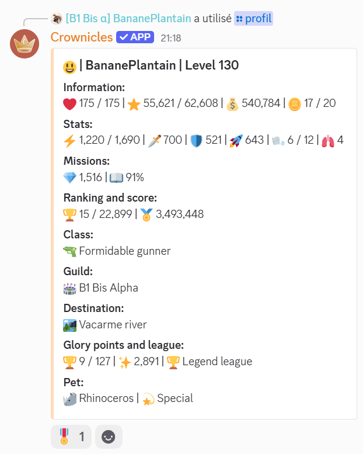

# Profile

As in every roleplaying game, your character has a profile used to show different statistics. To open your profile, just type `/profile`.


You can also see other players' profiles using their rank or just by mentioning him with the "rank" or "user" parameters !


A player profile is cut like this :&#x20;

<figure><picture><source srcset="../.gitbook/assets/profile_dark.png" media="(prefers-color-scheme: dark)"></picture><figcaption>
A player's profile
</figcaption></figure>

### Informations&#x20;

This line contains every statistics about the adventure, containing :&#x20;

* :heart: Your health
* :star: Your experience points
* :moneybag: Your money
* :coin:Your tokens

### Statistics

This line is about everything [fights ](combats.md)related. It shows :&#x20;

* :dagger: Your attack points
* :shield: Your defense points
* :rocket: Your speed points
* :zap: Your energy points
* :wind\_blowing\_face: Breath available / max breath
* :lungs: Breath recovery

### [Missions](profile.md#missions)

* Your number of gems
* Your progress in the campaign as a percentage

### Ranking and score

* Your rank / total number of players
* Your points accumulated throughout the adventure

For more information, see [Rank Up](../notions-avancees/monter-dans-les-classements.md)

### Remaining time&#x20;

This line shows the current status of your player. If you have any active [state alteration](alterations-detat.md), the remaining time will be displayed, with the related emoji.

### Classes

You have the possibility to choose a [class ](classes.md)for your character.

### Guilds

You can create or join a [guild](guildes.md).

### Destination

This is where you are heading on the map.

### Glory and League

* Your position in the glory rankings
* Your glory points ✨
* Your league : it changes depending on your glory : More on [leagues.md](leagues.md "mention")


The embed's border color also indicates your actual league.


### Pet

An animal that accompanies you on your adventure.

### Badges

Finally, the bot will add in reaction to your profile emojis corresponding to all of your earned [badges](../notions-avancees/badges.md) during your adventure.
