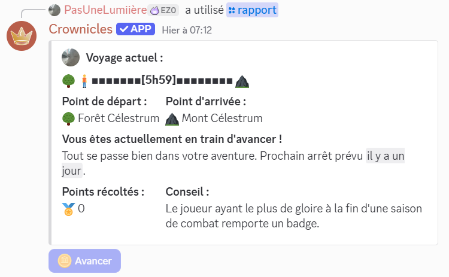
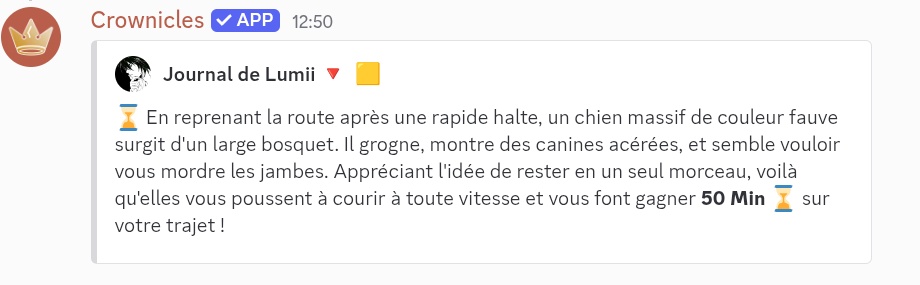
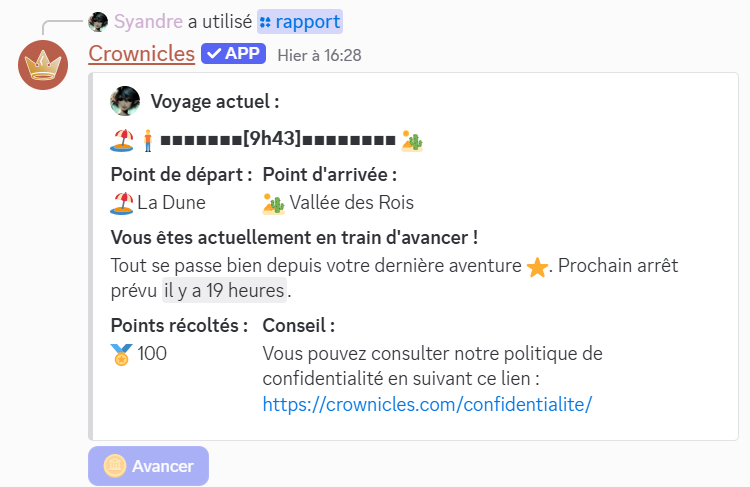
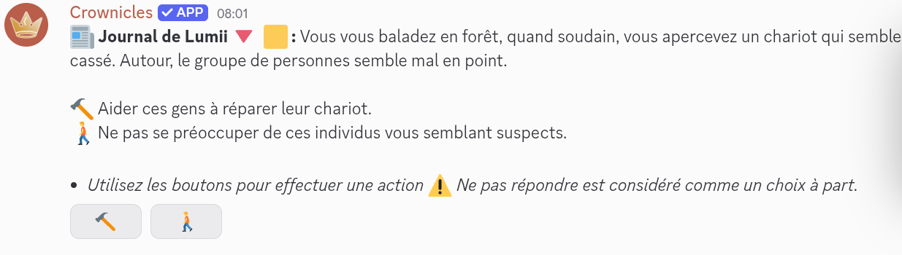
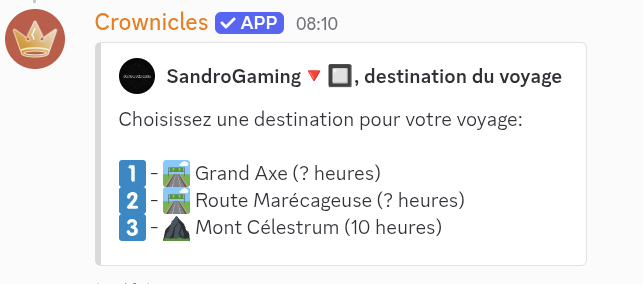
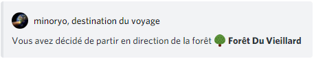

# Rapports

Les rapports représentent la base du jeu. Il s'agit d'une petite description de ce qu'il est advenu du personnage contrôlé par le joueur depuis sa dernière interaction. Pour demander un rapport, le joueur doit utiliser la commande `/rapport`.

### Interface :

La commande `/rapport` possède 5 états différents :

* Le joueur est en train de voyager.
* Le joueur est victime d'une altération d'état.
* Le joueur réalise un évènement.
* Le joueur réalise un mini-évènement.
* Le joueur est en ville.

<picture><source srcset="../.gitbook/assets/voyage_debut_sombre.png" media="(prefers-color-scheme: dark)"></picture>

### Mini-Évènements :

Le joueur met environ 9 minutes et 45 secondes à réaliser un trajet entre deux mini-évènements.

<picture><source srcset="../.gitbook/assets/Screenshot_20250618-160548.png" media="(prefers-color-scheme: dark)"></picture>

Un mini-évènement est souvent une simple phrase. Il existe cependant des mini-évènements qui peuvent vous faire gagner des objets, de la vie ou encore de l'argent.


Chaque mini-évènement rapporte au joueur une quantité de points diminuant à chaque nouveau mini-évènement. Ces points sont ajoutés au nombre de points remportés lors de l'évènement suivant.


<figure><picture><source srcset="../.gitbook/assets/voyage_emote_SE_sombre.png" media="(prefers-color-scheme: dark)"></picture><figcaption>
Une fois le mini-évènement passé, il apparaît sur l'interface de voyage
</figcaption></figure>

Vous pouvez voir le nombre de points récoltés avec les mini-évènements ainsi que le temps d'attente avant le prochain.

### Évènements :

Les évènements sont le cœur du jeu, le joueur doit simplement réagir à une situation à choix multiples à l'aide des boutons. En fonction de son choix, différentes issues surviennent.

<picture><source srcset="../.gitbook/assets/rapport_sombre.png" media="(prefers-color-scheme: dark)"></picture>

Ici, le joueur possède 3 choix différents : les 2 choix de réaction mais également le choix de ne rien faire.


Le non-choix ("Ne rien faire") se déclenche automatiquement au bout de 2 minutes en l'absence de choix explicite. Il est possible de forcer ce non-choix en ajoutant manuellement la réaction :end: (:end:) au texte de l'évènement.



Dans certains évènements, ne rien faire est le meilleur choix ! (Dans d'autres c'est le pire.)


Une fois un choix réalisé par le joueur, ce dernier peut cliquer sur une réaction (ou attendre 2 minutes), ce qui déclenche l'issue.

<picture><source srcset="../.gitbook/assets/Capture d&#x27;écran 2025-06-19 174333.png" media="(prefers-color-scheme: dark)"></picture>

### Destination :

Après un évènement, le joueur est amené à choisir une destination. Il n'est pas possible pour un joueur de faire un retour sur ses pas (sauf si c'est le seul choix possible). C'est dans cette interface qu'il est aussi possible de faire le choix "Entrer en ville" si le joueur est arrivée à l'une des 6 villes et villages.

<picture><source srcset="../.gitbook/assets/Screenshot_20250619-164527.png" media="(prefers-color-scheme: dark)"></picture>

Le temps indiqué entre parenthèses est le temps de voyage pour parvenir jusqu'au lieu, un point d'interrogation signifie que le temps est inconnu.

<figure><picture><source srcset="../.gitbook/assets/Screenshot_20250619-164556.png" media="(prefers-color-scheme: dark)"></picture><figcaption>
Voici votre information sur votre destination
</figcaption></figure>

### Les jetons :coin::

Les jetons sont une ressource primordial pour l'aventure et les voyages:

* Ils sont l'unique moyen de soigner les altérations d'état **occupé** (et avance en plus le temps de 10m).
* Ils permettent d'avancer le trajet de 10m vous emmenant au mini-événement ou événement suivant.


Vous en obtenez 3 par jour gratuitement et pouvez en posséder jusqu'à 20.

