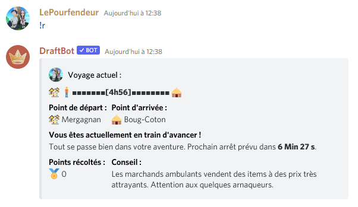
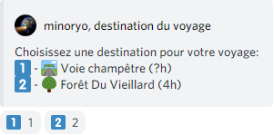
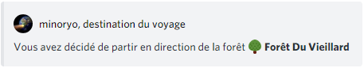

# Rapports

Les rapports représentent la base du jeu. Il s'agit d'une petite description de ce qu'il est advenu du personnage contrôlé par le joueur depuis leur dernière interaction. Pour demander un rapport, le joueur doit utiliser la commande `!report`.

### Interface :

La commande `!report` possède 4 états différents :

* Le joueur est en train de voyager.
* Le joueur est victime d'une altération d'état.
* Le joueur réalise un évènement.
* Le joueur réalise un mini-évènement.

### Mini-Évènements :

Le joueur met 10 minutes à réaliser un trajet entre deux mini-évènements.

Un mini-évènement est souvent une simple phrase. Il existe cependant des mini-évènements qui peuvent vous faire gagner des items, de la vie ou encore de l'argent.


Chaque mini évent rapporte au joueur une quantité de points diminuant à chaque nouveau mini évent. Ces points sont ajoutés au nombre de points remportés lors de l'évènement suivant.


Vous pouvez voir le nombre de points récoltés avec les mini-évènements ainsi que le temps d'attente avant le prochain.

### Évènements :

Les évènements sont le cœur du jeu, le joueur doit simplement réagir à une situation à choix multiples à l'aide des réactions Discord. En fonction de son choix, différentes issues surviennent.

.png>)

Ici, le joueur possède 3 choix différents : les 2 choix de réaction mais également le choix de ne rien faire.


Dans certains évènements, ne rien faire est le meilleur choix ! (Dans d'autres c'est le pire).


Une fois un choix réalisé par le joueur, ce dernier peut cliquer sur une réaction (ou attendre 2 minutes), ce qui déclenche l'issue.

.png>)

### Destination :

Après un évènement, le joueur est amené à choisir une destination. Il n'est pas possible pour un joueur de faire un retour sur ses pas (sauf si c'est le seul choix possible).

Le temps indiqué entre parenthèses est le temps de voyage pour parvenir jusqu'au lieu, un point d'interrogation signifie que le temps est inconnu. Dans un tiers des cas, le bot choisit automatiquement la destination du joueur.

###
